# Introducción a la Informática

## 🔎​​ ¿Qué es la Informática?
La informática es la ***ciencia*** que estudia el ***tratamiento*** automático de la ***información mediante computadoras***. Es un campo ***interdisciplinario*** que abarca desde la teoría de la computación hasta la práctica de la programación y el desarrollo de software.

!!! info "Informática proviene del francés 'informatique', que a su vez se deriva de 'information' (información) y 'automatique' (automático). Fue acuñado por el ingeniero francés ***Philippe Dreyfus*** en 1962 para describir la nueva disciplina que surgía con el desarrollo de las computadoras."

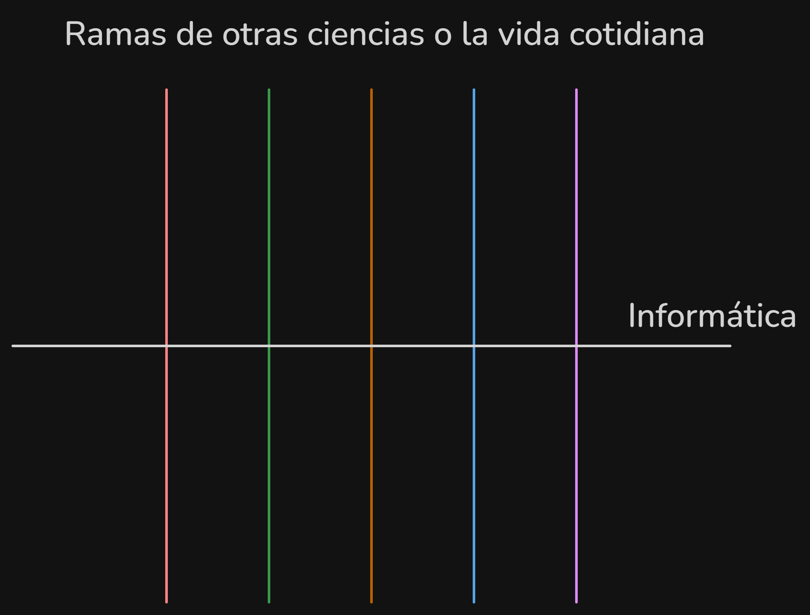

## 🖥️​ ¿Qué es una computadora?
Una computadora es una máquina que ***procesa información*** siguiendo un conjunto de ***instrucciones*** (programas). Está compuesta por ***hardware*** (componentes físicos) y ***software*** (programas y sistemas operativos).

### 📜 Historia de las computadoras
La ***ENIAC*** (Electronic Numerical Integrator and Computer) fue la ***primera computadora*** electrónica de ***propósito general***, construida entre 1943 y 1945 en la Universidad de Pensilvania por John Presper Eckert y John William Mauchly. Financiada por el ***ejército*** de los EE. UU. para ***calcular*** trayectorias balísticas, funcionaba con más de ***17,000 tubos de vacío***, pesaba ***27 toneladas*** y ocupaba ***167 metros cuadrados***. Aunque era extremadamente rápida para su época, consumía una gran cantidad de ***energía*** y requería un ***mantenimiento*** constante.
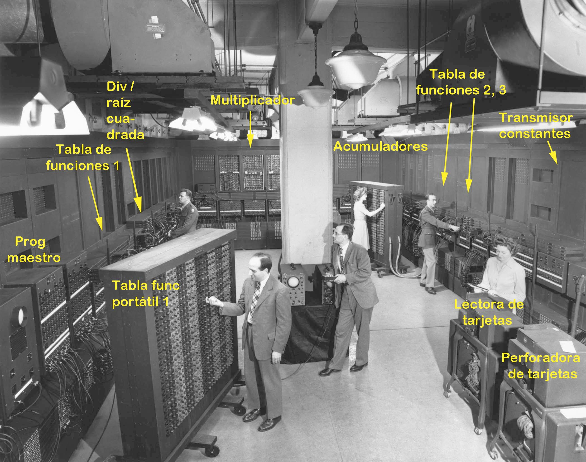

### 🧑‍🏫​ Primeros programadores
Las primeras ***programadoras*** fueron un grupo de mujeres que trabajaron en la ***ENIAC***. Entre ellas se encontraban Jean Jennings Bartik, Frances Elizabeth Holberton, Kathleen McNulty Mauchly Antonelli, Marlyn Wescoff Meltzer, Ruth Lichterman Teitelbaum y Betty Snyder Holberton. Estas mujeres fueron ***pioneras*** en el campo de la ***programación*** y contribuyeron significativamente al desarrollo de la informática.
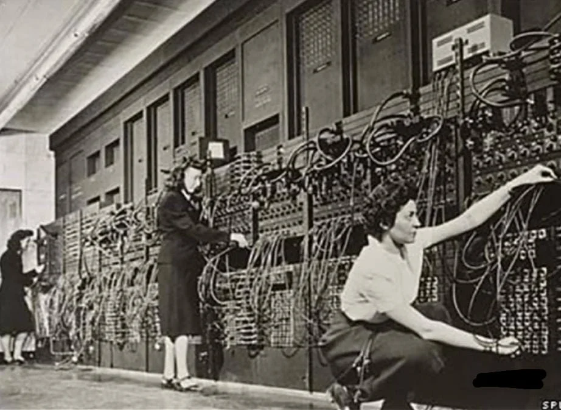

Aunque la ***primera programadora*** de la historia es ***Ada Lovelace***, quien en el siglo XIX ***escribió el primer algoritmo*** destinado a ser procesado por una máquina, específicamente la ***máquina analítica de Charles Babbage***. Ada Lovelace es considerada la ***primera programadora de la historia*** debido a su trabajo ***visionario*** en la informática.

### ⚙️​ Hardware - Partes de una computadora (básico) 
- **Placa base o madre (Motherboard)**: Es la ***tarjeta principal*** que conecta todos los componentes de la computadora, permitiendo la ***comunicación*** entre ellos.

- **CPU (Unidad Central de Procesamiento) o Microprocesador**: Es el ***cerebro*** de la computadora, encargado de ***ejecutar*** las ***instrucciones*** de los programas.

- **Memoria RAM (Memoria de Acceso Aleatorio)**: Es la ***memoria de trabajo*** de la computadora, donde se almacenan ***temporalmente*** los datos y programas que están en uso. Es ***Volátil*** ya que al ***apagar*** la computadora, se ***pierde*** toda la información almacenada en ella.

- **Almacenamiento**: Dispositivos como ***discos duros*** o unidades de estado sólido (***SSD***) que almacenan datos de forma ***permanente***.

- **Periféricos**: Dispositivos ***externos*** como teclados, ratones, monitores, impresoras, etc., que permiten la ***interacción*** con la computadora.
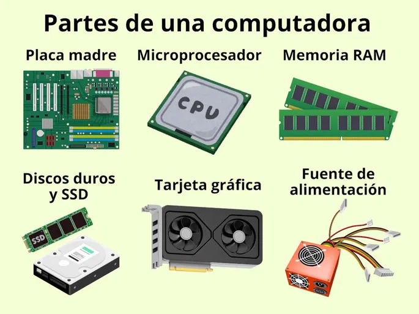

!!! info "[Juego para ver cuánto recuerdan las partes](https://es.educaplay.com/recursos-educativos/3628555-partes_de_la_computadora.html)"

Para que una computadora funcione correctamente, es necesario que todos sus componentes trabajen en ***armonía***. La ***CPU*** procesa las instrucciones, la ***RAM*** almacena los datos temporales, el ***almacenamiento*** guarda la información de forma permanente y los ***periféricos*** permiten la interacción con el usuario.

!!! tip "Un buen ejemplo en vivo de esta armonía se puede observar en ***[Vonsim](https://vonsim.github.io/)***, un simulador de tan sólo un ***CPU*** y una ***RAM***, que permite visualizar cómo funcionan estos componentes en conjunto para ***ejecutar programas***."

!!! example "[Video adicional sobre el funcionamiento avanzado de una computadora](https://www.youtube.com/watch?v=d86ws7mQYIg)"

### 📝​ Software - ¿Qué es un programa?
Un programa es un conjunto de ***instrucciones*** escritas en un ***lenguaje de programación*** que una ***computadora*** puede ***entender*** y ***ejecutar*** para realizar una tarea específica. Los programas pueden variar desde simples ***scripts*** hasta complejas ***aplicaciones*** de software.

#### 🧑‍💻​ Tipos de programas
- **Scripts**: Programas ***simples*** que ***automatizan*** tareas específicas, como scripts de shell, scripts de ***Python***, etc.

- **Sistemas operativos**: Software que ***gestiona los recursos*** de la computadora y proporciona una ***interfaz*** para que los usuarios interactúen con el ***Hardware*** (ej. Windows, macOS, Linux).

- **Aplicaciones**: Programas diseñados para realizar ***tareas específicas*** para el usuario, como procesadores de texto (Word), navegadores web (Google Chrome), juegos, etc. (Tienen una "aplicación" específica para el usuario).

- **Software de desarrollo**: Herramientas utilizadas por los ***programadores*** para escribir, probar y depurar ***código***, como editores de texto, entornos de desarrollo integrado (***IDE***), compiladores, etc.

- **Software de sistema**: Programas que ayudan a ***gestionar*** y ***mantener*** el sistema informático, como antivirus, herramientas de diagnóstico, etc.

### 🧑‍💻​ Lenguajes de programación
Los lenguajes de programación son ***sistemas de comunicación*** de ***alto nivel de abstracción*** que permiten a los programadores ***escribir instrucciones*** que una computadora puede ***entender*** y ***ejecutar***. Existen muchos lenguajes de programación, cada uno con sus propias ***características*** y ***usos específicos***. Algunos de los lenguajes de programación más populares incluyen:

- **Python**: Conocido por su ***sintaxis sencilla*** y su amplia ***biblioteca de módulos***, es utilizado en una variedad de campos, desde el desarrollo web hasta la ciencia de datos y la inteligencia artificial.
!!! tip "[Es el que aprenderemos en el curso](https://github.blog/news-insights/octoverse/octoverse-2024/#the-most-popular-programming-languages)"

- **Java**: Un lenguaje de programación ***orientado a objetos*** que es ampliamente utilizado en el desarrollo de aplicaciones empresariales, aplicaciones móviles y sistemas embebidos.

- **C++**: Un lenguaje de programación de ***alto rendimiento*** que se utiliza en el desarrollo de videojuegos, sistemas operativos y aplicaciones que requieren un control preciso sobre los recursos del sistema.

- **JavaScript**: Un lenguaje de programación que se ejecuta en el ***navegador web*** y se utiliza para crear sitios web interactivos y aplicaciones web.

- **Go**: Un lenguaje de programación desarrollado por ***Google***, conocido por su ***simplicidad*** y su capacidad para manejar ***concurrencia***, lo que lo hace ideal para el desarrollo de aplicaciones de red y ***sistemas distribuidos***.

- **Rust**: Un lenguaje de programación que se centra en la ***seguridad*** y el ***rendimiento***, utilizado en el desarrollo de sistemas y aplicaciones que requieren un alto nivel de seguridad y eficiencia.

- **Swift**: Un lenguaje de programación desarrollado por Apple, utilizado para el desarrollo de aplicaciones para iOS, macOS, watchOS y tvOS.

- **Kotlin**: Un lenguaje de programación que se ejecuta en la máquina virtual de Java (JVM) y es utilizado principalmente para el desarrollo de aplicaciones Android, aunque también se puede usar para el desarrollo de aplicaciones de escritorio y web.

!!! example "[Más información sobre lenguajes de programación](https://mappinggis.com/2025/10/lenguajes-de-programacion-gis/)"

## 0️⃣​1️⃣ ​El lenguaje de las computadoras
Las computadoras no entienden el ***lenguaje humano***, sino que utilizan un lenguaje de ***bajo nivel*** llamado ***lenguaje máquina***, que consiste en una serie de ***códigos binarios*** (0s y 1s) que representan ***instrucciones específicas*** para la computadora. Para facilitar la programación, se utilizan ***lenguajes de alto nivel*** que son más fáciles de entender para los ***humanos***, y luego se ***traducen*** al lenguaje máquina mediante un proceso llamado ***compilación*** o ***interpretación***.

### 🧑‍💻​ Compiladores vs intérpretes
- **Compiladores**: Son programas que ***traducen*** el código fuente de un lenguaje de alto nivel a lenguaje máquina antes de que se ejecute el programa. El resultado es un archivo ejecutable que puede ser ejecutado directamente por la computadora. Ejemplos de lenguajes compilados incluyen C, C++ y Go.

- **Intérpretes**: Son programas que ***ejecutan*** el código fuente de un lenguaje de alto nivel línea por línea, sin necesidad de traducirlo a lenguaje máquina previamente. Esto permite una mayor ***flexibilidad*** y ***facilidad de depuración***, pero puede resultar en un rendimiento más lento en comparación con los programas compilados. Ejemplos de lenguajes interpretados incluyen Python, JavaScript y Ruby.

- **Lenguajes híbridos**: Algunos lenguajes de programación, como Java y C#, utilizan un enfoque híbrido que combina la compilación y la interpretación. El código fuente se compila a un lenguaje intermedio (bytecode) que luego es interpretado por una máquina virtual (JVM para Java, CLR para C#).

!!! tip "¿Me creerían si les dijera que puedo contar hasta 31 con una sola mano?"

### 🧮​ Código Binario
El código binario es el ***sistema de numeración*** que utiliza solo ***dos dígitos***, **0** y **1**, para representar ***información***. En el contexto de las computadoras, cada dígito binario se llama ***bit*** (contracción de "binary" y "digit"). Un grupo de ***8 bits*** forma un ***byte***, que es la ***unidad básica*** de almacenamiento de datos en una computadora. El código binario se utiliza para ***representar*** todo tipo de información, desde números y texto hasta imágenes y sonidos, mediante combinaciones específicas de bits. 

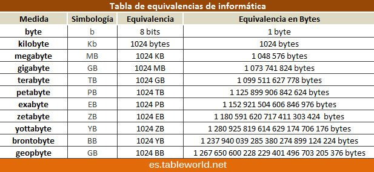
#### 📏​ Regla de conversiones
##### Equivalencias en Bytes
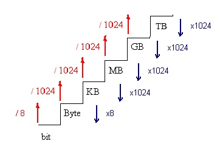

##### Binario a Decimal
!!! info "En el sistema binario, cada dígito representa una potencia de 2. Por ejemplo, el número binario 101 representa (1 * 2^2) + (0 * 2^1) + (1 * 2^0) = 4 + 0 + 1 = 5 en decimal."
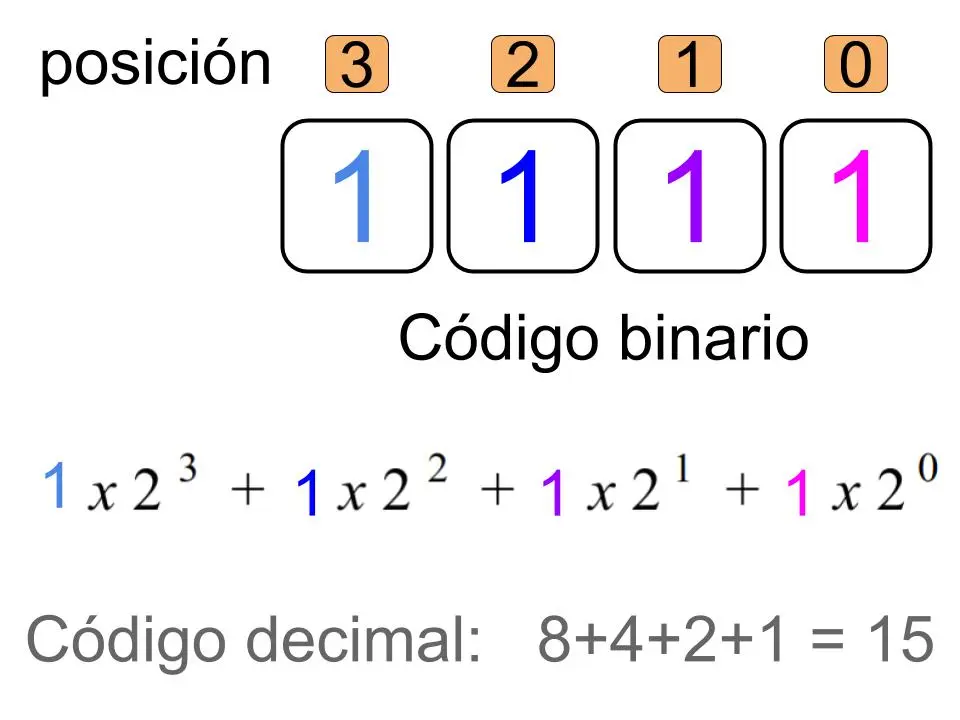
!!! tip "[Poné a prueba tus habilidades binarias](https://learningcontent.cisco.com/games/binary/index.html)"

Por ejemplo, el número decimal 55 se representa en código binario como 110111 (32 + 16 + 4 + 2 + 1), y la letra "A" se representa como 01000001 (65) en [código ASCII](https://elcodigoascii.com.ar/).

##### Decimal a Binario
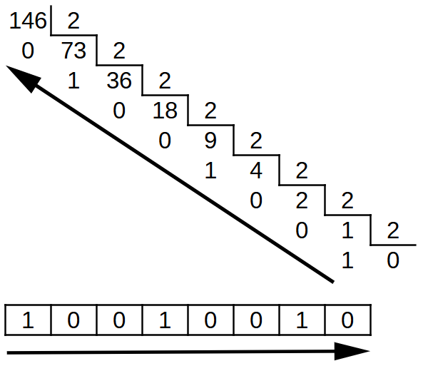

Para convertir un número decimal a binario, se puede utilizar el método de divisiones sucesivas por 2. Por ejemplo, para convertir el número decimal 13 a binario:
1. 13 ÷ 2 = 6, residuo 1
2. 6 ÷ 2 = 3, residuo 0
3. 3 ÷ 2 = 1, residuo 1
4. 1 ÷ 2 = 0, residuo 1
Luego, se leen los residuos de abajo hacia arriba, lo que da como resultado el número binario 1101.

### Código Hexadecimal
El código hexadecimal es un ***sistema de numeración*** que utiliza ***16 símbolos*** (0-9 y A-F) para representar números. Es ampliamente utilizado en programación y sistemas de computación porque proporciona una forma más ***compacta*** y ***legible*** de representar valores ***binarios***. Cada ***dígito*** hexadecimal representa ***cuatro bits***, lo que facilita la ***conversión*** entre sistemas binario y hexadecimal.
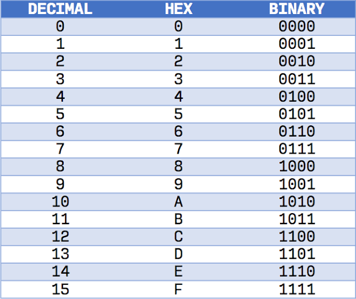

#### Tabla del 00 al 255 en hexadecimal
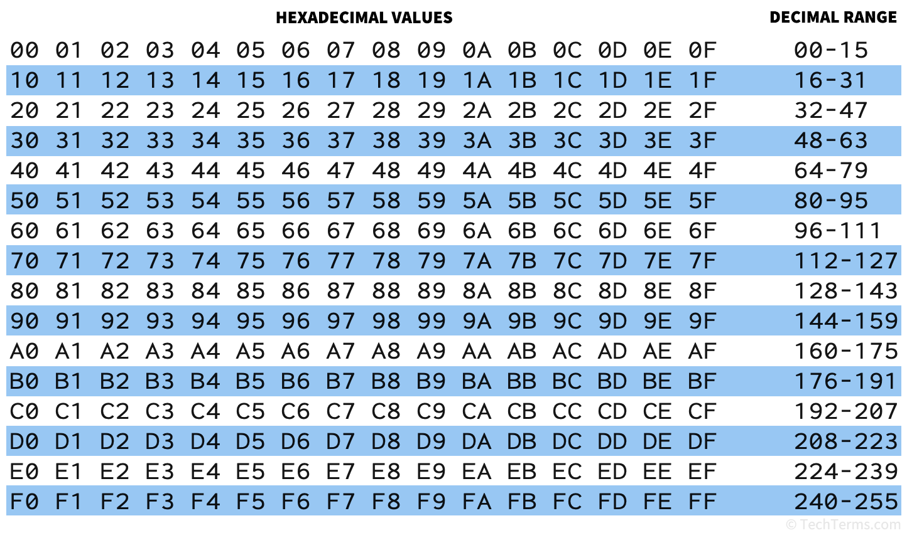

#### Hexadecimal a Binario
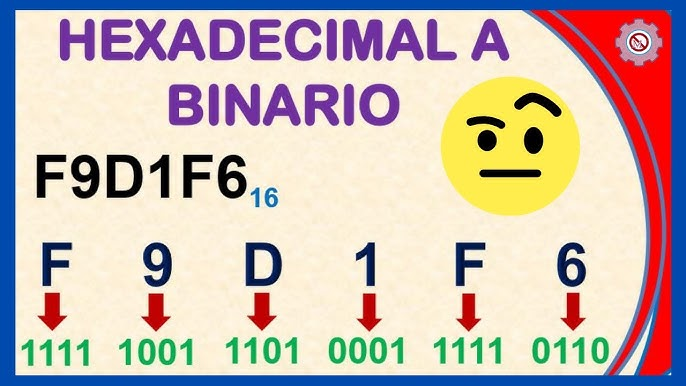

??? "¿Qué número es en Decimal?"
    2^23 + 2^22 + 2^21 + 2^20 + 2^19 + 2^16 + 2^15 + 2^14 + 2^12 + 2^8 + 2^7 + 2^6 + 2^5 + 2^4 + 2^2 + 2^1 =  ***16 372 214***