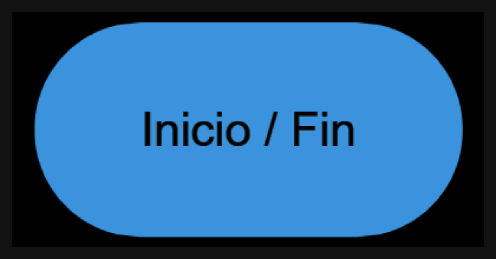
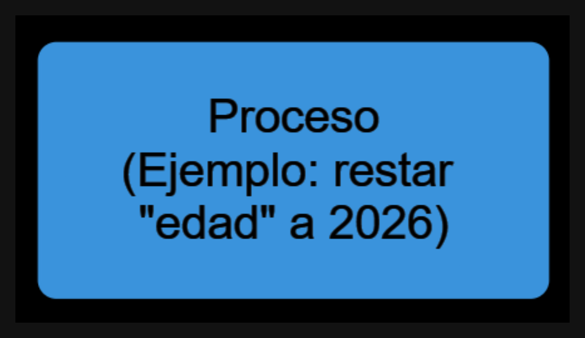
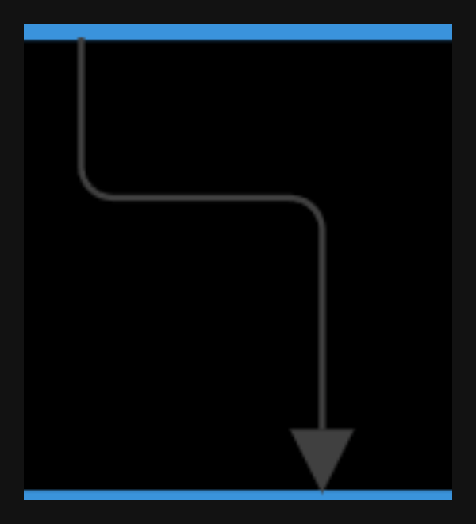
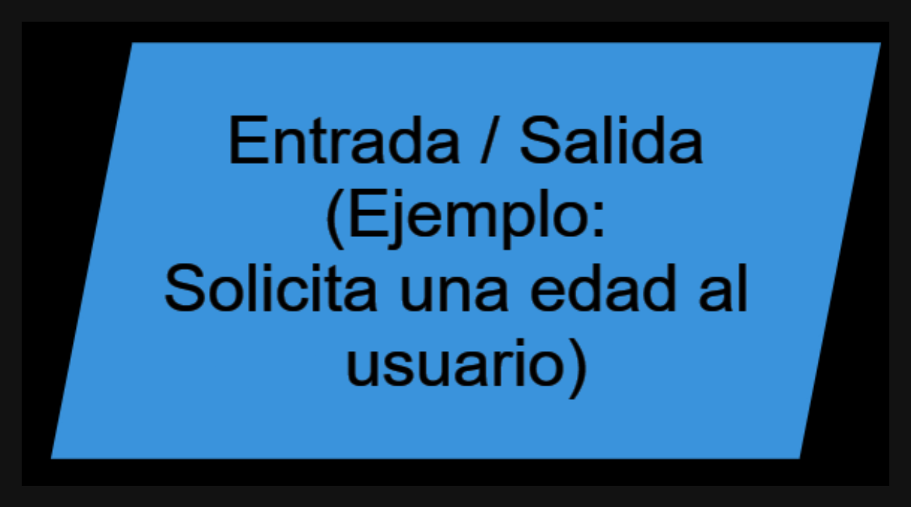
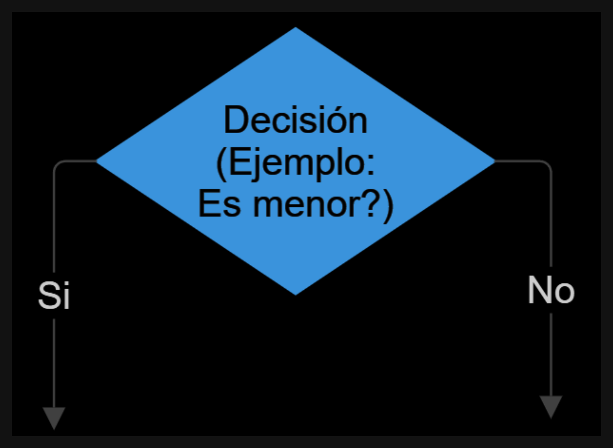
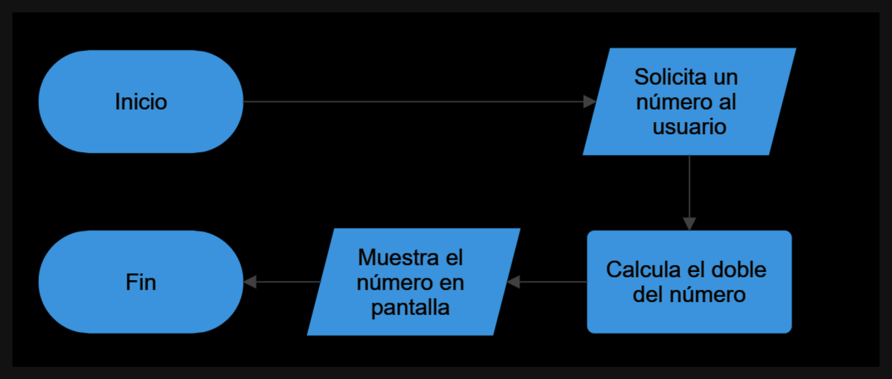
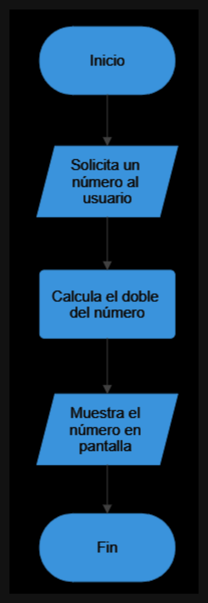
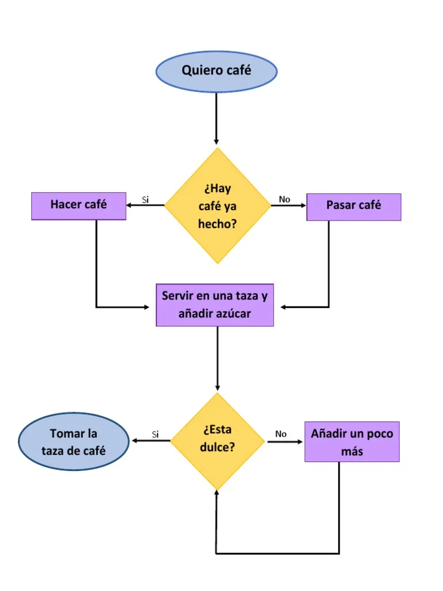

# 🧠 Pensar como una computadora

Antes de aprender un lenguaje de programación, primero necesitamos aprender **cómo piensan las computadoras**.

Las computadoras no entienden ideas generales ni interpretaciones.
Solo pueden seguir **instrucciones claras, precisas y ordenadas**.

Por eso, programar no empieza escribiendo código.
Empieza aprendiendo a **explicar un proceso paso a paso**.

---

## 🧑‍💻 ¿Qué es programar?

Programar es el ***proceso*** de ***diseñar*** y escribir ***algoritmos*** que una computadora puede ***ejecutar*** para realizar tareas específicas.

Es una forma de ***comunicarnos*** con las máquinas para que realicen acciones, procesen datos o ***resuelvan problemas***.

Todos alguna vez programamos, aunque no lo hayamos llamado así.

Por ejemplo:

* Al usar un ***microondas***, le damos instrucciones para calentar la comida.
* Al seguir una ***receta de cocina***, seguimos una serie de pasos ordenados.
* Al explicar ***cómo llegar a un lugar***, describimos una secuencia de acciones.

En todos esos casos estamos describiendo **un procedimiento**.

Eso es exactamente lo que hace un programador.

---

## 🧾 ¿Qué es un algoritmo?

Un **algoritmo** es un ***conjunto*** de instrucciones ***ordenadas***, ***finitas*** y ***no ambiguas*** que describen cómo resolver un problema o realizar una tarea.

Un buen algoritmo tiene tres características importantes:

**Ordenado** 

*Los pasos deben ejecutarse en una secuencia lógica.*

**Finito**

*Debe tener un final. No puede continuar para siempre.*

**Preciso**

*Cada paso debe ser claro y no admitir varias interpretaciones.*

---

### Ejemplo de algoritmo

**Problema:** preparar un mate

Algoritmo:

1. Agarrar un mate
2. Colocar yerba hasta 3/4 del recipiente
3. Calentar agua
4. Insertar la bombilla
5. Verter agua caliente
6. Beber de la bombilla

!!! info "[Video que demuestra la importancia de ser preciso](https://www.youtube.com/shorts/-EnzKSvipqo)"

Este algoritmo describe **una forma posible** de resolver la tarea.

En programación, muchas veces existen **varios algoritmos distintos** para resolver el mismo problema.

---

## ✍️ Ejercicio 1 — Algoritmos de la vida cotidiana

Escribí un algoritmo paso a paso para las siguientes tareas.

Intentá ser lo más **preciso y detallado posible**.

### 1️⃣ Lavarse los dientes

Escribí cada paso necesario desde el principio hasta el final.

---

### 2️⃣ Preparar un sandwich

Incluí todos los pasos necesarios.

---

### 3️⃣ Encender una computadora

Describí el proceso completo.

---

### 4️⃣ Enviar un mensaje de WhatsApp

Pensá cada acción que realiza el usuario.

---

## 🧩 Del algoritmo al pseudocódigo

Cuando los algoritmos se vuelven más complejos, escribirlos en lenguaje natural puede volverse confuso.

Por eso se utiliza **pseudocódigo**.

El pseudocódigo es una forma de escribir algoritmos usando una estructura parecida a la programación, pero **sin depender de un lenguaje específico**.

Es una forma de representar la lógica de un programa de manera clara.

---

### Ejemplo de pseudocódigo

Problema: calcular la edad de una persona.

```
INICIO

leer añoNacimiento

edad = 2026 - añoNacimiento

mostrar edad

FIN
```

En este ejemplo aparecen tres tipos de acciones comunes:

**leer**

*Permite ingresar un dato.*

**mostrar**

*Permite mostrar información al usuario.*

**asignación**

*Permite guardar un valor en una variable.*

```
edad = 2026 - añoNacimiento
```

Esto significa:

> guardar en la variable **edad** el resultado de la operación.

!!! info "Una variable es un espacio de memoria RAM que se utiliza para almacenar datos."

---

## ✍️ Ejercicio 2 — Escribir pseudocódigo

Escribí el pseudocódigo para resolver los siguientes problemas.

---

### 1️⃣ Calcular el doble de un número

El programa debe:

* pedir un número
* calcular su doble
* mostrar el resultado

---

### 2️⃣ Saludar a una persona

El programa debe:

* pedir el nombre
* pedir la edad
* mostrar el mensaje

```
Hola [nombre], tenés [edad] años
```

---

### 3️⃣ Calcular el precio final con IVA

El programa debe:

* pedir el precio de un producto
* calcular el precio final con **21% de IVA**
* mostrar el resultado

---

## 📊 Diagramas de flujo

Otra forma de representar algoritmos es mediante **diagramas de flujo**.

Un diagrama de flujo utiliza **símbolos gráficos** para representar los pasos de un proceso.

Esto permite visualizar el algoritmo de forma más clara.

---

### Símbolos básicos

**Inicio / Fin**

Óvalo



Representa el comienzo o el final del algoritmo.

---

**Proceso**

Rectángulo



Representa una operación o cálculo.

---

**Flujo**

Flecha



Indica la dirección del flujo del algoritmo.

---

**Entrada / Salida**

Paralelogramo



Se utiliza para leer o mostrar datos.

---

**Decisión**

Rombo



Representa una pregunta que puede tener diferentes caminos.

---

### Ejemplo de algoritmo en diagrama de flujo

Problema: calcular el doble de un número.

Pasos del algoritmo:

1. Inicio
2. Leer número
3. Calcular doble
4. Mostrar resultado
5. Fin

Este mismo proceso puede representarse gráficamente mediante un **diagrama de flujo** de esta manera:



??? "Otra forma de organizarlo sería:"
    

??? "Otro ejemplo también válido sería:"
    

---

## ✍️ Ejercicio 3 — Crear diagramas de flujo

Dibujá el diagrama de flujo para los siguientes problemas.
!!! Info "[La aplicación utilizada para los ejemplos anteriores es Smartdraw](https://app.smartdraw.com/?nsu=1)"

---

### 1️⃣ Área de un rectángulo

El programa debe:

* leer base
* leer altura
* calcular área
* mostrar resultado

Recordá:

```
área = base × altura
```

---

### 2️⃣ Conversión de temperatura

Convertir grados Celsius a Fahrenheit.

La fórmula es:

```
F = C × 9 / 5 + 32
```

---

### 3️⃣ Promedio de tres notas

El programa debe:

* leer tres notas
* calcular el promedio
* mostrar el resultado

---

## 🧠 Desafío final

Una tienda necesita calcular el precio total de una compra.

Datos necesarios:

* precio del producto
* cantidad comprada
* IVA del **21%**

El sistema debe calcular el **precio final de la compra**.

Realizá tres representaciones del problema:

### 1️⃣ Algoritmo en pasos

---

### 2️⃣ Pseudocódigo

---

### 3️⃣ Diagrama de flujo

---

## 💡 Concepto importante

Los lenguajes de programación cambian constantemente.

Hoy existen muchos:

* Python
* Java
* C#
* JavaScript
* Kotlin

Pero todos tienen algo en común.

Antes de escribir código, siempre existe un **algoritmo**.

Aprender a programar es, en gran parte, aprender a **pensar los problemas de forma lógica y ordenada**.

Un buen programador no solo sabe escribir código.

También sabe **analizar problemas y transformarlos en pasos claros, eficientes y reutilizables que una máquina pueda ejecutar**.


## 🧠 Ejercicios adicionales

### 1️⃣ Número par o impar

Crear un programa que:

* pida un número al usuario
* determine si el número es **par o impar**
* muestre el resultado

!!! info "Pista conceptual: un número es par si **el resto de dividirlo por 2 es 0**."

---

### 2️⃣ Número mayor

El programa debe:

* pedir **dos números**
* determinar cuál es el **mayor**
* mostrar el resultado

---

### 3️⃣ Calculadora básica

Crear un programa que:

* pida dos números
* calcule:

  * suma
  * resta
  * multiplicación
* muestre los resultados

---

### 4️⃣ Edad de una persona

El programa debe:

* pedir el **año de nacimiento**
* calcular la **edad actual**
* mostrar la edad

---

### 5️⃣ Promedio de cuatro notas

El programa debe:

* pedir **4 notas**
* calcular el **promedio**
* mostrar el resultado

---

### 6️⃣ Conversión de minutos a horas

El programa debe:

* pedir una cantidad de **minutos**
* convertirla a **horas**
* mostrar el resultado

!!! info "Ejemplo: 120 minutos → 2 horas"

---

### 7️⃣ Área de un triángulo

El programa debe:

* pedir **base**
* pedir **altura**
* calcular el área
* mostrar el resultado

!!! info "La fórmula es: Área = (base × altura) / 2"

---

### 8️⃣ Precio total de compra

El programa debe:

* pedir **precio de un producto**
* pedir **cantidad**
* calcular el **total a pagar**
* mostrar el resultado

---

### 9️⃣ Descuento en una compra

El programa debe:

* pedir el **precio de un producto**
* calcular el precio con **10% de descuento**
* mostrar el precio final

---

### 🔟 ¿Es mayor de edad?

Crear un algoritmo que:

* pida la **edad de una persona**
* determine si es **mayor de edad**
* muestre el resultado ("Es mayor de edad" o "No es mayor de edad")

Regla:

Mayor de edad → **18 años o más**
!!! info "(Ayuda para pseudocódigo: mayor -> " > " , menor -> " < ", igual -> " == " )"