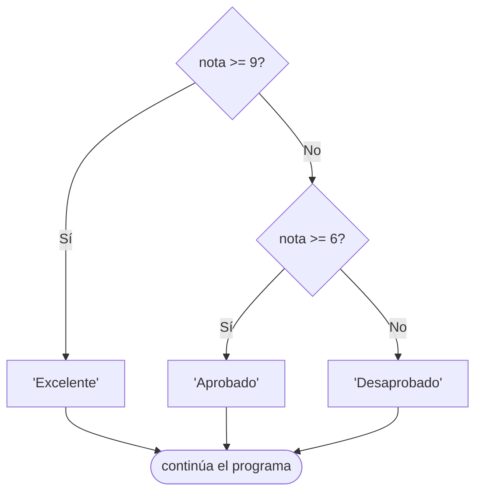

# 🔀 Estructura de control: if, else y elif

Hasta ahora nuestros programas ejecutaban todo en orden…

👉 Pero en la vida real necesitamos tomar decisiones:

- Si llueve → llevo paraguas ☔  
- Si tengo hambre → como 🍕  
- Si apruebo → festejo 🎉  

En programación hacemos lo mismo con **condicionales**

---

## 🧠 ¿Qué es un if?

La estructura `if` nos permite ejecutar código **solo si se cumple una condición**

---

### ✨ Ejemplo básico

```python
edad = 18

if edad >= 18:
    print("Sos mayor de edad")
```

📌 Si la condición es verdadera → se ejecuta el bloque
📌 Si es falsa → no pasa nada

---

## ⚠️ ¡Muy importante! Indentación

Python usa **indentación (espacios)** para definir bloques

```python
if edad >= 18:
    print("Esto está bien")
```

---

### ❌ Error común

```python
if edad >= 18:
print("Esto rompe todo")
```

👉 Esto da error porque falta indentación

---

### 🧠 Regla clave

👉 Todo lo que depende del `if` debe estar **indentado (tab o 4 espacios)**

---

## 🔍 Operadores que usamos en condiciones

```python
>   mayor que
<   menor que
>=  mayor o igual
<=  menor o igual
==  igual
!=  distinto
```

---

### 🧪 Ejemplo con comparación

```python
nota = 7

if nota >= 6:
    print("Aprobado")
```

---

## 🔁 Agregando else

¿Qué pasa si la condición es falsa?

👉 Usamos `else`

---

### ✨ Ejemplo

```python
nota = 4

if nota >= 6:
    print("Aprobado")
else:
    print("Desaprobado")
```

---

## 🧠 ¿Cómo funciona?

* Si el `if` es verdadero → ejecuta ese bloque
* Si no → ejecuta el `else`

👉 Siempre se ejecuta **uno de los dos**

---

## 🔀 Múltiples caminos: elif

Cuando tenemos más de dos opciones usamos `elif`

---

## ✨ Ejemplo

```python
nota = 8

if nota >= 9:
    print("Excelente")
elif nota >= 6:
    print("Aprobado")
else:
    print("Desaprobado")
```

---

## 🧠 Importante

👉 Python evalúa de arriba hacia abajo

👉 Se queda con la **primera condición verdadera**

---

## 🔗 Combinando condiciones

```python
edad = 20
tiene_dni = True

if edad >= 18 and tiene_dni:
    print("Puede votar")
```

### Recordar los Operadores lógicos (repaso de Variables):
```python
x = True
y = False

print(x and y) # True si ambos son True (Y lógico)
print(x or y)  # True si al menos uno es True (Ó lógico)
print(not x)   # False si x es True o True si x es False (NEGACIÓN lógico)
```

---

## ⚠️ Errores comunes

### ❌ Usar = en vez de ==

```python
if edad = 18:  # ERROR
```

✔️ Correcto:

```python
if edad == 18:
```

---

### ❌ Olvidar los :

```python
if edad >= 18   # ERROR
```

✔️ Correcto:

```python
if edad >= 18:
```

---

### ❌ Mala indentación

```python
if edad >= 18:
print("Hola")  # ERROR
```

---

## 🔄 Relación con diagramas de flujo

Un `if` se representa como una decisión con caminos que se ramifican y vuelven a unirse:



👉 Cada rombo es una condición. Cada camino, una rama del `if`/`elif`/`else`.

---

## 🎮 Ejercicios

!!! tip "🧪 Los ejercicios ahora son interactivos"
    Escribís el código, lo ejecutás con **Python de verdad en el navegador** y los tests te dicen al
    instante si está bien. Sin instalar nada: funciona desde la máquina del CFP, desde tu casa y
    desde el celular. Tu avance **se guarda solo**.

    Si te trabás, cada ejercicio tiene pistas — y un botón para mandarme tu código y tu consulta.

    [🚀 Ir a los ejercicios de Condicionales](/pensamiento-computacional-testing-2026/ejercicios/clases/condicionales/){ .md-button .md-button--primary }

## 🧩 Resumen

| Estructura | Cuándo usarla |
|-----------|---------------|
| `if` solo | Cuando querés hacer algo solo si se cumple una condición |
| `if / else` | Cuando hay dos caminos posibles |
| `if / elif / else` | Cuando hay tres o más caminos posibles |
| `and` / `or` / `not` | Para combinar varias condiciones |

---

💡 A partir de ahora tus programas ya pueden "pensar" y tomar decisiones. En la próxima clase vamos a repetir acciones automáticamente con `while`.

---

## [⬅️ Anterior: La función input()](./funcion_input.md)
## [📚 Índice](../clases.md#estructuras-de-control)
## [➡️ Siguiente: While](./while.md)