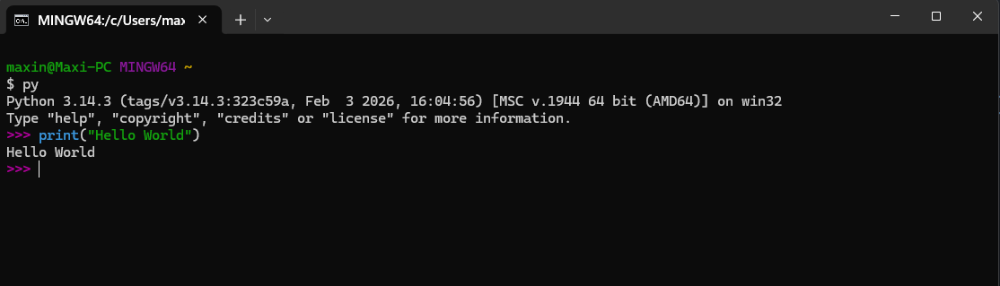
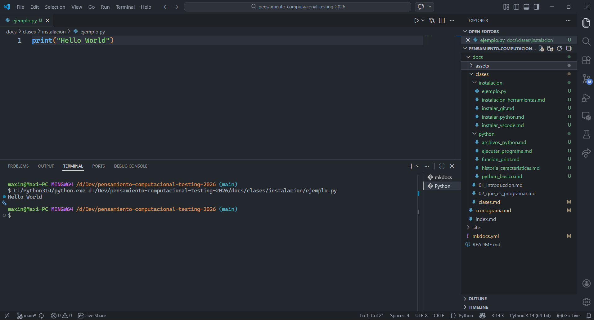
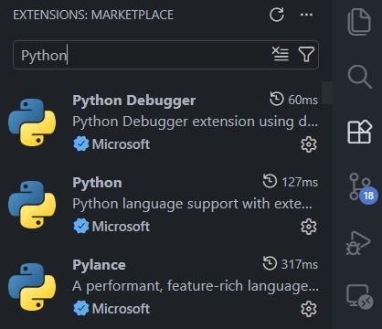

# 💻 Instalando las herramientas

Antes de empezar a programar necesitamos instalar algunas herramientas.
Para programar en Python vamos a necesitar instalar su intérprete y un editor de código:

## 🔗 [Instalar Python](./instalar_python.md)

👉 **Intérprete de Python**

## 🔗 [Instalar Visual Studio Code](./instalar_vscode.md)

👉 **IDE Visual Studio Code (VS Code)**

## ⚙️ Preparación del entorno
### 🔌 Extensiones necesarias

Para trabajar cómodamente con Python en VS Code necesitamos:

* Python (Microsoft)
* Pylance
* Debugger

## [⬅️ Anterior: Historia y características](./historia_caracteristicas.md)
## [📚 Índice](../clases.md#entorno)
## [➡️ Siguiente: Instalando Python](./instalar_python.md)