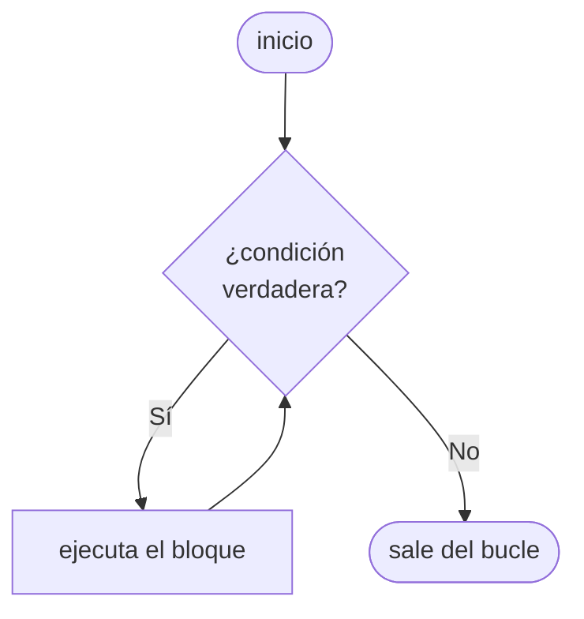

# 🔄 Bucle while en Python

## 🤔 ¿Qué es un bucle?

Hasta ahora, nuestros programas ejecutaban las instrucciones **una sola vez**, de arriba hacia abajo. Pero muchas veces necesitamos **repetir** una acción: pedirle datos al usuario hasta que ingrese algo válido, contar, acumular resultados, etc.

Para eso existen los **bucles** (o *loops*): estructuras que repiten un bloque de código.

!!! info "Primera estructura de repetición"
    En este curso, `while` es el **primer bucle** que vemos. Más adelante conoceremos `for`, que funciona de manera distinta. Por ahora, con `while` tenemos todo lo que necesitamos.

---

## 📖 ¿Cómo funciona el while?

`while` repite un bloque de código **mientras** una condición sea verdadera. Cuando la condición se vuelve falsa, el bucle termina y el programa continúa.



---

## 📝 Sintaxis básica

```python
while condición:
    # bloque que se repite
```

- La `condición` se evalúa **antes de cada iteración**
- El bloque debe estar **indentado** (4 espacios o 1 tab)
- Si la condición empieza siendo falsa, el bloque **nunca se ejecuta**

---

## 🔢 Primer ejemplo: contar

```python
contador = 1

while contador <= 5:
    print(contador)
    contador += 1

print("¡Listo!")
```

```
1
2
3
4
5
¡Listo!
```

!!! warning "¡Cuidado con el bucle infinito!"
    Si olvidamos actualizar la variable (`contador += 1`), la condición nunca se vuelve falsa y el programa **nunca termina**. Esto se llama **bucle infinito** y es uno de los errores más comunes al aprender bucles.

    ```python
    # ❌ Bucle infinito — no hagas esto
    contador = 1
    while contador <= 5:
        print(contador)
        # Falta contador += 1 !
    ```

    Para finalizar un programa que quedó atrapado en un bucle infinito, podés usar `Ctrl + C` en la terminal o cerrar la ventana del programa.
    
---

## 🧩 Partes de un bucle while

Todo bucle `while` bien construido tiene tres componentes:

| Parte | ¿Qué hace? | En el ejemplo |
|---|---|---|
| **Inicialización** | Define la variable de control | `contador = 1` |
| **Condición** | Decide si se repite o no | `contador <= 5` |
| **Actualización** | Modifica la variable para que algún día la condición sea falsa | `contador += 1` |

---

## 📥 while con entrada del usuario

Una de las aplicaciones más útiles: repetir hasta que el usuario ingrese algo válido.

```python
respuesta = ""

while respuesta != "salir":
    respuesta = input("Escribí algo (o 'salir' para terminar): ")
    print(f"Dijiste: {respuesta}")

print("¡Hasta luego!")
```

---

## ⚙️ Acumuladores

Un patrón muy común es usar una variable que **acumula** un valor a lo largo de las iteraciones:

```python
# Sumar números ingresados por el usuario
suma = 0
cantidad = 0

while cantidad < 3:
    numero = float(input("Ingresá un número: "))
    suma += numero
    cantidad += 1

print(f"La suma es: {suma}")
```

!!! tip "El patrón acumulador"
    Inicializá la variable acumuladora en `0` antes del bucle, y dentro del bucle usá `+=` para ir sumando. Este patrón lo vas a ver constantemente en programación.

---

## ⏭️ break y continue

A veces necesitamos más control sobre el flujo del bucle:

```python
# break: sale del bucle inmediatamente, sin importar la condición
numero = 0
while numero < 10:
    if numero == 5:
        break
    print(numero)
    numero += 1
# Imprime: 0 1 2 3 4
```

```python
# continue: saltea el resto de la iteración actual y vuelve a la condición
numero = 0
while numero < 6:
    numero += 1
    if numero == 3:
        continue
    print(numero)
# Imprime: 1 2 4 5 6
```

!!! info "break vs continue"
    - `break` → **sale** del bucle por completo
    - `continue` → **saltea** solo la iteración actual y sigue con la siguiente

---

## 🎮 Ejercicios

!!! tip "🧪 Los ejercicios ahora son interactivos"
    Escribís el código, lo ejecutás con **Python de verdad en el navegador** y los tests te dicen al
    instante si está bien. Sin instalar nada: funciona desde la máquina del CFP, desde tu casa y
    desde el celular. Tu avance **se guarda solo**.

    Si te trabás, cada ejercicio tiene pistas — y un botón para mandarme tu código y tu consulta.

    [🚀 Ir a los ejercicios de Bucles](/pensamiento-computacional-testing-2026/ejercicios/clases/bucles/){ .md-button .md-button--primary }

## [⬅️ Anterior: If / Else](./if_else.md)
## [📚 Índice](../clases.md#estructuras-de-control)
## [➡️ Siguiente: For](./for.md)