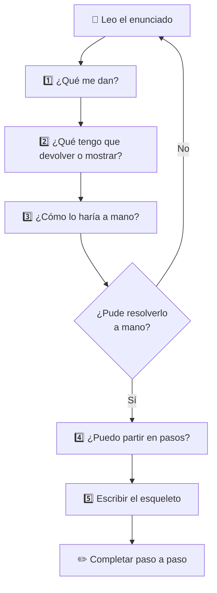

# 🧠 Cómo encarar un ejercicio

!!! warning "El error más común"
    Abrir el editor y empezar a escribir código sin haber entendido bien el problema.
    Resultado: bloqueo, frustración, borrar todo y empezar de nuevo.

    **El antídoto:** hacerse 5 preguntas antes de tocar el teclado.

---

## Los 5 pasos



---

| Paso | Pregunta | Qué buscás |
|------|----------|------------|
| 1 | **¿Qué me dan?** | Tipo y forma de los datos de entrada |
| 2 | **¿Qué tengo que devolver / mostrar?** | Tipo del resultado: número, lista, bool, nada |
| 3 | **¿Cómo lo haría a mano?** | La lógica sin Python, con un ejemplo chico |
| 4 | **¿Puedo partir en pasos?** | Lista de acciones en español, una por línea |
| 5 | **Esqueleto primero** | La firma vacía y las variables iniciales |

> **Regla de oro:** si no podés explicar qué hace tu función en una oración sin usar la palabra "código", todavía no entendiste el problema.

---

## El paso 3 es el más importante

El paso 3 es el que más se saltea y el que más desbloquea. Si no podés resolver el problema con papel y lápiz usando 3 o 4 datos inventados, no tiene sentido abrir el editor — no es un problema de Python, es un problema de lógica todavía sin resolver.

!!! tip "Antes de escribir código, escribí el ejemplo"
    Inventate datos concretos y resolvé el problema a mano. Eso revela exactamente qué operaciones necesitás.

---

## El protocolo en acción

**Enunciado:** Dada una lista de notas, devolvé solo las que están por encima del promedio.

---

**Paso 1 — ¿Qué me dan?**

Una lista de números. Por ejemplo: `[8, 5, 9, 3, 7, 6]`.

**Paso 2 — ¿Qué tengo que devolver?**

Una lista de números (las notas que superan el promedio). Tiene que usar `return`.

**Paso 3 — ¿Cómo lo haría a mano?**

```
notas = [8, 5, 9, 3, 7, 6]

promedio = (8 + 5 + 9 + 3 + 7 + 6) / 6 = 38 / 6 ≈ 6.33

¿Cuáles están por encima de 6.33?  →  8, 9, 7

resultado = [8, 9, 7]
```

**Paso 4 — ¿Puedo partir en pasos?**

```
1. Calcular el promedio de la lista
2. Recorrer cada nota
3. Si la nota es mayor al promedio, guardarla
4. Devolver las guardadas
```

**Paso 5 — Esqueleto:**

```python
def notas_sobre_promedio(notas):
    # 1. calcular promedio
    # 2-3. filtrar
    # 4. return
    pass
```

**Solución:**

```python
def notas_sobre_promedio(notas):
    promedio = sum(notas) / len(notas)
    return [n for n in notas if n > promedio]

print(notas_sobre_promedio([8, 5, 9, 3, 7, 6]))  # [8, 9, 7]
```

!!! success "Lo que acaba de pasar"
    El código casi se escribió solo una vez que los pasos estaban claros. El trabajo real estaba en el paso 3, no en el editor.

---

## El secreto del esqueleto

Con las funciones vacías escritas, el problema deja de verse como algo enorme y se convierte en una lista de tareas concretas. Cada `pass` es una función de 2 o 3 líneas esperando ser completada.

Siempre que algo te parezca demasiado grande, buscá el esqueleto.

---

## 🐛 Cuando el código no hace lo que esperás

Seguiste los 5 pasos, completaste el esqueleto... y el programa da un resultado incorrecto o lanza un error. ¿Ahora qué?

### El error más común al debuggear

Agregar `print()` por todas partes al azar hasta que algo cambie. No es que esté mal — pero sin método terminás con diez prints y más confusión que antes.

### La pregunta correcta

En vez de *"¿por qué no funciona?"*, preguntate:

> **¿En qué momento el valor de esta variable dejó de ser lo que yo esperaba?**

Esa pregunta te lleva directo a la línea con el bug.

### 🖥️ Python Tutor: ejecutá el código en cámara lenta

**[pythontutor.com](https://pythontutor.com)** ejecuta tu código **línea por línea**, mostrando en tiempo real el estado de cada variable y el flujo de ejecución. Es la forma más directa de responder la pregunta de arriba.

**Cómo usarlo:**

1. Entrá a [pythontutor.com](https://pythontutor.com)
2. Pegá el fragmento que falla (no hace falta todo el programa)
3. Hacé clic en **Visualize Execution**
4. Avanzá con **Next ›** y observá qué cambia en cada paso

!!! tip "💡 Qué mirar en cada paso"
    - ¿Las variables tienen el valor que esperabas *en ese momento*?
    - ¿El `if` entra por la rama que pensabas?
    - ¿La función recibe los parámetros correctos?
    - ¿El `for` itera las veces que esperabas?

### ✅ Bugs más frecuentes

| Error | Síntoma | Causa típica |
|-------|---------|--------------|
| `TypeError` al operar | `"5" + 3` falla | `input()` siempre devuelve string — falta convertir con `int()` |
| `IndexError` | "index out of range" | El loop pasa del último índice |
| Función devuelve `None` | La variable queda vacía | Falta el `return` |
| El `if` nunca se cumple | Condición siempre falsa | Comparás con `=` en vez de `==` |
| La lista no cambia | La función no tiene efecto | Modificaste la copia local, no la original |

---

## [⬅️ Anterior: Funciones II](./funciones_2.md)
## [📚 Índice](../clases.md#colecciones)
## [➡️ Siguiente: Repaso General](./repaso.md)
