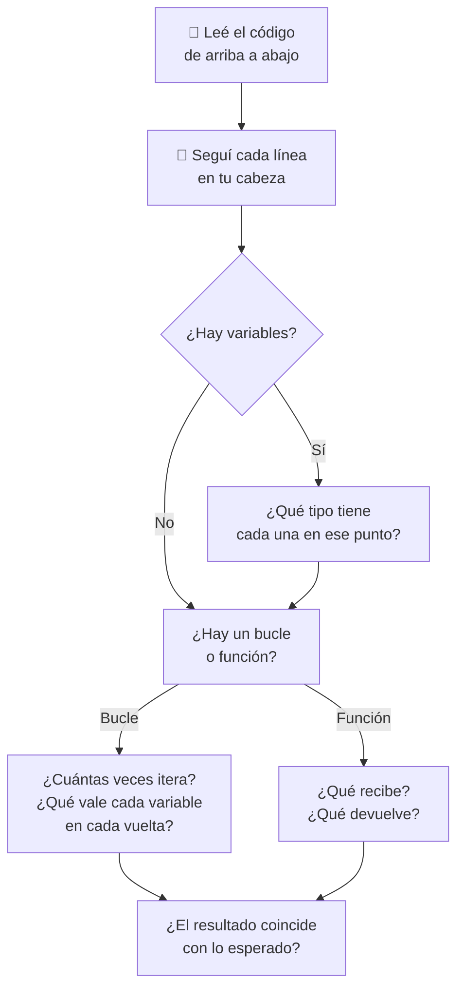

# 🔍 Lectura y corrección de código

!!! example "📬 Te llegó esto por WhatsApp"
    *"Che, mi código no anda. ¿Podés mirar?"*

    No hay mensaje de error. Solo resultados raros. ¿Por dónde empezás?

    Leer código — el tuyo y el de otros — es una habilidad tan importante como escribirlo. Hoy la entrenamos.

!!! info "🎯 Objetivos de la clase"
    Al terminar deberías poder:

    - **Ejecutar código mentalmente** línea por línea, sin computadora.
    - **Identificar el tipo de error** antes de ver el mensaje de Python.
    - **Proponer correcciones concretas** explicando por qué funcionan.
    - Distinguir un error de tipo, de lógica, de scope o de índice.

---

## 🛠️ Cómo leer código ajeno

Antes de los ejercicios, el protocolo:

!!! tip "💡 El truco de la mano"
    Poné el dedo en la línea 1. Avanzá línea a línea, anotando en un papel el valor de cada variable. Si llegás al final y los valores coinciden con lo esperado: no hay error. Si en algún punto algo "no cuadra": ahí está el bug.

---

## 🏷️ Tipos de error frecuentes

| Tipo | Cuándo aparece | Señal |
|------|---------------|-------|
| `TypeError` | Operación entre tipos incompatibles | `"5" + 3`, `None + 1` |
| `IndexError` | Índice fuera del rango de la lista | `lista[10]` en lista de 5 |
| `KeyError` | Clave que no existe en el diccionario | `d["x"]` si `"x"` no está |
| `NameError` | Variable usada antes de ser creada | Typo en nombre de variable |
| **Error de lógica** | No lanza error pero el resultado está mal | Condición invertida, acumulador mal ubicado |
| **Bucle infinito** | El programa nunca termina | Condición del `while` que nunca se vuelve falsa |

---

## 🎮 Ejercicios

!!! tip "🧪 Ahora se señala el error antes de arreglarlo"
    En la plataforma, estos ejercicios funcionan distinto: **primero marcás la línea** donde creés
    que está el problema, y recién si acertás se habilita el arreglo. Así no se puede tantear hasta
    que funcione.

    Ojo: **uno de los diez no tiene ningún error**. 😉

    [🚀 Ir a los ejercicios de Lectura de código](/pensamiento-computacional-testing-2026/ejercicios/clases/lectura-codigo/){ .md-button .md-button--primary }
