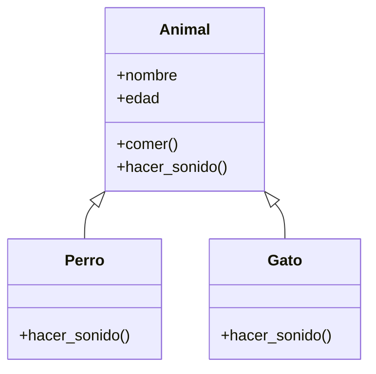

# 🔗 Herencia y polimorfismo

!!! example "🤔 El problema: código repetido entre clases parecidas"
    Querés modelar un `Perro` y un `Gato`. Los dos tienen nombre y edad, los dos comen igual... y solo
    se diferencian en el sonido que hacen.

    ```python
    class Perro:
        def __init__(self, nombre, edad):
            self.nombre = nombre
            self.edad = edad
        def comer(self):
            print(f"{self.nombre} está comiendo")
        def hacer_sonido(self):
            print(f"{self.nombre} dice: ¡Guau!")

    class Gato:
        def __init__(self, nombre, edad):   # 😮‍💨 idéntico al de Perro
            self.nombre = nombre
            self.edad = edad
        def comer(self):                    # 😮‍💨 idéntico al de Perro
            print(f"{self.nombre} está comiendo")
        def hacer_sonido(self):
            print(f"{self.nombre} dice: ¡Miau!")
    ```

    Todo lo que está en común lo escribiste **dos veces**. Si mañana cambia cómo comen, lo tenés que
    cambiar en los dos lados. ¿Y si pudieras escribir lo común **una sola vez** y que cada animal
    "herede" eso? Para eso existe la **herencia**.

!!! info "🎯 Objetivos de la clase"
    Al terminar deberías poder:

    - Hacer que una clase **herede** de otra (`class Hija(Madre)`) y reutilice su código.
    - Usar `super().__init__(...)` para reaprovechar el constructor de la clase madre.
    - **Sobrescribir** (override) un método para que la hija se comporte distinto.
    - Entender el **polimorfismo**: tratar objetos distintos con la misma interfaz.

---

## 🧬 Herencia: heredar para no repetir

La idea: una clase **madre** (o "base") tiene lo común. Las clases **hijas** la heredan y agregan o
cambian lo propio.

```python
class Animal:                      # la clase MADRE (lo común)
    def __init__(self, nombre, edad):
        self.nombre = nombre
        self.edad = edad
    def comer(self):
        print(f"{self.nombre} está comiendo")
    def hacer_sonido(self):
        print(f"{self.nombre} hace un sonido")

class Perro(Animal):               # Perro HEREDA de Animal
    def hacer_sonido(self):        # ...y cambia solo esto
        print(f"{self.nombre} dice: ¡Guau!")

class Gato(Animal):                # Gato también HEREDA de Animal
    def hacer_sonido(self):
        print(f"{self.nombre} dice: ¡Miau!")
```

`class Perro(Animal):` significa *"Perro es un Animal"*. Perro **no escribió** `__init__` ni `comer()`,
pero **los tiene**, porque los heredó:

```python
fido = Perro("Fido", 3)
fido.comer()          # Fido está comiendo   (heredado de Animal)
fido.hacer_sonido()   # Fido dice: ¡Guau!    (propio de Perro)
```

!!! tip "🧠 La pregunta clave: «¿es un…?»"
    Usá herencia cuando podés decir *"X **es un** Y"*: un perro **es un** animal, un gerente **es un**
    empleado, un círculo **es una** figura. Si no podés decir "es un", probablemente no sea herencia.

### Sobrescribir (override)

Cuando la hija define un método que **ya existía** en la madre, el suyo **gana**. Eso es
**sobrescribir**. Arriba, `Perro.hacer_sonido()` pisa al de `Animal`. Lo común se hereda, lo distinto
se sobrescribe.

---

## 🪜 `super()`: reaprovechar el constructor de la madre

¿Y si la hija necesita **un atributo más**? Por ejemplo, un `Perro` con `raza`. No queremos repetir
`self.nombre = nombre`... así que llamamos al constructor de la madre con `super()`:

```python
class Perro(Animal):
    def __init__(self, nombre, edad, raza):
        super().__init__(nombre, edad)   # ← la madre se encarga de nombre y edad
        self.raza = raza                 # ← y nosotros agregamos lo nuevo

fido = Perro("Fido", 3, "Caniche")
print(fido.nombre, fido.raza)   # Fido Caniche
```

`super()` es *"mi clase madre"*. `super().__init__(...)` corre el `__init__` de arriba, así no
repetís lo que ya estaba resuelto.

---

## 📐 El diagrama: la flecha de herencia

En un diagrama de clases, la herencia se dibuja con una **flecha que apunta a la madre**:



La flecha `Perro ──▷ Animal` se lee *"Perro es un Animal"*. `Perro` y `Gato` solo muestran lo que
**agregan o cambian**; todo lo demás lo heredan de `Animal`.

---

## 🎭 Polimorfismo: misma orden, distinta respuesta

**Polimorfismo** (palabra fea, idea simple): objetos **distintos** que responden a la **misma orden**,
cada uno a su manera. Como heredan la misma "interfaz", podés tratarlos a todos por igual:

```python
animales = [Perro("Fido", 3), Gato("Michi", 2), Perro("Rex", 5)]

for animal in animales:
    animal.hacer_sonido()     # ¡no nos importa si es Perro o Gato!
# Fido dice: ¡Guau!
# Michi dice: ¡Miau!
# Rex dice: ¡Guau!
```

El `for` no pregunta *"¿sos perro o gato?"*. Le dice a cada uno `hacer_sonido()` y **cada objeto sabe
qué hacer**. Eso es poderosísimo: podés agregar un `Vaca(Animal)` mañana y este `for` sigue andando
sin tocar una coma.

!!! note "🔌 Otra vez la caja negra"
    El `for` usa cada animal como una **caja negra**: confía en que todos saben `hacer_sonido()`, sin
    importarle el cómo. Herencia + polimorfismo = la forma más elegante de reutilizar código.

---

## 🎮 Ejercicios

!!! tip "🧪 Los ejercicios ahora son interactivos"
    Escribís el código, lo ejecutás con **Python de verdad en el navegador** y los tests te dicen al
    instante si está bien. Sin instalar nada: funciona desde la máquina del CFP, desde tu casa y
    desde el celular. Tu avance **se guarda solo**.

    Si te trabás, cada ejercicio tiene pistas — y un botón para mandarme tu código y tu consulta.

    [🚀 Ir a los ejercicios de Herencia y polimorfismo](/pensamiento-computacional-testing-2026/ejercicios/clases/poo-herencia/){ .md-button .md-button--primary }

## 📌 Cheatsheet

```python
class Madre:
    def __init__(self, x):
        self.x = x
    def saludar(self):
        print("Hola desde la madre")

class Hija(Madre):                   # Hija ES UNA Madre (hereda todo)
    def __init__(self, x, y):
        super().__init__(x)          # reusa el constructor de la madre
        self.y = y
    def saludar(self):               # sobrescribe (override)
        print("Hola desde la hija")

# Polimorfismo: misma orden, distinta respuesta
for obj in [Madre(1), Hija(1, 2)]:
    obj.saludar()
```

---

!!! quote "Para cerrar"
    Con esto **cerrás la parte conceptual de POO**: ya sabés modelar cosas (clases y objetos),
    mostrarlas y protegerlas (`__str__`, encapsulamiento) y reutilizar código entre clases parecidas
    (herencia y polimorfismo). Es **todo lo que necesitás** para el primer proyecto.

    🚀 **Lo que viene**: dejamos la teoría y arrancamos a construir el **Sistema de Asistencias del
    CFP**, juntando POO + archivos + JSON en una app de verdad. ¡Nos vemos ahí!

## [⬅️ Anterior: POO II — Métodos especiales y encapsulamiento](./poo_2.md)
## [📚 Índice](../clases.md)
## ➡️ Siguiente: Sistema de Asistencias del CFP *(próximamente)*
