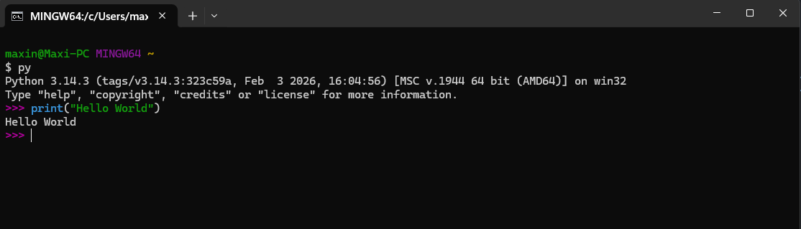
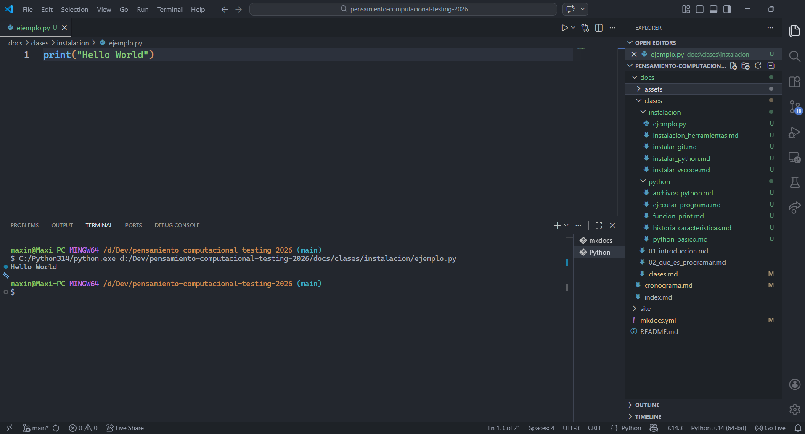
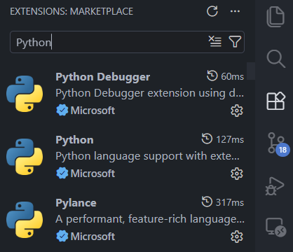

# 💻 Instalando las herramientas

Antes de empezar a programar necesitamos instalar algunas herramientas.
Para programar en Python vamos a necesitar instalar su intérprete y un editor de código:

👉 **Intérprete de Python**

🔗 [Instalar Python](../instalacion/instalar_python.md)

👉 **IDE Visual Studio Code (VS Code)**

🔗 [Instalar Visual Studio Code](../instalacion/instalar_vscode.md)

## ⚙️ Preparación del entorno
### 🔌 Extensiones necesarias

Para trabajar cómodamente con Python en VS Code necesitamos:

* Python (Microsoft)
* Pylance
* Debugger

## [🔙 ​Volver a Python Básico](../python/python_basico.md)