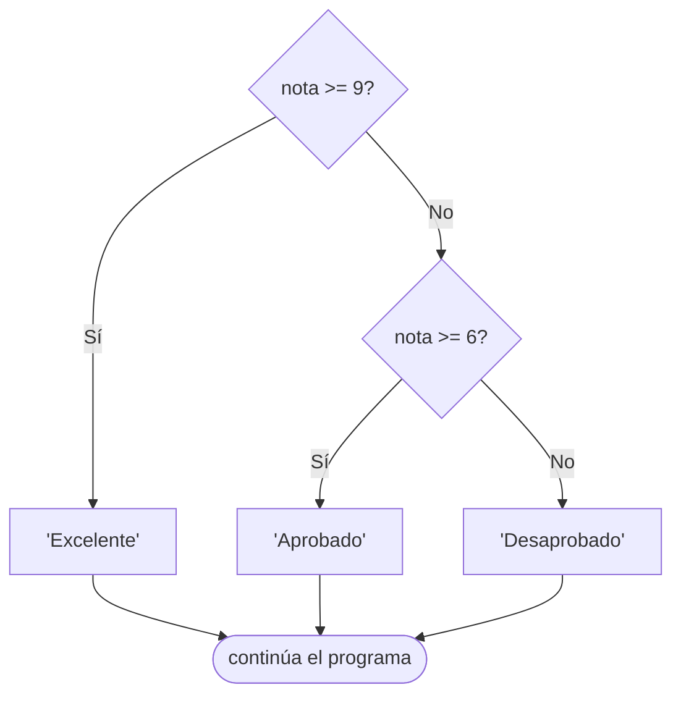

# 🔀 Estructura de control: if, else y elif

Hasta ahora nuestros programas ejecutaban todo en orden…

👉 Pero en la vida real necesitamos tomar decisiones:

- Si llueve → llevo paraguas ☔  
- Si tengo hambre → como 🍕  
- Si apruebo → festejo 🎉  

En programación hacemos lo mismo con **condicionales**

---

## 🧠 ¿Qué es un if?

La estructura `if` nos permite ejecutar código **solo si se cumple una condición**

---

### ✨ Ejemplo básico

```python
edad = 18

if edad >= 18:
    print("Sos mayor de edad")
```

📌 Si la condición es verdadera → se ejecuta el bloque
📌 Si es falsa → no pasa nada

---

## ⚠️ ¡Muy importante! Indentación

Python usa **indentación (espacios)** para definir bloques

```python
if edad >= 18:
    print("Esto está bien")
```

---

### ❌ Error común

```python
if edad >= 18:
print("Esto rompe todo")
```

👉 Esto da error porque falta indentación

---

### 🧠 Regla clave

👉 Todo lo que depende del `if` debe estar **indentado (tab o 4 espacios)**

---

## 🔍 Operadores que usamos en condiciones

```python
>   mayor que
<   menor que
>=  mayor o igual
<=  menor o igual
==  igual
!=  distinto
```

---

### 🧪 Ejemplo con comparación

```python
nota = 7

if nota >= 6:
    print("Aprobado")
```

---

## 🔁 Agregando else

¿Qué pasa si la condición es falsa?

👉 Usamos `else`

---

### ✨ Ejemplo

```python
nota = 4

if nota >= 6:
    print("Aprobado")
else:
    print("Desaprobado")
```

---

## 🧠 ¿Cómo funciona?

* Si el `if` es verdadero → ejecuta ese bloque
* Si no → ejecuta el `else`

👉 Siempre se ejecuta **uno de los dos**

---

## 🔀 Múltiples caminos: elif

Cuando tenemos más de dos opciones usamos `elif`

---

## ✨ Ejemplo

```python
nota = 8

if nota >= 9:
    print("Excelente")
elif nota >= 6:
    print("Aprobado")
else:
    print("Desaprobado")
```

---

## 🧠 Importante

👉 Python evalúa de arriba hacia abajo

👉 Se queda con la **primera condición verdadera**

---

## 🔗 Combinando condiciones

```python
edad = 20
tiene_dni = True

if edad >= 18 and tiene_dni:
    print("Puede votar")
```

### Recordar los Operadores lógicos (repaso de Variables):
```python
x = True
y = False

print(x and y) # True si ambos son True (Y lógico)
print(x or y)  # True si al menos uno es True (Ó lógico)
print(not x)   # False si x es True o True si x es False (NEGACIÓN lógico)
```

---

## ⚠️ Errores comunes

### ❌ Usar = en vez de ==

```python
if edad = 18:  # ERROR
```

✔️ Correcto:

```python
if edad == 18:
```

---

### ❌ Olvidar los :

```python
if edad >= 18   # ERROR
```

✔️ Correcto:

```python
if edad >= 18:
```

---

### ❌ Mala indentación

```python
if edad >= 18:
print("Hola")  # ERROR
```

---

## 🔄 Relación con diagramas de flujo

Un `if` se representa como una decisión con caminos que se ramifican y vuelven a unirse:



👉 Cada rombo es una condición. Cada camino, una rama del `if`/`elif`/`else`.

---

## 🎮 Ejercicios

### 🌱 Ejercicio 1 — Mayor de edad

Pedile la edad al usuario y mostrá si es mayor de edad.

```
¿Cuántos años tenés? 20
✅ Sos mayor de edad.

¿Cuántos años tenés? 15
❌ Sos menor de edad.
```

??? tip "💡 Pista"
    ¿Cuál es la condición que separa los mayores de edad de los menores? Escribí primero el `if`, luego el `else`.

??? success "✅ Solución"
    ```python
    edad = int(input("¿Cuántos años tenés? "))
    if edad >= 18:
        print("✅ Sos mayor de edad.")
    else:
        print("❌ Sos menor de edad.")
    ```

### 🌱 Ejercicio 2 — Positivo, negativo o cero

Pedile un número al usuario y mostrá si es positivo, negativo o cero.

```
Ingresá un número: -5
❌ Es negativo.

Ingresá un número: 0
Es cero.
```

??? tip "💡 Pista"
    Hay tres casos distintos. ¿Cuántas ramas necesitás para cubrirlos?

??? success "✅ Solución"
    ```python
    n = float(input("Ingresá un número: "))
    if n > 0:
        print("✅ Es positivo.")
    elif n < 0:
        print("❌ Es negativo.")
    else:
        print("Es cero.")
    ```

### 🌱 Ejercicio 3 — Nota aprobada

Pedile una nota al usuario y mostrá si aprobó (>= 6) o no.

```
Ingresá tu nota: 7
✅ Aprobado.

Ingresá tu nota: 4
❌ Desaprobado.
```

??? tip "💡 Pista"
    Solo hay dos casos. Un `if` y un `else` alcanzan.

??? success "✅ Solución"
    ```python
    nota = float(input("Ingresá tu nota: "))
    if nota >= 6:
        print("✅ Aprobado.")
    else:
        print("❌ Desaprobado.")
    ```

### 🌱 Ejercicio 4 — El mayor de dos

Pedile dos números al usuario y mostrá cuál es el mayor (o si son iguales).

```
Primer número: 8
Segundo número: 3
El mayor es: 8
```

??? tip "💡 Pista"
    Hay tres posibilidades: el primero es mayor, el segundo es mayor, o son iguales. ¿Con qué operadores comparás?

??? success "✅ Solución"
    ```python
    a = float(input("Primer número: "))
    b = float(input("Segundo número: "))
    if a > b:
        print(f"El mayor es: {a}")
    elif b > a:
        print(f"El mayor es: {b}")
    else:
        print("Son iguales.")
    ```

### 🌱 Ejercicio 5 — Par o impar

Pedile un número y mostrá si es par o impar.

```
Ingresá un número: 7
7 es impar.

Ingresá un número: 4
4 es par.
```

??? tip "💡 Pista"
    Un número es par si el resto de dividirlo por 2 es 0. ¿Qué operador te da el resto de una división?

??? success "✅ Solución"
    ```python
    n = int(input("Ingresá un número: "))
    if n % 2 == 0:
        print(f"{n} es par.")
    else:
        print(f"{n} es impar.")
    ```

### 🌱 Ejercicio 6 — Frío o calor

Pedile una temperatura y decí si hace frío (< 15°C), templado (15–25°C) o calor (> 25°C).

```
Temperatura: 12
🥶 Hace frío.

Temperatura: 30
🥵 Hace calor.
```

??? tip "💡 Pista"
    Tres rangos → dos `elif` o un `if`/`elif`/`else`. ¿En qué orden conviene escribir las condiciones?

??? success "✅ Solución"
    ```python
    temp = float(input("Temperatura: "))
    if temp < 15:
        print("🥶 Hace frío.")
    elif temp <= 25:
        print("🌤️ Templado.")
    else:
        print("🥵 Hace calor.")
    ```

### 🌿 Ejercicio 7 — Verificar contraseña

El programa tiene una contraseña hardcodeada. Pedíle al usuario que la ingrese y mostrá si es correcta o no.

```
Contraseña: hola
❌ Contraseña incorrecta.

Contraseña: python123
✅ Acceso concedido.
```

??? tip "💡 Pista"
    Definí la contraseña como una variable al principio. ¿Con qué operador comparás dos strings?

??? success "✅ Solución"
    ```python
    CONTRASENA = "python123"
    ingresada = input("Contraseña: ")
    if ingresada == CONTRASENA:
        print("✅ Acceso concedido.")
    else:
        print("❌ Contraseña incorrecta.")
    ```

### 🌿 Ejercicio 8 — Mayor que 10

Pedile un número y decí si es mayor que 10, igual a 10, o menor.

```
Número: 10
El número es exactamente 10.

Número: 15
El número es mayor que 10.
```

??? tip "💡 Pista"
    La condición de igualdad exacta conviene chequearla primero (con `==`). Luego el mayor, luego el menor.

??? success "✅ Solución"
    ```python
    n = float(input("Número: "))
    if n == 10:
        print("El número es exactamente 10.")
    elif n > 10:
        print("El número es mayor que 10.")
    else:
        print("El número es menor que 10.")
    ```

### 🌿 Ejercicio 9 — Boletín con promedio

Pedí tres notas, calculá el promedio y mostrá:

- `"Promociona"` si el promedio es >= 8
- `"Aprueba"` si el promedio es >= 6
- `"Recupera"` si el promedio es < 6

```
Nota 1: 8
Nota 2: 9
Nota 3: 7
Promedio: 8.0
🏆 Promociona
```

??? tip "💡 Pista"
    Primero calculá el promedio de las tres notas. Luego usá `if/elif/else` para clasificar según el resultado.

??? success "✅ Solución"
    ```python
    n1 = float(input("Nota 1: "))
    n2 = float(input("Nota 2: "))
    n3 = float(input("Nota 3: "))
    promedio = (n1 + n2 + n3) / 3
    print(f"Promedio: {promedio:.1f}")
    if promedio >= 8:
        print("🏆 Promociona")
    elif promedio >= 6:
        print("✅ Aprueba")
    else:
        print("❌ Recupera")
    ```

### 🌿 Ejercicio 10 — Entre 1 y 100

Pedile un número y decí si está dentro del rango 1–100 (inclusive) o fuera.

```
Número: 50
✅ Está entre 1 y 100.

Número: 0
❌ Está fuera del rango.
```

??? tip "💡 Pista"
    Necesitás una condición que verifique dos cosas a la vez: ¿qué operador lógico usás para que ambas deban ser verdaderas?

??? success "✅ Solución"
    ```python
    n = float(input("Número: "))
    if 1 <= n <= 100:
        print("✅ Está entre 1 y 100.")
    else:
        print("❌ Está fuera del rango.")
    ```

### 🌶️ Desafío — ¿Podés conducir?

Creá un programa que pida la edad y si tiene licencia (`"si"` o `"no"`). Mostrá si puede conducir y, si no puede, explicá el motivo.

```
Edad: 17
¿Tenés licencia? (si/no): si
❌ No podés conducir: sos menor de edad.

Edad: 25
¿Tenés licencia? (si/no): no
❌ No podés conducir: no tenés licencia.

Edad: 22
¿Tenés licencia? (si/no): si
✅ Podés conducir.
```

??? tip "💡 Pista"
    Para poder conducir deben cumplirse dos condiciones a la vez. Si no se puede, ¿cómo distinguís cuál de las dos falló?

??? success "✅ Solución"
    ```python
    edad    = int(input("Edad: "))
    licencia = input("¿Tenés licencia? (si/no): ").lower()

    if edad >= 18 and licencia == "si":
        print("✅ Podés conducir.")
    elif edad < 18:
        print("❌ No podés conducir: sos menor de edad.")
    else:
        print("❌ No podés conducir: no tenés licencia.")
    ```

---

## 🧩 Resumen

| Estructura | Cuándo usarla |
|-----------|---------------|
| `if` solo | Cuando querés hacer algo solo si se cumple una condición |
| `if / else` | Cuando hay dos caminos posibles |
| `if / elif / else` | Cuando hay tres o más caminos posibles |
| `and` / `or` / `not` | Para combinar varias condiciones |

---

💡 A partir de ahora tus programas ya pueden "pensar" y tomar decisiones. En la próxima clase vamos a repetir acciones automáticamente con `while`.

---

## [⬅️ Anterior: La función input()](../02_variables_y_tipos/funcion_input.md)
## [📚 Índice](../../clases.md#estructuras-de-control)
## [➡️ Siguiente: While](./while.md)