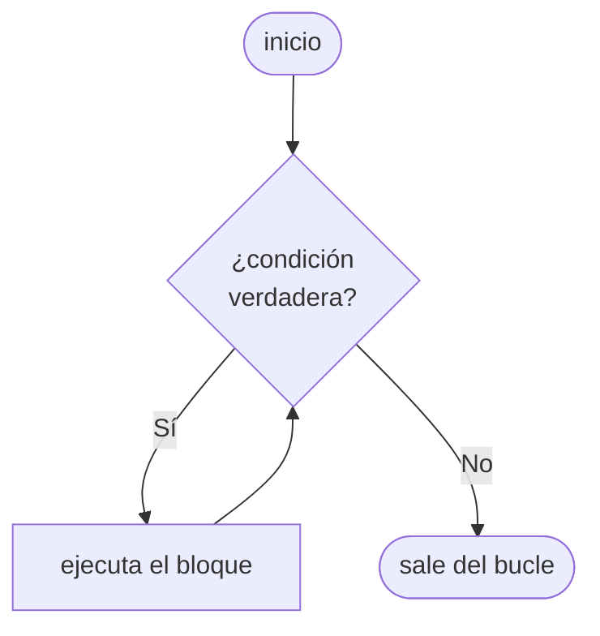

# 🔄 Bucle while en Python

## 🤔 ¿Qué es un bucle?

Hasta ahora, nuestros programas ejecutaban las instrucciones **una sola vez**, de arriba hacia abajo. Pero muchas veces necesitamos **repetir** una acción: pedirle datos al usuario hasta que ingrese algo válido, contar, acumular resultados, etc.

Para eso existen los **bucles** (o *loops*): estructuras que repiten un bloque de código.

!!! info "Primera estructura de repetición"
    En este curso, `while` es el **primer bucle** que vemos. Más adelante conoceremos `for`, que funciona de manera distinta. Por ahora, con `while` tenemos todo lo que necesitamos.

---

## 📖 ¿Cómo funciona el while?

`while` repite un bloque de código **mientras** una condición sea verdadera. Cuando la condición se vuelve falsa, el bucle termina y el programa continúa.



---

## 📝 Sintaxis básica

```python
while condición:
    # bloque que se repite
```

- La `condición` se evalúa **antes de cada iteración**
- El bloque debe estar **indentado** (4 espacios o 1 tab)
- Si la condición empieza siendo falsa, el bloque **nunca se ejecuta**

---

## 🔢 Primer ejemplo: contar

```python
contador = 1

while contador <= 5:
    print(contador)
    contador += 1

print("¡Listo!")
```

```
1
2
3
4
5
¡Listo!
```

!!! warning "¡Cuidado con el bucle infinito!"
    Si olvidamos actualizar la variable (`contador += 1`), la condición nunca se vuelve falsa y el programa **nunca termina**. Esto se llama **bucle infinito** y es uno de los errores más comunes al aprender bucles.

    ```python
    # ❌ Bucle infinito — no hagas esto
    contador = 1
    while contador <= 5:
        print(contador)
        # Falta contador += 1 !
    ```

    Para finalizar un programa que quedó atrapado en un bucle infinito, podés usar `Ctrl + C` en la terminal o cerrar la ventana del programa.
    
---

## 🧩 Partes de un bucle while

Todo bucle `while` bien construido tiene tres componentes:

| Parte | ¿Qué hace? | En el ejemplo |
|---|---|---|
| **Inicialización** | Define la variable de control | `contador = 1` |
| **Condición** | Decide si se repite o no | `contador <= 5` |
| **Actualización** | Modifica la variable para que algún día la condición sea falsa | `contador += 1` |

---

## 📥 while con entrada del usuario

Una de las aplicaciones más útiles: repetir hasta que el usuario ingrese algo válido.

```python
respuesta = ""

while respuesta != "salir":
    respuesta = input("Escribí algo (o 'salir' para terminar): ")
    print(f"Dijiste: {respuesta}")

print("¡Hasta luego!")
```

---

## ⚙️ Acumuladores

Un patrón muy común es usar una variable que **acumula** un valor a lo largo de las iteraciones:

```python
# Sumar números ingresados por el usuario
suma = 0
cantidad = 0

while cantidad < 3:
    numero = float(input("Ingresá un número: "))
    suma += numero
    cantidad += 1

print(f"La suma es: {suma}")
```

!!! tip "El patrón acumulador"
    Inicializá la variable acumuladora en `0` antes del bucle, y dentro del bucle usá `+=` para ir sumando. Este patrón lo vas a ver constantemente en programación.

---

## ⏭️ break y continue

A veces necesitamos más control sobre el flujo del bucle:

```python
# break: sale del bucle inmediatamente, sin importar la condición
numero = 0
while numero < 10:
    if numero == 5:
        break
    print(numero)
    numero += 1
# Imprime: 0 1 2 3 4
```

```python
# continue: saltea el resto de la iteración actual y vuelve a la condición
numero = 0
while numero < 6:
    numero += 1
    if numero == 3:
        continue
    print(numero)
# Imprime: 1 2 4 5 6
```

!!! info "break vs continue"
    - `break` → **sale** del bucle por completo
    - `continue` → **saltea** solo la iteración actual y sigue con la siguiente

---

## 🎮 Ejercicios

### 🌱 Ejercicio 1 — Del 1 al 10

Escribí un programa que imprima los números del 1 al 10 usando `while`.

```
1
2
...
10
```

??? tip "💡 Pista"
    Necesitás una variable que arranque en 1, una condición que la compare con 10, y una actualización que la incremente.

??? success "✅ Solución"
    ```python
    i = 1
    while i <= 10:
        print(i)
        i += 1
    ```

### 🌱 Ejercicio 2 — Cuenta regresiva

Escribí un programa que imprima la cuenta regresiva del 10 al 1 y al final imprima `"¡Despegue!"`.

```
10
9
...
1
¡Despegue!
```

??? tip "💡 Pista"
    Esta vez la variable empieza alta y debe *decrementarse* con `-= 1`. ¿Cuál es la condición para seguir?

??? success "✅ Solución"
    ```python
    i = 10
    while i >= 1:
        print(i)
        i -= 1
    print("¡Despegue!")
    ```

### 🌱 Ejercicio 3 — Pares hasta N

Pedile al usuario un número y mostrá todos los números **pares** desde 0 hasta ese número.

```
Ingresá un número: 10
0
2
4
6
8
10
```

??? tip "💡 Pista"
    Podés empezar en 0 e incrementar de 2 en 2. O empezar en 0 e incrementar de 1 en 1, con un `if` adentro.

??? success "✅ Solución"
    ```python
    n = int(input("Ingresá un número: "))
    i = 0
    while i <= n:
        print(i)
        i += 2
    ```

### 🌿 Ejercicio 4 — Suma del 1 al 100

Escribí un programa que sume todos los números del 1 al 100 e imprima el resultado.

```
5050
```

??? tip "💡 Pista"
    Necesitás dos variables: un contador que va del 1 al 100, y un acumulador que empieza en 0 y suma el contador en cada vuelta.

??? success "✅ Solución"
    ```python
    suma = 0
    i = 1
    while i <= 100:
        suma += i
        i += 1
    print(suma)
    ```

### 🌿 Ejercicio 5 — Suma hasta el cero

Pedile números al usuario **hasta que ingrese un 0**. Al final, mostrá cuántos números ingresó (sin contar el 0) y la suma de todos ellos.

```
Ingresá un número (0 para terminar): 5
Ingresá un número (0 para terminar): 3
Ingresá un número (0 para terminar): 8
Ingresá un número (0 para terminar): 0
Ingresaste 3 números. Suma: 16
```

??? tip "💡 Pista"
    Pedí el primer número antes del `while`. La condición del bucle es que el número sea distinto de 0. Al final del cuerpo del bucle, pedí el siguiente número.

??? success "✅ Solución"
    ```python
    suma = 0
    cantidad = 0
    numero = int(input("Ingresá un número (0 para terminar): "))
    while numero != 0:
        suma += numero
        cantidad += 1
        numero = int(input("Ingresá un número (0 para terminar): "))
    print(f"Ingresaste {cantidad} números. Suma: {suma}")
    ```

### 🌿 Ejercicio 6 — Cajero automático

Simulá un cajero automático simple: el usuario empieza con $1000 de saldo. En cada iteración le preguntás cuánto quiere retirar. El programa termina cuando el saldo llega a 0 o el usuario ingresa un monto mayor al saldo disponible.

```
Saldo disponible: $1000
¿Cuánto querés retirar? 400
Retiro exitoso. Saldo restante: $600
Saldo disponible: $600
¿Cuánto querés retirar? 700
Saldo insuficiente. Operación cancelada.
Gracias por usar el cajero.
```

??? tip "💡 Pista"
    La condición del `while` es que haya saldo. Dentro del bucle, si el retiro es mayor al saldo, usá `break` para salir. Si no, restá el monto.

??? success "✅ Solución"
    ```python
    saldo = 1000
    while saldo > 0:
        print(f"Saldo disponible: ${saldo}")
        retiro = int(input("¿Cuánto querés retirar? "))
        if retiro > saldo:
            print("Saldo insuficiente. Operación cancelada.")
            break
        saldo -= retiro
        print(f"Retiro exitoso. Saldo restante: ${saldo}")
    print("Gracias por usar el cajero.")
    ```

### 🌶️ Ejercicio 7 — Adiviná el número ⭐

Implementá el juego **"Adiviná el número"**: el programa usa un número fijo entre 1 y 100 (hardcodealo), y el usuario tiene que adivinarlo. En cada intento le decís si el número secreto es mayor o menor. Contá cuántos intentos necesitó.

```
Adiviná el número (1-100): 50
El número secreto es menor.
Adiviná el número (1-100): 25
El número secreto es mayor.
Adiviná el número (1-100): 42
¡Correcto! Lo adivinaste en 3 intentos.
```

??? tip "💡 Pista"
    El bucle corre mientras no se adivine. Dentro, pedís el intento, incrementás el contador, y comparás con el secreto. Necesitás una variable booleana para saber si ya adivinaron.

??? success "✅ Solución"
    ```python
    secreto   = 42
    intentos  = 0
    adivinado = False

    while not adivinado:
        intento = int(input("Adiviná el número (1-100): "))
        intentos += 1
        if intento < secreto:
            print("El número secreto es mayor.")
        elif intento > secreto:
            print("El número secreto es menor.")
        else:
            adivinado = True

    print(f"¡Correcto! Lo adivinaste en {intentos} intentos.")
    ```

### 🌶️ Ejercicio 8 — Estadísticas de notas ⭐

Pedile al usuario que ingrese notas (de 0 a 10) **hasta que ingrese -1**. Al final mostrá:

- La cantidad de notas ingresadas
- El promedio
- La nota más alta y la más baja

```
Ingresá una nota (-1 para terminar): 8
Ingresá una nota (-1 para terminar): 5
Ingresá una nota (-1 para terminar): 9
Ingresá una nota (-1 para terminar): -1
Cantidad: 3
Promedio: 7.33
Nota más alta: 9.0
Nota más baja: 5.0
```

??? tip "💡 Pista"
    Además del acumulador para el promedio, necesitás dos variables para el máximo y el mínimo. ¿Con qué valor inicial las ponés para que la primera nota siempre las actualice? Acordate de manejar el caso donde no se ingresó ninguna nota.

??? success "✅ Solución"
    ```python
    cantidad = 0
    suma   = 0
    mayor  = -1   # cualquier nota válida va a ser mayor
    menor  = 11   # cualquier nota válida va a ser menor

    nota = float(input("Ingresá una nota (-1 para terminar): "))
    while nota != -1:
        cantidad += 1
        suma     += nota
        if nota > mayor: mayor = nota
        if nota < menor: menor = nota
        nota = float(input("Ingresá una nota (-1 para terminar): "))

    if cantidad > 0:
        print(f"Cantidad: {cantidad}")
        print(f"Promedio: {suma / cantidad:.2f}")
        print(f"Nota más alta: {mayor}")
        print(f"Nota más baja: {menor}")
    else:
        print("No ingresaste ninguna nota.")
    ```

## [⬅️ Anterior: If / Else](./if_else.md)
## [📚 Índice](../../clases.md#estructuras-de-control)
## [➡️ Siguiente: For](./for.md)