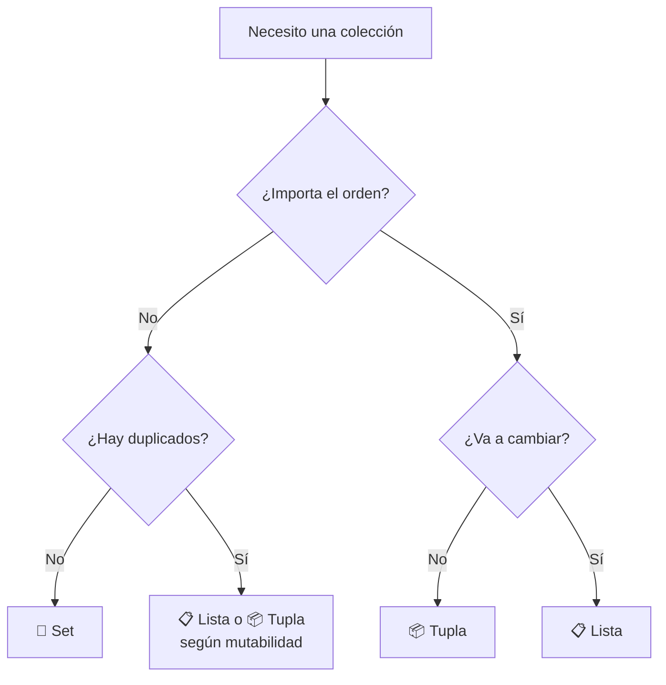

# 🎲 Tuplas y Sets

!!! example "🤔 Dos problemas que las listas no resuelven bien"

    ```python
    # Problema 1: coordenadas que NO deberían poder cambiar
    ubicacion = [-34.6, -58.4]  # Buenos Aires
    ubicacion[0] = 9999          # 😬 nadie lo previno...

    # Problema 2: lista de votos con repetidos — solo quiero los únicos
    votos = ["Ana", "Beto", "Ana", "Cami", "Ana"]
    # Para saber cuántos votantes distintos hay, habría que filtrar manualmente
    ```

    Las **tuplas** resuelven el primero: datos que no deberían cambiar.
    Los **sets** resuelven el segundo: colecciones sin duplicados.

!!! tip "🧬 Bienvenidos al universo de las colecciones"
    Ya conocemos las **listas**: colecciones ordenadas y modificables que pueden contener cualquier cosa. Pero Python tiene más herramientas en el arsenal de colecciones, y cada una está optimizada para un propósito distinto. Hoy vamos a sumar dos primas hermanas de la lista al toolkit:

    - 📦 **Tuplas**: como listas, pero **inmutables**. Sirven para datos que no deben cambiar.
    - 🧮 **Sets**: colecciones **sin orden** y **sin duplicados**. Sirven para verificar pertenencia y operaciones de conjuntos.

!!! info "🎯 Objetivos de la clase"
    Al terminar la clase deberían poder:

    - Explicar **qué es la inmutabilidad** y por qué importa.
    - Crear, recorrer y operar con **tuplas** y **sets**.
    - Saber **cuándo usar cada colección** (lista, tupla, set) según el problema.
    - Aplicar **operaciones de conjuntos** (unión, intersección, diferencia) para resolver problemas reales.

---

## 📚 El panorama de colecciones en Python

Antes de meternos en tuplas y sets, ubiquémonos. Python tiene **cuatro colecciones built-in** principales:

| Colección | Sintaxis | ¿Ordenada? | ¿Modificable? | ¿Permite duplicados? |
|-----------|----------|------------|---------------|----------------------|
| **Lista** 📋 | `[1, 2, 3]` | ✅ Sí | ✅ Sí | ✅ Sí |
| **Tupla** 📦 | `(1, 2, 3)` | ✅ Sí | ❌ **No** | ✅ Sí |
| **Set** 🧮 | `{1, 2, 3}` | ❌ No | ✅ Sí | ❌ **No** |
| **Diccionario** 🗝️ | `{"a": 1}` | ✅ Sí (3.7+) | ✅ Sí | Claves: ❌ / Valores: ✅ |

!!! tip "🧠 Tip mental"
    Cada colección **resuelve un problema distinto**. No son intercambiables. Aprender programación es, en buena parte, aprender a **elegir la estructura de datos correcta** para cada problema.

---

## 📦 Parte 1: Tuplas

### 🤔 ¿Qué es una tupla?

Una **tupla** es una colección **ordenada e inmutable**. Es como una lista, pero una vez creada, **no se puede modificar**: no podés agregar, borrar ni cambiar elementos.

```python
mi_tupla = (1, 2, 3)
mi_lista = [1, 2, 3]

# Esto funciona:
mi_lista[0] = 99
print(mi_lista)  # [99, 2, 3]

# Esto FALLA:
mi_tupla[0] = 99
# TypeError: 'tuple' object does not support item assignment
```

!!! question "¿Y entonces para qué sirven si son más limitadas?"
    **Justamente porque son limitadas**. Son útiles cuando querés garantizar que un dato **no cambie por accidente**. Imaginá las coordenadas de un punto en un mapa: `(latitud, longitud)`. No querés que tu programa, por error, modifique la latitud de Buenos Aires. Una tupla te da esa garantía.

### 🔧 Cómo se crean

=== "📦 Sintaxis básica"

    ```python
    # Tupla con paréntesis (la forma más común)
    coordenadas = (35.7, 139.7)

    # ¡Los paréntesis son OPCIONALES! Esto también es una tupla:
    coordenadas = 35.7, 139.7
    print(type(coordenadas))  # <class 'tuple'>

    # Tupla vacía
    vacia = ()

    # Tupla con elementos de distintos tipos (igual que las listas)
    persona = ("Maxi", 27, "Ensenada", True)
    ```

=== "⚠️ Trampa: tupla de un solo elemento"

    Esta es **la trampa clásica** de las tuplas. Adiviná:

    ```python
    a = (5)
    b = (5,)

    print(type(a))  # ?
    print(type(b))  # ?
    ```

    ```python
    print(type(a))  # <class 'int'>   ← ¡NO es una tupla!
    print(type(b))  # <class 'tuple'>  ← ESTA sí
    ```

    Para crear una tupla de **un solo elemento** necesitás la **coma final**: `(5,)`. Sin ella, Python interpreta los paréntesis como simple agrupación matemática.

=== "🔄 Conversión desde otras colecciones"

    ```python
    # Desde lista
    lista = [1, 2, 3]
    tupla = tuple(lista)
    print(tupla)  # (1, 2, 3)

    # Desde string
    tupla_letras = tuple("hola")
    print(tupla_letras)  # ('h', 'o', 'l', 'a')

    # Desde range
    tupla_nums = tuple(range(5))
    print(tupla_nums)  # (0, 1, 2, 3, 4)
    ```

### 🔍 Acceso e iteración

Acá las tuplas se comportan **idénticas a las listas**: índices, slicing, `for`, `in`, `len()`, todo igual.

```python
puntos = (10, 20, 30, 40, 50)

# Acceso por índice
print(puntos[0])    # 10
print(puntos[-1])   # 50

# Slicing
print(puntos[1:4])  # (20, 30, 40)

# Iteración
for p in puntos:
    print(p)

# Pertenencia
print(30 in puntos)  # True

# Largo
print(len(puntos))   # 5
```

### 🛠️ Métodos: muy pocos (y por buena razón)

Como las tuplas son inmutables, **no tienen métodos para modificar** (no hay `append`, `remove`, `pop`, etc.). Solo tienen dos métodos:

| Método | Qué hace | Ejemplo |
|--------|----------|---------|
| `.count(x)` | Cuenta cuántas veces aparece `x` | `(1, 2, 2, 3).count(2)` → `2` |
| `.index(x)` | Devuelve el índice de la primera aparición de `x` | `(1, 2, 3).index(2)` → `1` |

```python
notas = (7, 8, 9, 7, 6, 7)

print(notas.count(7))   # 3 (aparece 3 veces)
print(notas.index(9))   # 2 (en la posición 2)
```

### 🔒 Inmutabilidad: la magia oculta

La inmutabilidad de las tuplas tiene **dos consecuencias importantes**:

#### 🛡️ 1. Protección contra modificaciones accidentales

!!! note "👀 Adelanto"
    Este ejemplo usa funciones, que vemos la semana que viene. Por ahora leelo como pseudocódigo y fijate en la idea principal.

```python
def imprimir_punto(p):
    p[0] = 999  # Si p fuera lista, esto modificaría el original (¡efecto colateral!)

mi_punto = [10, 20]
imprimir_punto(mi_punto)
print(mi_punto)  # [999, 20] ← ¡quedó modificado!
```

Si pasaras una tupla en lugar de una lista, el intento de modificación **fallaría con error**, alertándote del problema en lugar de corromper datos en silencio.

#### 🗝️ 2. Las tuplas pueden ser claves de diccionario

Spoiler de la próxima clase: los diccionarios usan claves para indexar valores, y **esas claves deben ser inmutables**. Las listas no pueden ser claves, pero las tuplas **sí**.

```python
# Diccionario con coordenadas como claves
ciudades = {
    (-34.6, -58.4): "Buenos Aires",
    (35.7, 139.7): "Tokio",
    (-34.9, -57.9): "La Plata"
}

print(ciudades[(35.7, 139.7)])  # Tokio
```

!!! info "🧠 ¿Por qué la inmutabilidad permite ser clave?"
    Porque los diccionarios usan **hashing** para encontrar valores rápidamente. Si la clave pudiera cambiar después de guardada, el diccionario "perdería" el valor. La inmutabilidad garantiza que la clave es **estable en el tiempo**.

### 📦 Desempaquetado (unpacking): la feature estrella ⭐

Esta es **la razón principal** por la que las tuplas son tan usadas en Python. El **desempaquetado** te permite asignar los elementos de una tupla a varias variables en una sola línea.

```python
# Asignación normal
punto = (10, 20)
x = punto[0]
y = punto[1]

# Con desempaquetado: ¡una sola línea!
x, y = punto
print(x, y)  # 10 20
```

Esto se usa **muchísimo** en Python real. Mirá los casos típicos:

=== "🔄 Intercambio de variables"

    El truco más mágico: intercambiar dos variables sin variable temporal.

    ```python
    a = 1
    b = 2

    # Intercambio "pythónico" (usa una tupla por detrás)
    a, b = b, a

    print(a, b)  # 2 1
    ```

    Internamente Python crea la tupla `(b, a)` y la desempaqueta en `a, b`. ✨


=== "🔁 Iteración sobre listas de tuplas"

    Cuando recorrés una lista de tuplas, podés desempaquetar en el mismo `for`:

    ```python
    alumnos = [
        ("Ana", 8.5),
        ("Beto", 6.0),
        ("Cami", 9.5)
    ]

    for nombre, nota in alumnos:
        print(f"{nombre}: {nota}")
    ```

    Mucho más legible que `alumno[0]` y `alumno[1]`.

=== "🗂️ `enumerate()` (que ya vimos)"

    `enumerate()` devuelve tuplas `(índice, elemento)`. Por eso podemos hacer:

    ```python
    palabras = ["hola", "mundo", "python"]

    for i, palabra in enumerate(palabras):
        print(f"{i}: {palabra}")
    ```
=== "🎁 Funciones que devuelven múltiples valores"

    Una función puede "devolver dos cosas" usando una tupla:

    ```python
    def estadisticas(numeros):
        return min(numeros), max(numeros), sum(numeros) / len(numeros)

    minimo, maximo, promedio = estadisticas([3, 7, 2, 9, 4])
    print(minimo, maximo, promedio)  # 2 9 5.0
    ```

    Acá `estadisticas` devuelve una tupla de 3 elementos, y los desempaquetamos en 3 variables.

!!! info "📦 Función built-in: zip()"
    `zip(a, b)` combina dos iterables elemento a elemento en **tuplas de pares**. Se detiene cuando se agota el más corto.

    ```python
    letras = ["a", "b", "c"]
    nums   = [1, 2, 3]
    print(list(zip(letras, nums)))  # [('a', 1), ('b', 2), ('c', 3)]
    ```

### 🤐 zip() — iterar dos colecciones en paralelo

`zip()` combina dos (o más) iterables en tuplas de pares. Es la compañera natural del desempaquetado.

```python
alumnos = ["Ana", "Beto", "Cami"]
notas   = [9, 6, 8]

for alumno, nota in zip(alumnos, notas):   # ← desempaquetado de tuplas al vuelo
    print(f"{alumno}: {nota}")
# Ana: 9
# Beto: 6
# Cami: 8
```

`zip()` devuelve tuplas — por eso el desempaquetado `alumno, nota` funciona exactamente igual que con `enumerate()`.

=== "🔲 `zip(*matriz)` — recorrer columnas"

    ¿Recordás el ejercicio de "suma por columnas" del cuadernillo? Lo hacíamos con doble índice:

    ```python
    # Con doble índice (la que ya conocemos)
    for c in range(len(matriz[0])):
        total = sum(matriz[f][c] for f in range(len(matriz)))
        print(f"Col {c} → {total}")
    ```

    Con `zip(*matriz)` el `*` desempaqueta las filas como argumentos separados, y `zip` las recorre columna por columna:

    ```python
    matriz = [
        [1, 2, 3],
        [4, 5, 6],
        [7, 8, 9]
    ]

    for i, columna in enumerate(zip(*matriz)):
        print(f"Col {i} → {columna} → suma: {sum(columna)}")
    # Col 0 → (1, 4, 7) → suma: 12
    # Col 1 → (2, 5, 8) → suma: 15
    # Col 2 → (3, 6, 9) → suma: 18
    ```

    !!! tip "🧠 ¿Qué hace `zip(*matriz)`?"
        El `*` desempaqueta la lista de filas como si escribieras `zip(fila0, fila1, fila2, ...)`. Después `zip` las combina por posición — columna por columna en vez de fila por fila. Es la forma pythónica de transponer una matriz.

=== "⚠️ Largo del más corto"

    `zip()` se detiene cuando se acaba el iterable más corto:

    ```python
    letras  = ["a", "b", "c", "d"]
    numeros = [1, 2]

    print(list(zip(letras, numeros)))  # [('a', 1), ('b', 2)]
    # ← 'c' y 'd' quedaron afuera
    ```

### 🎯 ¿Cuándo usar tuplas?

!!! success "✅ Usá tuplas cuando..."
    - 📌 Los datos representan una **unidad conceptual fija**: un punto `(x, y)`, una fecha `(día, mes, año)`, un registro `(nombre, edad, dni)`.
    - 🔒 Querés **garantizar** que los datos no cambien.
    - 🗝️ Necesitás usarlos como **clave de diccionario** o como elemento de un **set**.
    - 🎁 Querés que una función **devuelva múltiples valores** de forma elegante.

!!! warning "❌ NO uses tuplas cuando..."
    - El contenido **va a cambiar** durante la ejecución (agregar/quitar elementos). Para eso están las listas.
    - Tenés muchos elementos del mismo tipo y operás sobre ellos colectivamente (notas, productos, etc.). También listas.

---

## 🧮 Parte 2: Sets

### 🤔 ¿Qué es un set?

Un **set** (conjunto, en español) es una colección **sin orden** y **sin duplicados**. Es la implementación en Python del concepto matemático de conjunto.

```python
# Un set
colores = {"rojo", "verde", "azul"}

# Si intentás duplicar, Python lo ignora silenciosamente:
colores2 = {"rojo", "verde", "azul", "rojo", "verde"}
print(colores2)  # {'rojo', 'verde', 'azul'} ← solo 3 elementos
```

!!! info "🧠 ¿Por qué importa que NO tenga orden?"
    Porque significa que **no podés acceder a elementos por índice**. `colores[0]` falla. Los sets están optimizados para responder rápido a la pregunta *"¿este elemento está en el conjunto?"*, no para iterar en orden.

### 🔧 Cómo se crean

=== "🧮 Sintaxis básica"

    ```python
    # Set con llaves (la forma más común)
    primos = {2, 3, 5, 7, 11}

    # Set vacío... ¡ATENCIÓN!
    vacio_mal = {}              # ¡Esto es un DICCIONARIO vacío!
    vacio_bien = set()           # Esto sí es un set vacío

    print(type(vacio_mal))   # <class 'dict'>
    print(type(vacio_bien))  # <class 'set'>
    ```

    ⚠️ **Trampa importante**: las llaves vacías `{}` crean un **diccionario**, no un set. Para set vacío usar `set()`.

=== "🔄 Conversión desde otras colecciones"

    Esta es **una de las técnicas más útiles** de Python: usar `set()` para **eliminar duplicados** de una lista.

    ```python
    nombres_con_repetidos = ["Ana", "Beto", "Ana", "Cami", "Beto", "Ana"]
    nombres_unicos = set(nombres_con_repetidos)
    print(nombres_unicos)  # {'Ana', 'Beto', 'Cami'}

    # Si necesitás volver a tener una lista (sin duplicados):
    lista_sin_repetidos = list(set(nombres_con_repetidos))
    print(lista_sin_repetidos)  # ['Ana', 'Beto', 'Cami'] (orden no garantizado)
    ```

    ⚠️ **Cuidado**: convertir a set y volver a lista **pierde el orden original**. Si necesitás conservarlo, mirá el ejercicio 1.5 del cuadernillo de listas.

=== "📐 Restricción importante"

    Los elementos de un set deben ser **inmutables** (números, strings, tuplas). **No se pueden poner listas dentro de un set**:

    ```python
    # ✅ Funciona
    ok = {1, 2, "hola", (3, 4)}

    # ❌ Falla
    mal = {[1, 2], [3, 4]}
    # TypeError: unhashable type: 'list'
    ```

### ⚡ Características clave

| Característica | Listas/Tuplas | Sets |
|----------------|---------------|------|
| **Orden** | ✅ Sí | ❌ No |
| **Duplicados** | ✅ Sí | ❌ No |
| **Acceso por índice** | ✅ `xs[0]` | ❌ |
| **Búsqueda con `in`** | 🐢 Lenta (O(n)) | ⚡ **Instantánea (O(1))** |
| **Operaciones de conjunto** | ❌ | ✅ Unión, intersección, etc. |

!!! tip "⚡ ¿Qué significa que `in` sea instantáneo en sets?"
    En una lista de **un millón de elementos**, buscar uno con `in` puede recorrer hasta el millón. En un set, encuentra el elemento **prácticamente al toque**, sin importar cuántos elementos tenga, gracias a una técnica llamada *hashing*.

    👉 Si vas a hacer **muchas verificaciones de pertenencia** (`if x in coleccion`), considerá usar un set.

### 🛠️ Operaciones básicas

=== "➕ Agregar elementos"

    ```python
    frutas = {"manzana", "banana"}

    # Agregar uno
    frutas.add("naranja")
    print(frutas)  # {'manzana', 'banana', 'naranja'}

    # Agregar varios desde otra colección
    frutas.update(["pera", "uva", "manzana"])  # 'manzana' se ignora (ya estaba)
    print(frutas)  # {'manzana', 'banana', 'naranja', 'pera', 'uva'}
    ```

=== "➖ Quitar elementos"

    Hay dos formas, con un detalle importante:

    ```python
    frutas = {"manzana", "banana", "naranja"}

    # .remove() lanza error si NO está
    frutas.remove("banana")
    # frutas.remove("kiwi")  # ❌ KeyError: 'kiwi'

    # .discard() NO lanza error si no está (más seguro)
    frutas.discard("kiwi")  # No pasa nada, todo bien

    # .pop() saca un elemento "cualquiera" (no podés elegir cuál, no hay orden)
    elemento = frutas.pop()
    print(elemento)  # 'manzana' o 'naranja' (impredecible)

    # Vaciar completamente
    frutas.clear()
    print(frutas)  # set()
    ```

=== "🔁 Iteración"

    ```python
    primos = {2, 3, 5, 7, 11}
    for n in primos:
        print(n)
    # ⚠️ El orden de salida NO está garantizado
    ```

=== "📏 Otras operaciones"

    ```python
    primos = {2, 3, 5, 7, 11}

    print(len(primos))     # 5
    print(7 in primos)     # True
    print(4 in primos)     # False
    print(4 not in primos) # True
    ```

### 🧬 Operaciones de conjuntos: la razón de existir

Acá es donde los sets brillan ✨. Son la implementación directa de los conjuntos matemáticos que viste en la escuela.

Imaginá que tenemos dos grupos de alumnos:

```python
matematica = {"Ana", "Beto", "Cami", "Dante"}
fisica = {"Cami", "Dante", "Eva", "Franco"}
```

#### 🔗 Unión: alumnos en **al menos una** de las dos materias

```python
todos = matematica | fisica         # con operador
todos = matematica.union(fisica)    # con método (equivalente)

print(todos)  # {'Ana', 'Beto', 'Cami', 'Dante', 'Eva', 'Franco'}
```

#### 🎯 Intersección: alumnos que cursan **ambas**

```python
ambas = matematica & fisica                   # con operador
ambas = matematica.intersection(fisica)       # con método

print(ambas)  # {'Cami', 'Dante'}
```

#### ➖ Diferencia: alumnos que cursan **una pero no la otra**

```python
solo_mate = matematica - fisica               # con operador
solo_mate = matematica.difference(fisica)     # con método

print(solo_mate)  # {'Ana', 'Beto'}
```

⚠️ **La diferencia NO es simétrica**: `matematica - fisica` ≠ `fisica - matematica`.

#### 🔀 Diferencia simétrica: alumnos en **una sola** materia (no en ambas)

```python
una_sola = matematica ^ fisica                          # con operador
una_sola = matematica.symmetric_difference(fisica)      # con método

print(una_sola)  # {'Ana', 'Beto', 'Eva', 'Franco'}
```

#### 📊 Tabla resumen de operaciones

| Operación | Operador | Método | Significado |
|-----------|----------|--------|-------------|
| Unión | `A | B` | `A.union(B)` | En A **o** en B |
| Intersección | `A & B` | `A.intersection(B)` | En A **y** en B |
| Diferencia | `A - B` | `A.difference(B)` | En A pero **no** en B |
| Diferencia simétrica | `A ^ B` | `A.symmetric_difference(B)` | En **una sola** (no ambas) |

!!! example "🎨 Visualización con diagramas de Venn"
    ```
        matematica          fisica
       ┌──────────┐    ┌──────────┐
       │  Ana     │    │  Eva     │
       │  Beto    │    │  Franco  │
       │     ┌────┼────┼────┐     │
       │     │ Cami    │    │     │
       │     │ Dante   │    │     │
       │     └────┼────┼────┘     │
       └──────────┘    └──────────┘

       Unión (|)           = todos los nombres
       Intersección (&)    = solo el rectángulo del medio
       Diferencia (mate-fis) = Ana, Beto
       Diferencia simétrica (^) = todo menos el medio
    ```

#### 🔍 Relaciones entre conjuntos: subconjunto, superconjunto y disjunto

Además de las operaciones que generan un nuevo set, Python tiene tres preguntas que devuelven `True` o `False`:

| Pregunta | Operador | Método | Significa |
|----------|----------|--------|-----------|
| ¿A está contenido en B? | `A <= B` | `A.issubset(B)` | Todos los elementos de A están en B |
| ¿A contiene a B? | `A >= B` | `A.issuperset(B)` | Todos los elementos de B están en A |
| ¿A y B no comparten nada? | — | `A.isdisjoint(B)` | No tienen ningún elemento en común |

```python
materias_de_ana  = {"Python", "JavaScript", "Rust"}
materias_comunes = {"Python", "JavaScript"}
materias_de_beto = {"Java", "C++"}

# ¿Todas las materias comunes están en las de Ana?
print(materias_comunes.issubset(materias_de_ana))    # True
print(materias_comunes <= materias_de_ana)            # True — equivalente

# ¿Ana tiene todas las materias comunes?
print(materias_de_ana.issuperset(materias_comunes))  # True
print(materias_de_ana >= materias_comunes)            # True — equivalente

# ¿Ana y Beto no comparten ninguna materia?
print(materias_de_ana.isdisjoint(materias_de_beto))  # True — sin elementos en común
```

!!! tip "🎰 Aplicación directa en el Bingo"
    En el ejercicio integrador de Bingo usamos `issubset` para verificar si un jugador ganó:

    ```python
    # ¿Todos los números del cartón ya salieron?
    if carton.issubset(sorteados):
        print("¡BINGO!")

    # Con operador (equivalente, más compacto)
    if carton <= sorteados:
        print("¡BINGO!")
    ```

    La pregunta en castellano es literalmente: *"¿Es el cartón un subconjunto de los números sorteados?"*

---

### 🎯 ¿Cuándo usar sets?

!!! success "✅ Usá sets cuando..."
    - 🚫 Necesitás **eliminar duplicados** de una colección.
    - ⚡ Vas a hacer **muchas verificaciones de pertenencia** (`x in coleccion`).
    - 🧬 Estás resolviendo un problema con **lógica de conjuntos** (intersección, diferencia, etc.).
    - 📌 El **orden no importa**.

!!! warning "❌ NO uses sets cuando..."
    - Necesitás **acceder por índice**.
    - El **orden importa**.
    - Necesitás **permitir duplicados** (ej: contar cuántas veces aparece algo).

---

## ⚖️ Comparación final: Lista vs Tupla vs Set

!!! tip "🎯 La pregunta clave para elegir"
    Antes de elegir una colección, preguntate:

    1. **¿Importa el orden?** Si no → set. Si sí → lista o tupla.
    2. **¿Puede haber duplicados?** Si no → set. Si sí → lista o tupla.
    3. **¿Va a cambiar después de creado?** Si no → tupla. Si sí → lista.



### 🌟 Ejemplos del mundo real

| Caso de uso | Mejor elección | ¿Por qué? |
|-------------|----------------|-----------|
| Lista de productos del carrito | 📋 Lista | Orden importa, podés agregar/quitar |
| Coordenadas `(lat, lng)` | 📦 Tupla | Datos fijos, unidad conceptual |
| Días de la semana | 📦 Tupla | Fijos, nunca cambian |
| Etiquetas únicas de un post | 🧮 Set | Sin duplicados, sin orden |
| Usuarios online | 🧮 Set | Pertenencia rápida, sin duplicados |
| Historial de búsquedas | 📋 Lista | Orden cronológico importa |

---

## 🎮 Ejercicios

!!! tip "🧪 Los ejercicios ahora son interactivos"
    Escribís el código, lo ejecutás con **Python de verdad en el navegador** y los tests te dicen al
    instante si está bien. Sin instalar nada: funciona desde la máquina del CFP, desde tu casa y
    desde el celular. Tu avance **se guarda solo**.

    Si te trabás, cada ejercicio tiene pistas — y un botón para mandarme tu código y tu consulta.

    [🚀 Ir a los ejercicios de Tuplas](/pensamiento-computacional-testing-2026/ejercicios/clases/tuplas/){ .md-button .md-button--primary }
    [🚀 Ir a los ejercicios de Sets](/pensamiento-computacional-testing-2026/ejercicios/clases/sets/){ .md-button .md-button--primary }

## 📌 Cheatsheet final

### 📦 Tuplas

```python
# Crear
t = (1, 2, 3)
t = 1, 2, 3              # paréntesis opcionales
t1 = (5,)                # ¡coma final para 1 elemento!
vacia = ()

# Acceso (igual que listas)
t[0]      # primer elemento
t[-1]     # último
t[1:3]    # slicing

# Métodos (solo dos)
t.count(x)    # cuántas veces aparece x
t.index(x)    # posición de la primera aparición

# Desempaquetado
a, b, c = (1, 2, 3)
a, b = b, a              # intercambio mágico

# Conversión
tuple([1, 2, 3])
```

### 🧮 Sets

```python
# Crear
s = {1, 2, 3}
vacio = set()            # ¡{} es dict!
desde_lista = set([1, 2, 2, 3])   # → {1, 2, 3}

# Modificar
s.add(4)                 # agregar uno
s.update([5, 6, 7])      # agregar varios
s.remove(3)              # quitar (error si no existe)
s.discard(99)            # quitar (sin error)
s.pop()                  # saca cualquiera
s.clear()                # vacía

# Verificar
len(s)
x in s                   # ⚡ instantáneo

# Operaciones de conjunto
A | B    # unión
A & B    # intersección
A - B    # diferencia
A ^ B    # diferencia simétrica

# Relaciones entre conjuntos
A.issubset(B)     # A <= B  → todos los de A están en B
A.issuperset(B)   # A >= B  → A contiene todos los de B
A.isdisjoint(B)   # no comparten ningún elemento

# Set comprehension
{x * 2 for x in range(10) if x % 2 == 0}
```

---

## 🚀 ¿Y ahora qué viene?

!!! success "🎯 Próxima clase: Diccionarios"
    En la próxima clase nos metemos con la **última gran colección de Python**: los **diccionarios** 🗝️. Son la estructura más usada en el día a día y la base de cómo Python organiza información compleja. Si las tuplas son "datos fijos" y los sets son "elementos únicos", los diccionarios son **"información etiquetada"**.

    Adelanto sintáctico para que les suene:

    ```python
    persona = {
        "nombre": "Maxi",
        "edad": 27,
        "ciudad": "Ensenada"
    }
    print(persona["nombre"])  # Maxi
    ```

¡Nos vemos la próxima! 🧬✨

---

## [⬅️ Anterior: Mini Parcial](../04_listas/mini_parcial.md)
## [📚 Índice](../../clases.md#colecciones)
## [➡️ Siguiente: Diccionarios](./diccionarios.md)