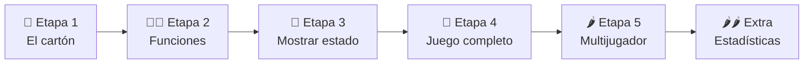

# 🎰 Bingo — Ejercicio Integrador

!!! info "🎯 ¿Qué vamos a construir?"
    Un **simulador de Bingo** completo, desde cero. Este ejercicio integra todo lo que vimos en el Bloque 2:

    | Concepto | ¿Dónde aparece? |
    |----------|----------------|
    | **Sets** | El cartón, los números sorteados, la condición de victoria |
    | **Listas** | El historial del sorteo, la lista de jugadores |
    | **Diccionarios** | Los datos de cada jugador (nombre + cartón) |
    | **Tuplas** | El registro de partidas (nombre, cantidad de turnos) |
    | **Funciones** | Cada acción del juego encapsulada y reutilizable |

!!! tip "🧠 Por qué Bingo"
    El Bingo es un ejemplo perfecto de por qué los sets existen:

    - Un cartón tiene números **únicos** → `set`
    - Verificar si "salió" un número → operación `in` en O(1)
    - La condición de victoria → `issubset`: *¿están todos los del cartón en los sorteados?*

    Con una lista, cada una de esas operaciones sería más lenta y más engorrosa. El Bingo no es una excusa para practicar — es el caso de uso natural de los sets.

---

## 📋 El programa completo

Antes de arrancar, leé cómo se ve el programa terminado. Esto es lo que vas a construir:

```
¡Empieza el juego!
Tu cartón: [3, 11, 18, 24, 33, 37, 45, 52, 58, 61, 67, 74, 80, 85, 90]

Presioná Enter para empezar...

Salió el 45.
────────────────────────────────────────
 3    11   18   24   33   37  45✓  52   58   61   67   74   80   85   90
────────────────────────────────────────
Marcados: 1 / 15  |  Faltan: 14

Salió el 7.
Salió el 33.
────────────────────────────────────────
 3    11   18   24  33✓  37  45✓  52   58   61   67   74   80   85   90
────────────────────────────────────────
Marcados: 2 / 15  |  Faltan: 13

[... más turnos ...]

Salió el 90.
────────────────────────────────────────
 3✓  11✓  18✓  24✓  33✓  37✓  45✓  52✓  58✓  61✓  67✓  74✓  80✓  85✓  90✓
────────────────────────────────────────
Marcados: 15 / 15  |  Faltan: 0

🎉 ¡BINGO! Ganaste en 62 turnos.
```

---

## 🧠 Antes de arrancar

!!! tip "Aplicá el protocolo"
    Antes de leer las etapas, aplicá los [5 pasos para encarar ejercicios](./como_encarar_ejercicios.md) a este enunciado. Abrí tu cuaderno y respondé:

    - ¿Cuántas acciones distintas tiene el juego?
    - ¿Qué datos necesita cada una? ¿Qué devuelve?
    - ¿Podés simular una partida chica (con 5 números) a mano?
    - ¿Qué funciones vacías escribirías como esqueleto?

    Recién después seguí leyendo.

---

## 🗺️ Hoja de ruta



---

## Etapa 1 — El cartón

🌱 *Sets + random*

!!! info "📦 Módulo: random"
    El módulo `random` viene incluido en Python — no hay que instalarlo, solo importarlo.

    ```python
    import random
    ```

    Las funciones que vamos a usar en este ejercicio:

    | Función | Qué hace | Ejemplo |
    |---------|----------|---------|
    | `random.sample(iterable, k)` | Devuelve `k` elementos **únicos** al azar (sin repetir) | `random.sample(range(1, 91), 15)` |
    | `random.choice(secuencia)` | Devuelve un elemento al azar de una secuencia | `random.choice([10, 20, 30])` → `20` |
    | `random.randint(a, b)` | Entero al azar entre `a` y `b` (ambos inclusive) | `random.randint(1, 6)` → como un dado |

Un cartón de Bingo tiene **15 números únicos** entre el 1 y el 90.

Escribí un script (sin funciones todavía) que genere un cartón e imprima los números ordenados. Vas a necesitar el módulo `random` y la función `random.sample(iterable, k)`, que devuelve `k` elementos únicos elegidos al azar de un iterable.

??? success "✅ Solución"
    ```python
    import random

    carton = set(random.sample(range(1, 91), 15))

    print("Tu cartón:")
    print(sorted(carton))
    ```

    Probá ejecutarlo varias veces — cada vez obtenés un cartón diferente.

---

## Etapa 2 — Encapsular en funciones

!!! tip "🔥 ¿Inseguro con funciones? Entrá en calor primero"
    Acá empezás a **escribir tus propias funciones y a usarlas**. Si todavía no te sentís firme con
    eso, hacé primero la [🔥 Entrada en calor: Funciones como caja negra](./funciones_caja_negra.md)
    — son 10 minutos y te va a hacer clic. Si ya te sentís cómodo, seguí de una. 💪

🌱🌿 *Funciones + sets*

El script de la Etapa 1 funciona, pero si lo queremos usar en distintas partes del juego necesitamos funciones. Fijate la diferencia:

=== "❌ Sin funciones"

    ```python
    # Para generar un cartón, copiamos el código cada vez
    carton_ana  = set(random.sample(range(1, 91), 15))
    carton_beto = set(random.sample(range(1, 91), 15))
    carton_cami = set(random.sample(range(1, 91), 15))
    # Si el día de mañana cambia la lógica, hay que cambiarlo en 3 lugares
    ```

=== "✅ Con funciones"

    ```python
    # Definimos la lógica una sola vez
    def generar_carton():
        return set(random.sample(range(1, 91), 15))

    carton_ana  = generar_carton()
    carton_beto = generar_carton()
    carton_cami = generar_carton()
    # Si cambia la lógica, solo cambia en un lugar
    ```

Pensá qué otras acciones del juego se van a repetir y encapsulalas. Para orientarte: ¿qué pasa en cada turno? ¿Al iniciar? ¿Para saber si alguien ganó? Cada respuesta es una función candidata.

!!! info "🎱 El bolillero"
    El bolillero es el conjunto de números que **todavía no salieron**. Empieza con todos los números posibles (1 al 90) y se va vaciando a medida que se sortean. Usarlo como `set` permite eliminar elementos en O(1).

??? tip "💡 Pista"
    ¿`random.choice()` funciona directamente con un set? Probalo. Si no funciona, ¿cómo lo convertirías para poder usarlo?

??? success "✅ Solución"
    ```python
    import random

    def generar_carton(cantidad=15, maximo=90):
        return set(random.sample(range(1, maximo + 1), cantidad))

    def sortear_numero(bolillero):
        numero = random.choice(list(bolillero))
        bolillero.remove(numero)
        return numero

    def verificar_ganador(carton, sorteados):
        return carton.issubset(sorteados)

    # Prueba rápida
    carton    = generar_carton()
    bolillero = set(range(1, 91))
    sorteados = set()

    print("Cartón:", sorted(carton))
    print("¿Ganó?", verificar_ganador(carton, sorteados))  # False

    sorteados = carton.copy()
    print("¿Ganó?", verificar_ganador(carton, sorteados))  # True
    ```

---

## Etapa 3 — Mostrar el estado del juego

🌿 *Funciones + formateo*

No alcanza con saber si ganó: queremos **ver** el cartón con los números marcados y cuántos faltan. La salida tiene que mostrar algo así:

```
────────────────────────────────────────
 3    11   18  24✓  33   37  45✓  52   58   61   67   74   80   85   90
────────────────────────────────────────
Marcados: 2 / 15  |  Faltan: 13
```

Escribí una función que reciba el cartón y los números ya sorteados, y muestre ese estado.

!!! tip "💡 Sobre el formato visual"
    No te enrosques con el alineado perfecto. Lo importante es que se distinga claramente qué números salieron y cuáles no. Una versión simple en una sola línea ya cumple el objetivo.

??? tip "💡 Pista"
    ¿Qué operación de sets te da los números del cartón que ya salieron? ¿Y los que todavía faltan?

??? success "✅ Solución"
    ```python
    def mostrar_carton(carton, sorteados):
        marcados   = carton & sorteados
        pendientes = carton - sorteados

        fila = ""
        for num in sorted(carton):
            marca = "✓" if num in sorteados else " "
            fila += f"{num:>2}{marca}  "

        print("─" * 40)
        print(fila.strip())
        print("─" * 40)
        print(f"Marcados: {len(marcados)} / {len(carton)}  |  Faltan: {len(pendientes)}")
    ```

---

## Etapa 4 — El juego completo (un jugador)

🌿 *Bucle + integración*

Ahora unís todo en una función que corra una partida completa: genera el cartón, prepara el bolillero, sortea números uno a uno hasta que el jugador gane, y devuelve cuántos turnos tardó.

Usá las funciones que ya escribiste. No repitas lógica — si ya existe una función que hace algo, llamala.

??? tip "💡 Pista"
    ¿Qué condición hace que el juego *siga*? ¿Cuándo *para*? Eso define el `while`.

??? success "✅ Solución"
    ```python
    import random
    import os
    os.system("clear")

    def generar_carton():
        return set(random.sample(range(1,91),15))

    def verificar_ganador(carton, salientes):
        return carton.issubset(salientes)

    def sacar_numero(bolillero, salientes):
        num = random.choice(list(bolillero))
        bolillero.remove(num)
        print(f"Salió el {num}.")
        salientes.add(num)
        return num

    def estado_del_carton(carton, salientes):
        faltantes = carton - salientes
        marcados = carton & salientes
        print("_"*50)

        for num in carton:
            if num in salientes:
                print(num, "✓", sep="", end=" ")
            else:
                print(num, end= "  ") 
        print()
        print("_"*50)
        print(f"Marcados: {len(marcados)}/15  |  Faltantes: {len(faltantes)}")
        
    print("¡Empieza el juego!")

    def jugar_individual():
        carton = generar_carton()

        print(f"Tu cartón: {sorted(carton)}")

        input("Presioná Enter para empezar...")

        bolillero = set(range(1,91))
        salientes = set()

        cont = 0
        while not verificar_ganador(carton, salientes):
            num = sacar_numero(bolillero, salientes)
            cont += 1

            if num in carton:
                estado_del_carton(carton, salientes)

            input("Presioná Enter para continuar...")

        print(f"🎉 ¡BINGO! Ganaste en {cont} turnos.")
    ```

---

## Etapa 5 — Múltiples jugadores

🌶️ *Listas + dicts*

Un Bingo real tiene varios jugadores. Escribí una función que reciba una lista de nombres, genere un cartón para cada uno, y corra una partida hasta que alguien (o varios) ganen. Tiene que devolver el o los ganadores y cuántos turnos tardó.

Pensá cómo representar a cada jugador para tener su nombre y su cartón juntos.

!!! tip "🧠 Caso borde"
    ¿Qué pasa si dos jugadores ganan en el mismo turno? En el Bingo real, ambos ganan. Contemplalo en tu solución.

??? success "✅ Solución"
    ```python
    def jugar_multijugador(nombres):
        jugadores = [{"nombre": n, "carton": generar_carton()} for n in nombres]

        for j in jugadores:
            print(f"\n🎴 Cartón de {j['nombre']}: {sorted(j['carton'])}")

        bolillero = set(range(1, 91))
        sorteados = set()
        turnos    = 0

        while True:
            numero = sortear_numero(bolillero)
            sorteados.add(numero)
            turnos += 1
            print(f"Turno {turnos}: {numero}")

            ganadores = [j["nombre"] for j in jugadores
                         if verificar_ganador(j["carton"], sorteados)]

            if ganadores:
                if len(ganadores) == 1:
                    print(f"\n🏆 ¡{ganadores[0]} ganó en {turnos} turnos!")
                else:
                    print(f"\n🏆 ¡Empate! Ganaron: {', '.join(ganadores)} en {turnos} turnos!")
                return ganadores, turnos

    ganadores, turnos = jugar_multijugador(["Ana", "Beto", "Cami", "Dante"])
    ```

---

## 🌶️🌶️ Desafío extra — Estadísticas

*Simulación + listas + dicts*

Ahora que tenés el juego funcionando, podés responder preguntas reales:

**¿Cuántos turnos se necesitan en promedio para ganar al Bingo?**

Escribí una función que simule `n` partidas completas (sin imprimir nada durante el juego) y al final muestre el mínimo, máximo, promedio de turnos, y un histograma simple con `*`.

??? tip "💡 Pista"
    Para simular sin imprimir, ¿qué modificación mínima le harías a `jugar_solitario`? Pensá en parámetros opcionales.

??? success "✅ Solución"
    ```python
    def jugar_solitario(silencioso=False):
        carton    = generar_carton()
        bolillero = set(range(1, 91))
        sorteados = set()
        turnos    = 0

        while not verificar_ganador(carton, sorteados):
            numero = sortear_numero(bolillero)
            sorteados.add(numero)
            turnos += 1
            if not silencioso and numero in carton:
                print(f"🎱 Salió el {numero} — ¡está en tu cartón!")
                mostrar_carton(carton, sorteados)

        if not silencioso:
            print(f"\n🎉 ¡BINGO! Ganaste en {turnos} turnos.")
        return turnos


    def simular(partidas=1000):
        resultados = [jugar_solitario(silencioso=True) for _ in range(partidas)]

        minimo   = min(resultados)
        maximo   = max(resultados)
        promedio = sum(resultados) / len(resultados)

        print(f"\n📊 Estadísticas de {partidas} partidas simuladas")
        print(f"  Mínimo:   {minimo} turnos")
        print(f"  Máximo:   {maximo} turnos")
        print(f"  Promedio: {promedio:.1f} turnos")

        print("\n  Histograma:")
        for limite in range(10, maximo + 10, 10):
            desde  = limite - 9
            cuenta = sum(1 for r in resultados if desde <= r <= limite)
            barra  = "*" * (cuenta * 40 // partidas)
            print(f"  {desde:>3}–{limite:<3} │{barra} {cuenta}")

    simular(1000)
    ```

    ??? info "🤔 ¿Qué resultado esperás?"
        El promedio suele caer entre **55 y 65 turnos**. El mínimo teórico es 15. ¿Alguna vez lo viste en tus simulaciones?

---

## 📌 Cheatsheet de operaciones de sets usadas en este ejercicio

```python
# Cartón único de 15 números
carton = set(random.sample(range(1, 91), 15))

# ¿Un número cayó en el cartón?
if numero in carton: ...

# Números del cartón que ya salieron (intersección)
marcados = carton & sorteados

# Números del cartón que todavía faltan (diferencia)
pendientes = carton - sorteados

# ¿Ganó? (¿todos los del cartón están en sorteados?)
gano = carton.issubset(sorteados)
gano = carton <= sorteados   # equivalente
```

---

## 🚀 ¿Y ahora qué viene?

!!! success "🎯 Lo que acabás de construir"
    Sin darte cuenta, construiste un sistema con:

    - **Separación de responsabilidades**: cada función hace una sola cosa.
    - **Estado mutable compartido**: el bolillero y los sorteados se modifican entre turnos.
    - **Abstracción**: `jugar_multijugador` no sabe cómo funciona `verificar_ganador` por dentro.
    - **Simulación**: podés correr mil partidas y sacar estadísticas reales.

    Esto ya es el esqueleto de cómo se construyen sistemas más complejos. En el primer proyecto vamos a usar exactamente esta misma lógica: funciones bien definidas, datos persistidos, menú interactivo.

---

## 🔗 El problema que queda abierto

Cerrás el programa... y todo desaparece.

- ¿Cuántos turnos tardaste? Perdido.
- ¿Quién ganó la partida anterior? Perdido.
- ¿Tu récord personal? Perdido.

Cada vez que ejecutás el Bingo, empieza desde cero. Si quisieras guardar un historial de partidas o las estadísticas del ejercicio extra, tendrías que inventar un formato propio para escribirlos a mano en un archivo de texto.

**En la próxima clase aprendemos exactamente eso**: cómo hacer que los datos *sobrevivan* entre ejecuciones. Con lo que vamos a ver, guardar el historial del Bingo serían tres líneas de código.

---

## 🔄 Retrospectiva

Antes de cerrar, tomamos 3 minutos. Cada uno responde en voz alta (o en papel):

1. **¿Qué fue lo que más te costó?** (una respuesta concreta: "no entendía cuándo usar `return`", "me confundí con el `while`", etc.)
2. **¿Quedó alguna parte que no terminaste de entender?**
3. **¿Cómo salís de la clase?** Elegí uno:

| | |
|---|---|
| 😊 | Entendí bien, me sentí cómodo/a |
| 🤔 | Me costó pero llegué |
| 😵 | Me perdí bastante, necesito repasar |

!!! info ""
    No hay respuesta incorrecta. El 😵 es igual de válido — y más útil para el profe que el 😊 de compromiso.

## [⬅️ Anterior: Lectura y corrección de código](./lectura_codigo.md)
## [📚 Índice](../../clases.md#colecciones)
## [➡️ Siguiente: Importar módulos](./imports_y_modulos.md)
