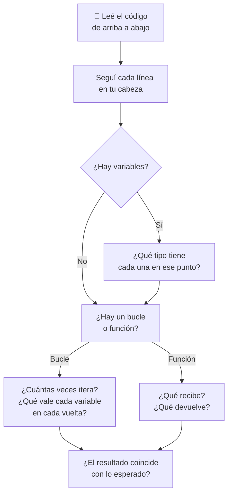

# 🔍 Lectura y corrección de código

!!! example "📬 Te llegó esto por WhatsApp"
    *"Che, mi código no anda. ¿Podés mirar?"*

    No hay mensaje de error. Solo resultados raros. ¿Por dónde empezás?

    Leer código — el tuyo y el de otros — es una habilidad tan importante como escribirlo. Hoy la entrenamos.

!!! info "🎯 Objetivos de la clase"
    Al terminar deberías poder:

    - **Ejecutar código mentalmente** línea por línea, sin computadora.
    - **Identificar el tipo de error** antes de ver el mensaje de Python.
    - **Proponer correcciones concretas** explicando por qué funcionan.
    - Distinguir un error de tipo, de lógica, de scope o de índice.

---

## 🛠️ Cómo leer código ajeno

Antes de los ejercicios, el protocolo:



!!! tip "💡 El truco de la mano"
    Poné el dedo en la línea 1. Avanzá línea a línea, anotando en un papel el valor de cada variable. Si llegás al final y los valores coinciden con lo esperado: no hay error. Si en algún punto algo "no cuadra": ahí está el bug.

---

## 🏷️ Tipos de error frecuentes

| Tipo | Cuándo aparece | Señal |
|------|---------------|-------|
| `TypeError` | Operación entre tipos incompatibles | `"5" + 3`, `None + 1` |
| `IndexError` | Índice fuera del rango de la lista | `lista[10]` en lista de 5 |
| `KeyError` | Clave que no existe en el diccionario | `d["x"]` si `"x"` no está |
| `NameError` | Variable usada antes de ser creada | Typo en nombre de variable |
| **Error de lógica** | No lanza error pero el resultado está mal | Condición invertida, acumulador mal ubicado |
| **Bucle infinito** | El programa nunca termina | Condición del `while` que nunca se vuelve falsa |

---

## 🎮 Ejercicios

Para cada ejercicio, antes de abrir la solución respondé estas tres preguntas:

> 1. ¿Qué hace este código **tal como está**? ¿Qué imprime (o qué error lanza)?
> 2. ¿Hay algún error? ¿De qué tipo?
> 3. ¿Cómo lo corregirías?

---

### 🌱 Ejercicio 1 — Calculadora de años

**Debería hacer:** Pedir la edad del usuario e imprimir cuántos años va a tener en 10 años.

```python
edad = input("¿Cuántos años tenés? ")
print(f"En 10 años vas a tener {edad + 10} años")
```

??? success "✅ Análisis"
    **Lo que hace:** Lanza un `TypeError` al intentar sumar.

    **El error:** `input()` siempre devuelve un `str`. Sumar un string con el entero `10` no está permitido en Python.

    ```
    TypeError: can only concatenate str (not "int") to str
    ```

    **Corrección:**
    ```python
    edad = int(input("¿Cuántos años tenés? "))
    print(f"En 10 años vas a tener {edad + 10} años")
    ```

---

### 🌱 Ejercicio 2 — ¿Par o impar?

**Debería hacer:** Decirle al usuario si el número que ingresó es par o impar.

```python
numero = int(input("Ingresá un número: "))
if numero % 2 == 1:
    print(f"{numero} es par")
else:
    print(f"{numero} es impar")
```

??? success "✅ Análisis"
    **Lo que hace:** Ejecuta sin error pero da el resultado al revés. Si ingresás `4` (par), imprime `"4 es impar"`.

    **El error:** Error de **lógica**. Cuando `numero % 2 == 1` el número es impar, no par. Las etiquetas están cambiadas.

    **Corrección** (dos opciones equivalentes):
    ```python
    # Opción A — cambiar los mensajes
    if numero % 2 == 1:
        print(f"{numero} es impar")
    else:
        print(f"{numero} es par")

    # Opción B — cambiar la condición
    if numero % 2 == 0:
        print(f"{numero} es par")
    else:
        print(f"{numero} es impar")
    ```

---

### 🌱 Ejercicio 3 — La función doble

**Debería hacer:** Calcular el doble de un número usando una función, y después sumarle 5.

```python
def doble(n):
    print(n * 2)

resultado = doble(7)
total = resultado + 5
print(f"Total: {total}")
```

??? success "✅ Análisis"
    **Lo que hace:** Imprime `14` (por el `print` interno), pero después lanza un `TypeError`.

    **El error:** La función usa `print()` en vez de `return`. Cuando una función no tiene `return`, devuelve `None`. Entonces `resultado` vale `None`, y `None + 5` genera:

    ```
    TypeError: unsupported operand type(s) for +: 'NoneType' and 'int'
    ```

    **Corrección:**
    ```python
    def doble(n):
        return n * 2

    resultado = doble(7)
    total = resultado + 5
    print(f"Total: {total}")  # Total: 19
    ```

---

### 🌿 Ejercicio 4 — La suma que se reinicia

**Debería hacer:** Sumar todos los números mayores a 10 de la lista e imprimir el total.

```python
numeros = [5, 15, 3, 20, 8, 12]
for n in numeros:
    if n > 10:
        suma = 0
        suma += n
print(f"Suma de mayores a 10: {suma}")
```

??? success "✅ Análisis"
    **Lo que hace:** Imprime `12` en vez de `47`.

    **El error:** Error de **lógica / scope**. `suma = 0` está dentro del `if`, así que se reinicia a cero cada vez que encuentra un número mayor a 10. Solo "sobrevive" el último (12).

    El resultado correcto sería `15 + 20 + 12 = 47`.

    **Corrección:**
    ```python
    numeros = [5, 15, 3, 20, 8, 12]
    suma = 0                   # ← afuera del bucle
    for n in numeros:
        if n > 10:
            suma += n
    print(f"Suma de mayores a 10: {suma}")  # 47
    ```

---

### 🌿 Ejercicio 5 — La cuenta regresiva

**Debería hacer:** Imprimir una cuenta regresiva del 5 al 1.

```python
contador = 5
while contador > 0:
    print(contador)
    contador += 1
```

??? success "✅ Análisis"
    **Lo que hace:** Bucle infinito. Imprime 5, 6, 7, 8... sin parar nunca.

    **El error:** `contador += 1` lo hace crecer. Como empieza en 5 y la condición es `> 0`, nunca se vuelve falsa.

    **Corrección:**
    ```python
    contador = 5
    while contador > 0:
        print(contador)
        contador -= 1   # ← restar, no sumar
    ```
    Salida: `5  4  3  2  1`

---

### 🌿 Ejercicio 6 — Del 1 al 10

**Debería hacer:** Imprimir todos los números del 1 al 10, inclusive.

```python
for i in range(1, 10):
    print(i)
```

??? success "✅ Análisis"
    **Lo que hace:** Imprime del 1 al 9. Le falta el 10.

    **El error:** Error de **lógica / off-by-one**. `range(inicio, fin)` excluye el valor final. `range(1, 10)` genera 1, 2, ..., 9.

    **Corrección:**
    ```python
    for i in range(1, 11):   # ← 11 para incluir el 10
        print(i)
    ```

---

### 🌿 Ejercicio 7 — El último color

**Debería hacer:** Imprimir el último elemento de la lista.

```python
colores = ["rojo", "verde", "azul", "amarillo"]
print(f"El último color es: {colores[4]}")
```

??? success "✅ Análisis"
    **Lo que hace:** Lanza un `IndexError`.

    **El error:** La lista tiene 4 elementos, con índices del 0 al 3. El índice 4 no existe.

    ```
    IndexError: list index out of range
    ```

    **Corrección** (dos opciones):
    ```python
    print(f"El último color es: {colores[3]}")    # índice explícito
    print(f"El último color es: {colores[-1]}")   # índice negativo (pythónico)
    ```

---

### 🌿 Ejercicio 8 — El buscador de inscriptos

**Debería hacer:** Verificar si "Dante" está en el set de inscriptos e imprimirlo.

```python
inscriptos = {"Ana", "Beto", "Cami", "Dante"}
if inscriptos == "Dante":
    print("Dante está inscripto")
else:
    print("Dante no está inscripto")
```

??? success "✅ Análisis"
    **Lo que hace:** Siempre imprime `"Dante no está inscripto"`, aunque Dante SÍ esté en el set.

    **El error:** Error de **lógica**. `inscriptos == "Dante"` compara el set entero contra el string `"Dante"` — eso siempre es `False`. Para verificar si un elemento pertenece a un set (o lista, o dict), se usa `in`.

    **Corrección:**
    ```python
    if "Dante" in inscriptos:
        print("Dante está inscripto")
    else:
        print("Dante no está inscripto")
    ```

---

### 🌿 Ejercicio 9 — La agenda

**Debería hacer:** Buscar e imprimir el teléfono de "Ana" en el diccionario.

```python
agenda = {
    "Ana": "221-1234",
    "Beto": "011-5678",
    "Cami": "223-9012",
}
print(f"El teléfono de Ana es: {agenda['ana']}")
```

??? success "✅ Análisis"
    **Lo que hace:** Lanza un `KeyError`.

    **El error:** Las claves de un diccionario son **case-sensitive**. La clave guardada es `"Ana"` (con A mayúscula), pero se busca `"ana"` (minúscula) — son dos claves distintas.

    ```
    KeyError: 'ana'
    ```

    **Corrección:**
    ```python
    print(f"El teléfono de Ana es: {agenda['Ana']}")
    ```

    !!! tip "🧠 Para evitar KeyError en general"
        Usá `.get()` si no estás seguro de que la clave existe:
        ```python
        print(agenda.get("ana", "No encontrado"))  # No lanza error
        ```

---

### 🌶️ Ejercicio 10 — ¿Este anda?

**Debería hacer:** Encontrar y devolver la palabra más larga de una lista.

```python
def palabra_mas_larga(palabras):
    mas_larga = palabras[0]
    for p in palabras:
        if len(p) > len(mas_larga):
            mas_larga = p
    return mas_larga

lista = ["python", "es", "genial", "increíblemente", "poderoso"]
print(palabra_mas_larga(lista))
```

??? success "✅ Análisis"
    **Lo que hace:** Imprime `increíblemente`. ✅

    **¿Tiene error?** No. El código es correcto.

    - Arranca comparando contra el primer elemento (`palabras[0]`).
    - Recorre toda la lista actualizando `mas_larga` si encuentra algo más largo.
    - Devuelve el resultado con `return`.

    Si llegaste hasta acá asumiendo que TODOS los ejercicios estaban rotos y no encontraste el error... ahí está la trampa. Parte de leer código es reconocer cuándo **sí funciona**.

---

## 📌 Resumen: errores y sus causas

| Error | Causa más común | Solución típica |
|-------|----------------|-----------------|
| `TypeError` | `input()` sin convertir | Agregar `int()` o `float()` |
| `TypeError: NoneType` | Función con `print` en vez de `return` | Cambiar a `return` |
| `IndexError` | Índice igual a `len(lista)` | Usar `[-1]` o `len - 1` |
| `KeyError` | Clave mal escrita o case-sensitive | Verificar mayúsculas o usar `.get()` |
| Bucle infinito | Contador que crece en vez de decrecer | Revisar `+=` vs `-=` |
| Lógica invertida | Condición `== 1` para par, `== 0` para impar | Releer qué significa cada caso |
| Acumulador que se reinicia | `var = 0` dentro del bucle | Mover la inicialización afuera |

---

## [⬅️ Anterior: Repaso general](./repaso.md)
## [📚 Índice](../../clases.md#colecciones)
## [➡️ Siguiente: Bingo — Ejercicio Integrador](./bingo.md)
