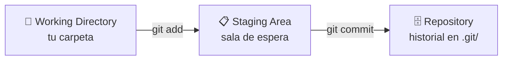
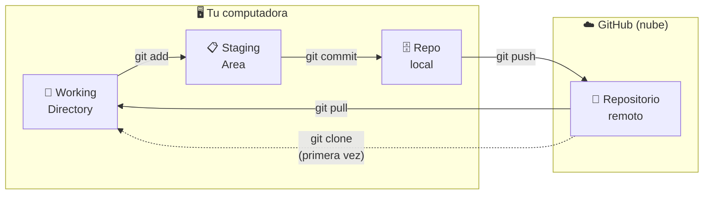

# 🌳🐙 Git y GitHub

!!! tip "🧠 ¿Por qué aprender esto ahora?"
    Ya tenés varios programas funcionando. Hoy aprendemos a **no perderlos nunca más**, a trabajar desde **cualquier computadora** y a tener el historial de cada cambio que hiciste. Estas son habilidades que todo programador usa todos los días.

!!! info "🎯 Objetivos de la clase"
    Al terminar la clase deberían poder:

    - Entender qué es el control de versiones y por qué existe.
    - Usar el workflow básico de Git: `init`, `status`, `add`, `commit`, `log`.
    - Tener una cuenta de GitHub y un repositorio personal.
    - Subir (`push`) su código a GitHub y bajarlo (`pull`/`clone`) desde otra máquina.
    - Escribir un `README.md` básico.

!!! warning "📌 Alcance de esta clase"
    Hoy cubrimos el **workflow mínimo** para versionar el primer proyecto y continuar el código en sus casas. No vemos branches, merges, conflictos ni Pull Requests — eso viene más adelante si se necesita.

---

## 🧠 ¿Qué es el control de versiones?

Imaginá que cada vez que guardás tu proyecto tenés una **foto de cómo estaba en ese momento**. Si algo sale mal, podés volver a cualquier foto anterior. Eso es Git.

Sin Git, muchos programadores hacen esto:

```
proyecto_v1.py
proyecto_v2.py
proyecto_final.py
proyecto_final_ESTE.py
proyecto_final_ESTE_ahora_si.py
```

Con Git, tenés un solo archivo y Git guarda el historial por vos.

!!! example "¿Git o GitHub?"
    - **Git**: la herramienta que instalás en tu computadora y maneja el historial de versiones **localmente**.
    - **GitHub**: un sitio web donde podés subir tu repositorio Git para tenerlo **en la nube** (y compartirlo).

    Git funciona sin GitHub. GitHub necesita Git.

---

## 🔧 Parte 1 — Git local

### Instalación

Instalá Git desde [git-scm.com](https://git-scm.com/). En Windows usá el instalador. Para verificar que quedó instalado:

```bash
git --version
# git version 2.x.x
```

### Configuración inicial (una sola vez)

Antes de usar Git, le decimos quiénes somos. Esta info aparece en cada commit que hagas:

```bash
git config --global user.name "Tu Nombre"
git config --global user.email "tu@email.com"
git config --global init.defaultBranch main   # los repos nuevos arrancan en la rama "main"
```

Podés verificarla con:

```bash
git config --list
```

!!! note "🌿 ¿Por qué `init.defaultBranch main`?"
    Históricamente la rama principal se llamaba `master`; hoy el estándar (y lo que espera GitHub) es
    `main`. Con esa línea, cada `git init` arranca en `main` y los comandos de más abajo
    (`git push -u origin main`) coinciden sin sorpresas.

---

### 🗺️ El flujo de trabajo de Git



Pensalo en tres zonas:

- **Working Directory**: tu carpeta, donde editás los archivos.
- **Staging Area**: la "sala de espera" — lo que decidiste incluir en el próximo commit.
- **Repository**: el historial oficial de versiones (la base de datos de Git, en la carpeta `.git/`).

---

### git init — Iniciar un repositorio

```bash
cd mi_proyecto          # entramos a la carpeta del proyecto
git init                # inicializamos Git
# Initialized empty Git repository in .../mi_proyecto/.git/
```

Esto crea una carpeta oculta `.git/` que contiene toda la historia del proyecto. **No la toques ni la borres.**

---

### git status — Ver el estado actual

```bash
git status
```

Es el comando que más vas a usar. Te dice:

- Qué archivos cambiaron desde el último commit.
- Qué está en el staging area listo para commitear.
- Qué archivos no están siendo rastreados por Git.

---

### git add — Preparar cambios para el commit

```bash
git add programa.py          # agregar un archivo específico
git add .                    # agregar TODOS los cambios del directorio actual
```

!!! tip "💡 `git add .` vs `git add archivo`"
    `git add .` agrega todo lo que cambió. Es conveniente pero hay que usarlo con cuidado para no incluir archivos que no querés versionar (contraseñas, archivos temporales, etc.).

---

### git commit — Guardar una versión

```bash
git commit -m "Agrego función para calcular promedio"
```

Un commit es una **foto del estado del proyecto** con un mensaje que explica qué hiciste.

!!! success "✅ Mensajes de commit claros"
    El mensaje debe responder: **¿qué cambiaste?**

    ```bash
    # ❌ Mensajes malos
    git commit -m "cambios"
    git commit -m "arreglé cosa"
    git commit -m "asdfgh"

    # ✅ Mensajes buenos
    git commit -m "Agrego validación de nota mínima"
    git commit -m "Corrijo error en cálculo de promedio con lista vacía"
    git commit -m "Agrego persistencia JSON al menú principal"
    ```

---

### git log — Ver el historial

```bash
git log
# commit a3f8b2c... (HEAD -> main)
# Author: Maxi <maxi@email.com>
# Date:   Wed May 13 10:00:00 2026 -0300
#
#     Agrego persistencia JSON al menú principal

git log --oneline   # versión compacta (una línea por commit)
```

---

### Flujo de trabajo típico

```bash
# 1. Hacés cambios en tus archivos

# 2. Verificás el estado
git status

# 3. Preparás los cambios
git add .

# 4. Guardás la versión
git commit -m "Descripción de lo que hiciste"

# 5. Podés ver el historial
git log --oneline
```

!!! tip "¿Con qué frecuencia hacer commits?"
    No hay regla fija, pero un buen criterio es: **cada vez que algo funciona**. Así si rompés algo, podés volver al commit anterior.

---

### .gitignore — Ignorar archivos

Algunos archivos no queremos versionar: contraseñas, archivos temporales, caché, etc. Los listamos en un archivo especial `.gitignore`:

```
# .gitignore
__pycache__/
*.pyc
.env
datos_privados.json
```

Git ignorará estos archivos como si no existieran.

---

## 🐙 Parte 2 — GitHub

### Crear una cuenta

1. Entrá a [github.com](https://github.com)
2. Hacé clic en **Sign up**
3. Elegí un nombre de usuario (va a ser público y parte de tus URLs)
4. Verificá el email

### Crear un repositorio

1. Una vez logueado, hacé clic en el **`+`** → **New repository**
2. Nombre: `pensamiento-computacional-2026` (o el que quieras)
3. Descripción opcional
4. Elegí **Public** (para que puedan verlo tus compañeros o futuros empleadores)
5. **NO** checkees "Add a README file" (ya tenemos código local)
6. Hacé clic en **Create repository**

---

### Conectar tu repo local con GitHub

GitHub te muestra los comandos exactos después de crear el repo. En general son:

```bash
# Vincular el repo local con el remoto
git remote add origin https://github.com/tu-usuario/tu-repo.git

# Subir el código por primera vez
git push -u origin main
```

!!! warning "🔑 La primera vez te va a pedir autenticación (¡y NO es tu contraseña!)"
    Al hacer el primer `git push`, GitHub te pide identificarte. **Desde 2021 la contraseña de tu
    cuenta ya NO sirve** para esto — hay que usar un **token**. Es el tropiezo más común, así que
    prestá atención:

    - **Lo más fácil (Windows):** el instalador de Git incluye el **Git Credential Manager**. La
      primera vez que hagas `push`, se abre una **ventana del navegador** para iniciar sesión en
      GitHub. Aceptás, y listo — te queda guardado y no lo pide más.
    - **Si te pide usuario y contraseña en la terminal:** en "Username" va tu usuario de GitHub y en
      "Password" va un **Personal Access Token (PAT)**, no tu contraseña. Se crea en
      **GitHub → Settings → Developer settings → Personal access tokens → Tokens (classic) → Generate
      new token**, tildando el permiso **`repo`**. Copiá el token (se ve una sola vez) y pegalo como
      contraseña.

    Guardá el token en un lugar seguro. Si lo perdés, no pasa nada: generás uno nuevo.

Después de eso, cada vez que quieras subir nuevos commits:

```bash
git push
```

---

### git clone — Descargar un repo

Si querés trabajar desde **otra computadora**, o descargar el repo de un compañero:

```bash
git clone https://github.com/usuario/repositorio.git
```

Esto crea una carpeta con todo el proyecto y su historial.

---

### git pull — Traer cambios del remoto

Si ya tenés el repo clonado y subiste cambios desde otra máquina:

```bash
git pull
```

Descarga y aplica los cambios más recientes.

---

### El README.md

El archivo `README.md` es la **portada** de tu repositorio en GitHub. Aparece automáticamente en la página del proyecto.

```markdown
# Pensamiento Computacional 2026

Repositorio de ejercicios y proyectos del curso de Pensamiento Computacional
y Testing de Aplicaciones — CFP 401.

## Contenido

- `bloque_1/` — Fundamentos de Python
- `bloque_2/` — Colecciones y funciones
- `proyecto_asistencias/` — Primer proyecto integrador

## Tecnologías

- Python 3.12
- pytest
```

!!! tip "Markdown básico para el README"
    `# Título`, `## Subtítulo`, `**negrita**`, `*cursiva*`, `` `código` ``, listas con `-`.

---

## 🗺️ Resumen visual del workflow completo



---

## ✅ Buenas prácticas

!!! success "Hacé esto ✅"
    - Hacé commits pequeños y frecuentes (cada vez que algo funciona).
    - Escribí mensajes de commit descriptivos y en presente: "Agrego X", "Corrijo Y".
    - Siempre hacé `git pull` antes de empezar a trabajar si compartís el repo.
    - Tené un `.gitignore` desde el principio.
    - Escribí un `README.md` que explique de qué se trata el proyecto.

!!! failure "Evitá esto ❌"
    - No subas contraseñas, tokens ni archivos con datos privados a GitHub.
    - No hagas commits de archivos gigantes (imágenes pesadas, ejecutables, etc.).
    - No uses `git push --force` a menos que sepas exactamente qué estás haciendo.

---

## 🧪 Ejercicios

### 🌱 Ejercicio 1 — Tu primer repo

1. Creá una carpeta `hola_git/` y dentro un archivo `hola.py` que imprima "Hola, Git!".
2. Inicializá Git en esa carpeta.
3. Hacé un primer commit.
4. Modificá el mensaje en el print, hacé un segundo commit.
5. Mirá el historial con `git log --oneline`.

??? tip "💡 Pista"
    - ¿Cuál es el primer comando para que Git "empiece a vigilar" una carpeta?
    - Antes de hacer `commit`, ¿qué paso intermedio tenés que hacer para "preparar" los archivos?
    - `git status` es tu mejor amigo — ¿qué te dice en cada momento?

??? success "✅ Solución"
    ```bash
    # Crear carpeta, entrar y crear hola.py con print("Hola, Git!")
    mkdir hola_git
    cd hola_git

    # Inicializar Git
    git init

    # Preparar y primer commit
    git add hola.py
    git commit -m "Primer commit: hola mundo"

    # Modificar hola.py y segundo commit
    git add hola.py
    git commit -m "Actualizo mensaje del print"

    # Ver historial compacto
    git log --oneline
    ```

### 🌿 Ejercicio 2 — Subir al campus

1. Creá un repositorio en GitHub llamado `pensamiento-computacional-2026`.
2. Vinculalo con tu repo local.
3. Subí todos los ejercicios del curso que tengas organizados en carpetas.
4. Agregá un `README.md` con tu nombre y una breve descripción del curso.
5. Compartí la URL del repo en el grupo.

??? tip "💡 Pista"
    - ¿Tenés que crear el repo en GitHub primero o en tu compu primero?
    - El comando para vincular un remoto se llama `git remote add`. ¿Qué dos cosas le pasás: un nombre y...?
    - Para subir por primera vez, usás `-u origin main`. Las veces siguientes, ¿qué comando alcanza?

??? success "✅ Solución"
    ```bash
    # Después de crear el repo vacío en github.com:

    # Vincular el repo local con el remoto
    git remote add origin https://github.com/tu-usuario/pensamiento-computacional-2026.git

    # Subir por primera vez (el -u guarda origin main como destino por defecto)
    git push -u origin main

    # Verificar que quedó vinculado
    git remote -v

    # Las veces siguientes, solo:
    git push
    ```

### 🌶️ Ejercicio 3 — Flujo completo

1. Cloná el repo de un compañero.
2. Explorá su código.
3. Desde tu propio repo, hacé 3 commits seguidos con cambios distintos.
4. Subí los cambios y verificá que se vean en GitHub.

??? tip "💡 Pista"
    - Para clonar un repo ajeno, ¿qué URL usás? ¿La podés encontrar en el botón verde "Code" en GitHub?
    - Para los 3 commits, no necesitás 3 archivos distintos — podés modificar el mismo archivo 3 veces.
    - ¿Cuántos `git push` necesitás para subir los 3 commits?

??? success "✅ Solución"
    ```bash
    # Clonar repo de un compañero (en otra carpeta)
    git clone https://github.com/compañero/su-repo.git

    # En tu propio repo: 3 commits con cambios distintos
    # (editá algún archivo entre cada commit)
    git add .
    git commit -m "Agrego ejercicio de funciones"

    git add .
    git commit -m "Corrijo bug en cálculo de promedio"

    git add .
    git commit -m "Agrego README con descripción del proyecto"

    # Un solo push sube los 3 commits juntos
    git push

    # Verificar en GitHub que se ven los 3 commits nuevos
    git log --oneline
    ```

---

!!! quote "Para cerrar"
    Git y GitHub son las herramientas de colaboración más usadas en el mundo del software. Que puedan decir "tengo mis proyectos en GitHub" es algo que ya diferencia a un programador de alguien que solo aprendió a programar. ¡Bienvenidos al ecosistema! 🌍

## [⬅️ Anterior: Importar módulos](../06_funciones/imports_y_modulos.md)
## [📚 Índice](../../clases.md#persistencia)
## [➡️ Siguiente: Manejo de archivos](./archivos.md)
