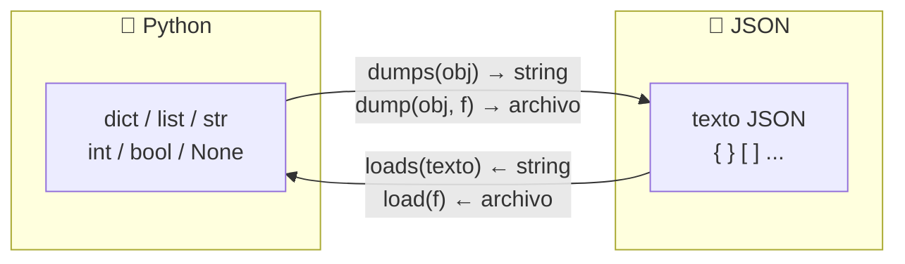

# 📋 JSON en Python

En la clase anterior aprendimos a guardar texto en archivos. Pero si queremos guardar una **lista de alumnos** o un **diccionario de notas**, tendríamos que inventar un formato propio para convertirlos a texto y parsearlos de vuelta. Por suerte, ya existe un formato estándar para esto: **JSON**.

!!! info "🎯 Objetivos de la clase"
    Al terminar la clase deberían poder:

    - Entender qué es JSON y por qué es el formato estándar para persistir datos estructurados.
    - Usar `json.dump()` y `json.load()` para guardar y cargar datos en archivos.
    - Usar `json.dumps()` y `json.loads()` para convertir entre Python y JSON en strings.
    - Aplicar el patrón **cargar → modificar → guardar** para persistir datos entre ejecuciones.

---

## 🧠 ¿Qué es JSON?

**JSON** (JavaScript Object Notation) es un formato de texto para representar datos estructurados. Se ve así:

```json
{
  "nombre": "Ana",
  "edad": 20,
  "aprobada": true,
  "notas": [8, 9, 10],
  "direccion": null
}
```

Es el formato más usado en el mundo para intercambiar datos entre programas, APIs, configuraciones y bases de datos. Y es perfectamente legible por humanos.

### Python ↔ JSON: tipos compatibles

| Python | JSON |
|--------|------|
| `dict` | objeto `{}` |
| `list`, `tuple` | array `[]` |
| `str` | string `"..."` |
| `int`, `float` | número |
| `True` / `False` | `true` / `false` |
| `None` | `null` |

!!! warning "⚠️ Las tuplas se convierten en arrays"
    JSON no tiene tuplas. Al serializar una tupla Python, se convierte a array JSON. Al deserializar, vuelve como lista, no como tupla.

---

## 📦 El módulo json

Python incluye el módulo `json` en su biblioteca estándar — no hay que instalar nada.

```python
import json
```

Tiene cuatro funciones principales:

| Función | Dirección | Trabaja con |
|---------|-----------|-------------|
| `json.dumps(obj)` | Python → JSON | **string** |
| `json.loads(texto)` | JSON → Python | **string** |
| `json.dump(obj, f)` | Python → JSON | **archivo** |
| `json.load(f)` | JSON → Python | **archivo** |



!!! tip "Cómo recordarlo"
    - Las que terminan en **`s`** trabajan con **s**trings.
    - Las que no terminan en `s` trabajan con archivos.

---

## 🔤 json.dumps() y json.loads() — trabajar con strings

=== "Python → JSON string"

    `json.dumps()` convierte un objeto Python en un **string JSON**.

    ```python
    import json

    alumno = {
        "nombre": "Ana",
        "nota": 9,
        "aprobada": True,
        "materias": ["Python", "Matemática"]
    }

    texto_json = json.dumps(alumno)
    print(texto_json)
    # '{"nombre": "Ana", "nota": 9, "aprobada": true, "materias": ["Python", "Matemática"]}'

    # Con indent y ensure_ascii para que sea legible
    texto_bonito = json.dumps(alumno, indent=2, ensure_ascii=False)
    print(texto_bonito)
    # {
    #   "nombre": "Ana",
    #   "nota": 9,
    #   "aprobada": true,
    #   "materias": ["Python", "Matemática"]
    # }
    ```

=== "JSON string → Python"

    `json.loads()` convierte un string JSON en un objeto Python.

    ```python
    import json

    texto = '{"nombre": "Beto", "nota": 7, "aprobado": true}'
    alumno = json.loads(texto)

    print(alumno)           # {'nombre': 'Beto', 'nota': 7, 'aprobado': True}
    print(type(alumno))     # <class 'dict'>
    print(alumno["nombre"]) # Beto
    ```

---

## 💾 json.dump() y json.load() — trabajar con archivos

Estas son las funciones que más vas a usar en el proyecto.

=== "Guardar en archivo"

    ```python
    import json

    alumnos = [
        {"nombre": "Ana",  "nota": 9},
        {"nombre": "Beto", "nota": 7},
        {"nombre": "Cami", "nota": 10},
    ]

    with open("alumnos.json", "w", encoding="utf-8") as f:
        json.dump(alumnos, f, indent=2, ensure_ascii=False)
    ```

    El archivo `alumnos.json` quedará así:
    ```json
    [
      {
        "nombre": "Ana",
        "nota": 9
      },
      {
        "nombre": "Beto",
        "nota": 7
      },
      {
        "nombre": "Cami",
        "nota": 10
      }
    ]
    ```

=== "Cargar desde archivo"

    ```python
    import json

    with open("alumnos.json", "r", encoding="utf-8") as f:
        alumnos = json.load(f)

    print(type(alumnos))    # <class 'list'>
    print(alumnos[0])       # {'nombre': 'Ana', 'nota': 9}

    for alumno in alumnos:
        print(f"{alumno['nombre']}: {alumno['nota']}")
    ```

!!! info "Parámetros útiles de `json.dump()`"
    - `indent=2` → sangría de 2 espacios para que sea legible.
    - `ensure_ascii=False` → permite guardar tildes y ñ directamente (en lugar de `á`).

---

## 🔄 Patrón: Cargar → Modificar → Guardar

Este es el patrón más importante para **persistir datos entre ejecuciones**. Es lo que vamos a usar en el proyecto.

```python
import json
import os

ARCHIVO = "datos.json"

def cargar_datos():
    if os.path.exists(ARCHIVO):
        with open(ARCHIVO, "r", encoding="utf-8") as f:
            return json.load(f)
    return []  # Si el archivo no existe, empezamos con lista vacía

def guardar_datos(datos):
    with open(ARCHIVO, "w", encoding="utf-8") as f:
        json.dump(datos, f, indent=2, ensure_ascii=False)


# --- Programa principal ---
alumnos = cargar_datos()

nuevo = input("Nombre del nuevo alumno: ")
alumnos.append({"nombre": nuevo, "nota": 0})

guardar_datos(alumnos)
print(f"Alumno '{nuevo}' guardado. Total: {len(alumnos)}")
```

Ejecutás esto dos veces:

- Primera vez: crea el archivo con el primer alumno.
- Segunda vez: carga el archivo, agrega el segundo alumno y guarda.

!!! tip "🏆 Las dos funciones de oro"
    En casi cualquier proyecto, vas a necesitar exactamente `cargar_datos()` y `guardar_datos()`. Estos nombres son una buena convención.

---

## ✅ Buenas prácticas

!!! success "Hacé esto ✅"
    - Siempre usá `ensure_ascii=False` para manejar bien el español.
    - Siempre usá `indent=2` (o `indent=4`) para que el archivo sea legible.
    - Verificá si el archivo existe antes de cargarlo (`os.path.exists()`).
    - Guardá los datos en una estructura organizada: lista de dicts o dict de dicts.

!!! failure "Evitá esto ❌"
    - No guardes objetos Python que no son serializables a JSON (como sets o instancias de clases propias sin conversión).
    - No abras el archivo JSON en modo `"a"` — JSON no funciona con append simple, siempre hay que leer-modificar-guardar.

---

## 🧪 Ejercicios

### 🌱 Ejercicio 1 — Tu primera persistencia

Escribí un programa que:

1. Cargue una lista de nombres desde `nombres.json` (si existe).
2. Pida al usuario un nombre nuevo.
3. Lo agregue a la lista y lo guarde.
4. Al ejecutarlo varias veces, la lista crece.

```
Nombre nuevo: Dante
Lista guardada (3 nombres): ['Ana', 'Beto', 'Dante']
```

??? tip "💡 Pista"
    - ¿Cómo verificás si el archivo existe antes de intentar abrirlo?
    - Si el archivo no existe todavía, ¿qué valor inicial devolvés?
    - ¿Cuál es la diferencia entre `json.load(f)` (archivo) y `json.loads(texto)` (string)?

??? success "✅ Solución"
    ```python
    import json
    import os

    ARCHIVO = "nombres.json"

    def cargar():
        if os.path.exists(ARCHIVO):
            with open(ARCHIVO, "r", encoding="utf-8") as f:
                return json.load(f)
        return []

    def guardar(nombres):
        with open(ARCHIVO, "w", encoding="utf-8") as f:
            json.dump(nombres, f, indent=2, ensure_ascii=False)

    nombres = cargar()
    nuevo = input("Nombre nuevo: ")
    nombres.append(nuevo)
    guardar(nombres)
    print(f"Lista guardada ({len(nombres)} nombres): {nombres}")
    ```

### 🌿 Ejercicio 2 — Agenda persistente

Creá una agenda de contactos que persista entre ejecuciones. El programa debe ofrecer un menú:

```
1. Ver todos los contactos
2. Agregar contacto
3. Buscar por nombre
4. Salir
```

Los contactos se guardan en `agenda.json` como lista de dicts `{"nombre": ..., "telefono": ...}`.

??? tip "💡 Pista"
    - ¿Cuándo guardás en el archivo: después de cada cambio o solo al salir?
    - Para buscar por nombre, ¿cómo recorrés la lista? ¿Cómo hacés que la búsqueda no distinga mayúsculas/minúsculas?
    - Reutilizá las funciones `cargar()` y `guardar()` del patrón de la clase.

??? success "✅ Solución"
    ```python
    import json
    import os

    ARCHIVO = "agenda.json"

    def cargar():
        if os.path.exists(ARCHIVO):
            with open(ARCHIVO, "r", encoding="utf-8") as f:
                return json.load(f)
        return []

    def guardar(contactos):
        with open(ARCHIVO, "w", encoding="utf-8") as f:
            json.dump(contactos, f, indent=2, ensure_ascii=False)

    contactos = cargar()

    while True:
        print("\n1. Ver todos  2. Agregar  3. Buscar  4. Salir")
        opcion = input("Opción: ")

        if opcion == "1":
            if not contactos:
                print("La agenda está vacía.")
            for c in contactos:
                print(f"  {c['nombre']}: {c['telefono']}")
        elif opcion == "2":
            nombre = input("Nombre: ")
            tel = input("Teléfono: ")
            contactos.append({"nombre": nombre, "telefono": tel})
            guardar(contactos)
            print("Contacto guardado.")
        elif opcion == "3":
            buscar = input("Nombre a buscar: ").lower()
            encontrados = [c for c in contactos if buscar in c["nombre"].lower()]
            if encontrados:
                for c in encontrados:
                    print(f"  {c['nombre']}: {c['telefono']}")
            else:
                print("No encontrado.")
        elif opcion == "4":
            break
    ```

### 🌿 Ejercicio 3 — Config de usuario

Creá un programa que la primera vez que se ejecuta le pida al usuario su nombre y color favorito, los guarde en `config.json`, y las veces siguientes los cargue y salude sin volver a preguntar.

```
¿Cómo te llamás? Maxi
¿Cuál es tu color favorito? azul
Configuración guardada. ¡Hola, Maxi!
```

??? tip "💡 Pista"
    - ¿Cómo sabés si es la primera ejecución o una posterior?
    - ¿Qué estructura guardás en el JSON: un `dict` o una `list`?
    - El `if` tiene dos caminos: ¿en cuál pedís datos y en cuál los cargás?

??? success "✅ Solución"
    ```python
    import json
    import os

    ARCHIVO = "config.json"

    if os.path.exists(ARCHIVO):
        with open(ARCHIVO, "r", encoding="utf-8") as f:
            config = json.load(f)
        print(f"¡Hola de nuevo, {config['nombre']}! Tu color favorito es {config['color']}.")
    else:
        nombre = input("¿Cómo te llamás? ")
        color = input("¿Cuál es tu color favorito? ")
        config = {"nombre": nombre, "color": color}
        with open(ARCHIVO, "w", encoding="utf-8") as f:
            json.dump(config, f, indent=2, ensure_ascii=False)
        print(f"Configuración guardada. ¡Hola, {nombre}!")
    ```

### 🌶️ Ejercicio 4 — Estadísticas persistentes

Creá un programa de "estadísticas de sesión":

- Cuenta cuántas veces fue ejecutado.
- Registra la fecha/hora de cada ejecución (módulo `datetime`).
- Calcula el promedio de ejecuciones por día.
- Todo se guarda y carga desde `stats.json`.

```
Ejecución #3 — 2026-05-22 11:30:00
Promedio: 1.5 ejecuciones/día
```

!!! info "📦 Módulo: datetime (recordatorio)"
    ```python
    from datetime import datetime
    ahora = datetime.now()
    print(ahora.strftime("%Y-%m-%d %H:%M:%S"))  # "2026-05-22 11:30:00"
    ```

??? tip "💡 Pista"
    - ¿Qué estructura guardás en el JSON? Pensá en un `dict` con un contador y una lista de timestamps.
    - Los timestamps tienen formato `"YYYY-MM-DD HH:MM:SS"` — ¿cómo extraés solo la parte de la fecha (los primeros 10 caracteres)?
    - Para contar días únicos, ¿qué hace `set()` con una lista que puede tener repetidos?

??? success "✅ Solución"
    ```python
    import json
    import os
    from datetime import datetime

    ARCHIVO = "stats.json"

    def cargar_stats():
        if os.path.exists(ARCHIVO):
            with open(ARCHIVO, "r", encoding="utf-8") as f:
                return json.load(f)
        return {"ejecuciones": 0, "fechas": []}

    stats = cargar_stats()
    ahora = datetime.now().strftime("%Y-%m-%d %H:%M:%S")
    stats["ejecuciones"] += 1
    stats["fechas"].append(ahora)

    dias_unicos = set()
    for fecha in stats["fechas"]:
        dias_unicos.add(fecha[:10])
    promedio = stats["ejecuciones"] / len(dias_unicos) if dias_unicos else 0

    with open(ARCHIVO, "w", encoding="utf-8") as f:
        json.dump(stats, f, indent=2, ensure_ascii=False)

    print(f"Ejecución #{stats['ejecuciones']} — {ahora}")
    print(f"Promedio: {promedio:.1f} ejecuciones/día")
    ```

---

!!! quote "Para cerrar"
    JSON es la puerta de entrada a trabajar con datos reales. Cualquier API web que llames, cualquier configuración que leas, cualquier base de datos ligera que uses va a hablar JSON. ¡Ya sabés el idioma!

## [⬅️ Anterior: Manejo de archivos](./archivos.md)
## [📚 Índice](../../clases.md#persistencia)
## [➡️ Siguiente: Git y GitHub](./git_github.md)
