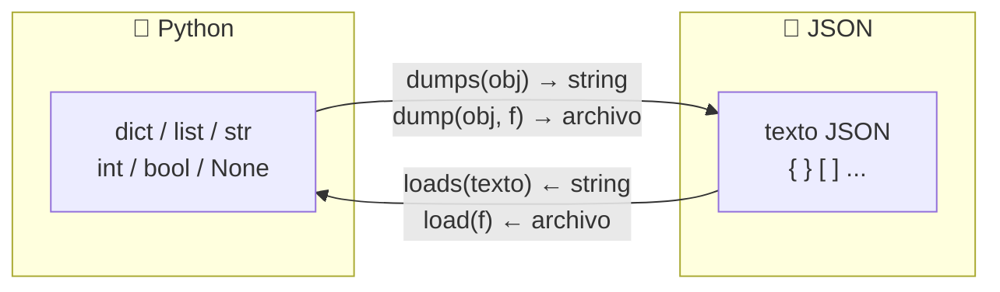

# 📋 JSON en Python

En la clase anterior aprendimos a guardar texto en archivos. Pero si queremos guardar una **lista de alumnos** o un **diccionario de notas**, tendríamos que inventar un formato propio para convertirlos a texto y parsearlos de vuelta. Por suerte, ya existe un formato estándar para esto: **JSON**.

!!! info "🎯 Objetivos de la clase"
    Al terminar la clase deberían poder:

    - Entender qué es JSON y por qué es el formato estándar para persistir datos estructurados.
    - Usar `json.dump()` y `json.load()` para guardar y cargar datos en archivos.
    - Usar `json.dumps()` y `json.loads()` para convertir entre Python y JSON en strings.
    - Aplicar el patrón **cargar → modificar → guardar** para persistir datos entre ejecuciones.

---

## 🧠 ¿Qué es JSON?

**JSON** (JavaScript Object Notation) es un formato de texto para representar datos estructurados. Se ve así:

```json
{
  "nombre": "Ana",
  "edad": 20,
  "aprobada": true,
  "notas": [8, 9, 10],
  "direccion": null
}
```

Es el formato más usado en el mundo para intercambiar datos entre programas, APIs, configuraciones y bases de datos. Y es perfectamente legible por humanos.

### Python ↔ JSON: tipos compatibles

| Python | JSON |
|--------|------|
| `dict` | objeto `{}` |
| `list`, `tuple` | array `[]` |
| `str` | string `"..."` |
| `int`, `float` | número |
| `True` / `False` | `true` / `false` |
| `None` | `null` |

!!! warning "⚠️ Las tuplas se convierten en arrays"
    JSON no tiene tuplas. Al serializar una tupla Python, se convierte a array JSON. Al deserializar, vuelve como lista, no como tupla.

---

## 📦 El módulo json

Python incluye el módulo `json` en su biblioteca estándar — no hay que instalar nada.

```python
import json
```

Tiene cuatro funciones principales:

| Función | Dirección | Trabaja con |
|---------|-----------|-------------|
| `json.dumps(obj)` | Python → JSON | **string** |
| `json.loads(texto)` | JSON → Python | **string** |
| `json.dump(obj, f)` | Python → JSON | **archivo** |
| `json.load(f)` | JSON → Python | **archivo** |



!!! tip "Cómo recordarlo"
    - Las que terminan en **`s`** trabajan con **s**trings.
    - Las que no terminan en `s` trabajan con archivos.

---

## 🔤 json.dumps() y json.loads() — trabajar con strings

=== "Python → JSON string"

    `json.dumps()` convierte un diccionario Python en un **string JSON**.

    ```python
    import json

    alumno = {
        "nombre": "Ana",
        "nota": 9,
        "aprobada": True,
        "materias": ["Python", "Matemática"]
    }

    texto_json = json.dumps(alumno)
    print(texto_json)
    # '{"nombre": "Ana", "nota": 9, "aprobada": true, "materias": ["Python", "Matemática"]}'

    # Con indent y ensure_ascii para que sea legible
    texto_bonito = json.dumps(alumno, indent=2, ensure_ascii=False)
    print(texto_bonito)
    # {
    #   "nombre": "Ana",
    #   "nota": 9,
    #   "aprobada": true,
    #   "materias": ["Python", "Matemática"]
    # }
    ```

=== "JSON string → Python"

    `json.loads()` convierte un string JSON en un diccionario Python.

    ```python
    import json

    texto = '{"nombre": "Beto", "nota": 7, "aprobado": true}'
    alumno = json.loads(texto)

    print(alumno)           # {'nombre': 'Beto', 'nota': 7, 'aprobado': True}
    print(type(alumno))     # <class 'dict'>
    print(alumno["nombre"]) # Beto
    ```

---

## 💾 json.dump() y json.load() — trabajar con archivos

Estas son las funciones que más vas a usar en el proyecto.

=== "Guardar en archivo"

    ```python
    import json

    alumnos = [
        {"nombre": "Ana",  "nota": 9},
        {"nombre": "Beto", "nota": 7},
        {"nombre": "Cami", "nota": 10},
    ]

    with open("alumnos.json", "w", encoding="utf-8") as f:
        json.dump(alumnos, f, indent=2, ensure_ascii=False)
    ```

    El archivo `alumnos.json` quedará así:
    ```json
    [
      {
        "nombre": "Ana",
        "nota": 9
      },
      {
        "nombre": "Beto",
        "nota": 7
      },
      {
        "nombre": "Cami",
        "nota": 10
      }
    ]
    ```

=== "Cargar desde archivo"

    ```python
    import json

    with open("alumnos.json", "r", encoding="utf-8") as f:
        alumnos = json.load(f)

    print(type(alumnos))    # <class 'list'>
    print(alumnos[0])       # {'nombre': 'Ana', 'nota': 9}

    for alumno in alumnos:
        print(f"{alumno['nombre']}: {alumno['nota']}")
    ```

!!! info "Parámetros útiles de `json.dump()`"
    - `indent=2` → sangría de 2 espacios para que sea legible.
    - `ensure_ascii=False` → permite guardar tildes y ñ directamente (en lugar de `á`).

---

## 🔄 Patrón: Cargar → Modificar → Guardar

Este es el patrón más importante para **persistir datos entre ejecuciones**. Es lo que vamos a usar en el proyecto.

```python
import json
import os

ARCHIVO = "datos.json"

def cargar_datos():
    if os.path.exists(ARCHIVO):
        with open(ARCHIVO, "r", encoding="utf-8") as f:
            return json.load(f)
    return []  # Si el archivo no existe, empezamos con lista vacía

def guardar_datos(datos):
    with open(ARCHIVO, "w", encoding="utf-8") as f:
        json.dump(datos, f, indent=2, ensure_ascii=False)


# --- Programa principal ---
alumnos = cargar_datos()

nuevo = input("Nombre del nuevo alumno: ")
alumnos.append({"nombre": nuevo, "nota": 0})

guardar_datos(alumnos)
print(f"Alumno '{nuevo}' guardado. Total: {len(alumnos)}")
```

Ejecutás esto dos veces:

- Primera vez: crea el archivo con el primer alumno.
- Segunda vez: carga el archivo, agrega el segundo alumno y guarda.

!!! tip "🏆 Las dos funciones de oro"
    En casi cualquier proyecto, vas a necesitar exactamente `cargar_datos()` y `guardar_datos()`. Estos nombres son una buena convención.

!!! note "🔥 ¿Te marean las funciones de este patrón?"
    Acá `cargar_datos()` y `guardar_datos()` son **cajas negras**: las usás por lo que hacen (traer
    datos / guardarlos), sin pensar en el `with open(...)` de adentro cada vez. Si todavía no te
    sentís firme con eso, date una vuelta por la [🔥 Entrada en calor: Funciones como caja
    negra](../06_funciones/funciones_caja_negra.md). Además, en vez de `os.path.exists(ARCHIVO)` podés
    usar el `pathlib` que vimos: `Path(ARCHIVO).exists()`.

---

## ✅ Buenas prácticas

!!! success "Hacé esto ✅"
    - Siempre usá `ensure_ascii=False` para manejar bien el español.
    - Siempre usá `indent=2` (o `indent=4`) para que el archivo sea legible.
    - Verificá si el archivo existe antes de cargarlo (`os.path.exists()`).
    - Guardá los datos en una estructura organizada: lista de dicts o dict de dicts.

!!! failure "Evitá esto ❌"
    - No guardes objetos Python que no son serializables a JSON (como sets o instancias de clases propias sin conversión).
    - No abras el archivo JSON en modo `"a"` — JSON no funciona con append simple, siempre hay que leer-modificar-guardar.

---

## 🎮 Ejercicios

!!! tip "🧪 Los ejercicios ahora son interactivos"
    Escribís el código, lo ejecutás con **Python de verdad en el navegador** y los tests te dicen al
    instante si está bien. Sin instalar nada: funciona desde la máquina del CFP, desde tu casa y
    desde el celular. Tu avance **se guarda solo**.

    Si te trabás, cada ejercicio tiene pistas — y un botón para mandarme tu código y tu consulta.

    [🚀 Ir a los ejercicios de JSON](/pensamiento-computacional-testing-2026/ejercicios/clases/json/){ .md-button .md-button--primary }

## [⬅️ Anterior: Manejo de archivos](./archivos.md)
## [📚 Índice](../../clases.md#persistencia)
## ➡️ Siguiente: POO I — Clases y objetos *(próximamente)*
