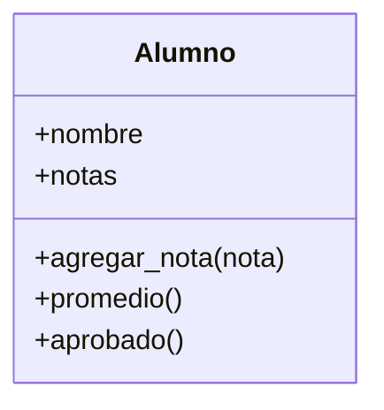

# 🧬 POO I — Clases y objetos

!!! example "🤔 El problema: datos sueltos que andan de la mano"
    Querés representar a un alumno: nombre, nota y materias. Con lo que sabés, usás un diccionario:

    ```python
    ana = {"nombre": "Ana", "nota": 9, "materias": ["Python", "Mate"]}
    ```

    Funciona, pero tiene dos molestias:

    1. Nada te avisa si escribís mal una clave: `ana["nombre"]` no es un error hasta que explota.
    2. Las cosas que se **hacen** con un alumno (saludar, ver si aprobó) quedan **sueltas** como
       funciones por todo el programa, lejos de los datos que usan.

    ¿Y si pudieras meter los **datos** y lo que se **hace** con ellos en una sola cosa, con un molde
    que siempre tenga la misma forma? Eso es la **Programación Orientada a Objetos**.

!!! info "🎯 Objetivos de la clase"
    Al terminar deberías poder:

    - Entender la diferencia entre una **clase** (el molde) y un **objeto** (lo construido con él).
    - Escribir una clase con su **constructor** `__init__` y sus **atributos**.
    - Entender qué es **`self`** y para qué sirve.
    - Agregar **métodos** (funciones que viven dentro de la clase) y usarlos.

---

## 🧱 La idea: un molde y sus copias

Una **clase** es un **molde** (un plano). Un **objeto** es algo **construido con ese molde**.

- 🏠 El **plano** de una casa es la clase. Cada **casa** construida con ese plano es un objeto.
- 🍪 El **molde** de galletitas es la clase. Cada **galletita** es un objeto.

Definís el molde **una vez** y creás **todos los objetos que quieras** con él. Cada objeto tiene sus
**propios datos**, pero todos comparten la misma forma.

---

## 🐣 Tu primera clase

```python
class Alumno:
    def __init__(self, nombre, nota):
        self.nombre = nombre
        self.nota = nota
```

Despacito, qué es cada cosa:

- **`class Alumno:`** → definimos el molde. Por convención, el nombre va en *MayúsculaInicial*.
- **`def __init__(self, ...)`** → el **constructor**. Es una función especial que Python ejecuta
  **sola, automáticamente, cada vez que creás un objeto**. Acá le decís qué datos necesita.
- **`self.nombre = nombre`** → guarda el dato dentro del objeto. Eso es un **atributo**.

### Crear objetos (instanciar)

```python
ana  = Alumno("Ana", 9)      # se ejecuta __init__ con nombre="Ana", nota=9
beto = Alumno("Beto", 5)

print(ana.nombre)   # Ana
print(ana.nota)     # 9
print(beto.nombre)  # Beto
```

`ana` y `beto` son **dos objetos distintos** del mismo molde, cada uno con **sus propios datos**.
Acceder a un atributo es `objeto.atributo` — con punto, sin comillas (a diferencia del diccionario,
que era `ana["nombre"]`).

---

## 🪞 `self`: "yo mismo"

`self` es la palabra clave que más confunde al principio, así que vamos con calma.

Cuando escribís un método, **todavía no existe ningún objeto concreto** — estás escribiendo el molde.
`self` es el comodín que significa **"el objeto que esté usando este método en este momento"**.

```python
ana.nombre    # cuando hacés esto, adentro del método self ES ana
beto.nombre   # y acá self ES beto
```

!!! tip "🧠 Regla práctica"
    **Adentro de la clase**, para referirte a los datos del objeto, usás `self.algo`. **Afuera**, para
    referirte a un objeto concreto, usás `suNombre.algo` (`ana.nombre`). Es la misma cosa vista desde
    adentro y desde afuera.

---

## 🛠️ Métodos: funciones que el objeto lleva consigo

Un **método** es una función definida **adentro** de la clase. Opera sobre los datos del objeto
(`self`). Es la parte de "lo que se **hace**" con el alumno, ahora pegada a sus datos.

```python
class Alumno:
    def __init__(self, nombre, nota):
        self.nombre = nombre
        self.nota = nota

    def aprobo(self):
        return self.nota >= 6

    def saludar(self):
        print(f"Hola, soy {self.nombre} y mi nota es {self.nota}")
```

Para usarlos, los llamás con punto, igual que un atributo pero con `()`:

```python
ana = Alumno("Ana", 9)
ana.saludar()        # Hola, soy Ana y mi nota es 9
print(ana.aprobo())  # True

beto = Alumno("Beto", 4)
print(beto.aprobo()) # False
```

!!! note "🔌 Esto es la entrada en calor en acción"
    `ana.aprobo()` es una **caja negra**: la llamás confiando en que te devuelve si aprobó, sin pensar
    en el `self.nota >= 6` de adentro. Un objeto no es más que **datos + sus propias funciones**
    juntos. Si esto te suena raro, repasá la
    [🔥 Entrada en calor: Funciones como caja negra](../06_funciones/funciones_caja_negra.md).

### ¿Por qué no seguir con diccionarios?

=== "❌ Con diccionario"

    ```python
    ana = {"nombre": "Ana", "nota": 9}

    # La lógica anda suelta, lejos de los datos:
    def aprobo(alumno):
        return alumno["nota"] >= 6

    print(aprobo(ana))
    print(ana["nombre"])   # 💥 typo silencioso: KeyError recién al ejecutar
    ```

=== "✅ Con clase"

    ```python
    ana = Alumno("Ana", 9)

    # La lógica vive CON los datos:
    print(ana.aprobo())
    print(ana.nombre)      # el editor te autocompleta y avisa si te equivocás
    ```

La clase junta los datos y sus operaciones en una sola cosa coherente. Eso escala muchísimo mejor
cuando el programa crece.

---

## 🎮 Ejercicios

!!! tip "🧪 Los ejercicios ahora son interactivos"
    Escribís el código, lo ejecutás con **Python de verdad en el navegador** y los tests te dicen al
    instante si está bien. Sin instalar nada: funciona desde la máquina del CFP, desde tu casa y
    desde el celular. Tu avance **se guarda solo**.

    Si te trabás, cada ejercicio tiene pistas — y un botón para mandarme tu código y tu consulta.

    [🚀 Ir a los ejercicios de POO I](/pensamiento-computacional-testing-2026/ejercicios/clases/poo-1/){ .md-button .md-button--primary }

## 📐 Bonus: el diagrama de clases

Cuando los programas crecen, dibujar las clases ayuda a pensarlas **antes** de escribirlas. Un
**diagrama de clases** es una cajita con tres pisos: el **nombre**, los **atributos** y los
**métodos**. Así se ve el `Alumno` del Ejercicio 3:



- **Arriba**: el nombre de la clase.
- **Al medio**: los atributos (los datos).
- **Abajo**: los métodos (lo que sabe hacer).
- El **`+`** quiere decir "público": accesible desde afuera. (En la próxima clase vas a ver el `-`,
  que es "privado".)

!!! tip "✏️ Dibujá antes de codear"
    Para un proyecto, dibujar las clases en papel (o con un diagrama así) **antes** de programar te
    ahorra un montón de idas y vueltas. Es el "plano" antes de construir.

---

## 📌 Cheatsheet

```python
class NombreClase:               # el molde (MayúsculaInicial)
    def __init__(self, dato1):   # constructor: corre al crear el objeto
        self.dato1 = dato1       # atributo: dato guardado en el objeto

    def un_metodo(self):         # método: función del objeto (self primero)
        return self.dato1

obj = NombreClase("hola")        # crear un objeto (instanciar)
print(obj.dato1)                 # acceder a un atributo
print(obj.un_metodo())           # llamar a un método
```

---

!!! quote "Para cerrar"
    Acabás de dar el salto más importante del año: de manejar datos sueltos a **modelar cosas** con
    sus datos y sus comportamientos juntos. En el primer proyecto vas a modelar `Alumno`, `Clase` y
    `Asistencia` exactamente así. En la próxima clase (**POO II**) vamos a hacer que tus objetos se
    impriman lindo (`__str__`) y a proteger sus datos (encapsulamiento).

## [⬅️ Anterior: Git y GitHub](../07_persistencia/git_github.md)
## [📚 Índice](../../clases.md)
## [➡️ Siguiente: POO II](./poo_2.md)
