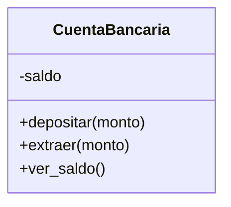

# 🛡️ POO II — Métodos especiales y encapsulamiento

!!! example "🤔 Dos cosas molestas de los objetos que hicimos"
    Seguimos con las clases de la clase pasada. Aparecen dos problemas:

    **1. Los objetos se imprimen feo.**
    ```python
    ana = Alumno("Ana", 9)
    print(ana)   # <__main__.Alumno object at 0x000001E3F2A8>  😵
    ```
    ¿Qué es eso? No nos dice nada útil.

    **2. Cualquiera puede romper los datos.**
    ```python
    cuenta = CuentaBancaria(100)
    cuenta.saldo = -9999999   # 😱 ¡me salteé toda la lógica de extraer()!
    ```
    Escribimos un método `extraer()` que controla que no te pases... y alguien lo esquiva tocando
    `saldo` directo. Todo nuestro cuidado, al tacho.

    Hoy resolvemos las dos: que los objetos se **muestren lindo** y que sus datos estén **protegidos**.

!!! info "🎯 Objetivos de la clase"
    Al terminar deberías poder:

    - Usar `__str__` para que tus objetos se impriman de forma legible.
    - Saber que existen otros **métodos especiales** (`__repr__`, etc.).
    - Entender qué es el **encapsulamiento** y por qué importa.
    - Usar la convención `_atributo` y controlar el acceso a los datos a través de métodos.

---

## ✨ `__str__`: que tu objeto se imprima lindo

`__str__` es un **método especial**: Python lo llama solo cuando hacés `print(objeto)` o
`str(objeto)`. Vos definís qué texto devuelve.

=== "❌ Sin `__str__`"

    ```python
    class Alumno:
        def __init__(self, nombre, nota):
            self.nombre = nombre
            self.nota = nota

    print(Alumno("Ana", 9))
    # <__main__.Alumno object at 0x000001E3F2A8>
    ```

=== "✅ Con `__str__`"

    ```python
    class Alumno:
        def __init__(self, nombre, nota):
            self.nombre = nombre
            self.nota = nota

        def __str__(self):
            return f"Alumno: {self.nombre} (nota {self.nota})"

    print(Alumno("Ana", 9))
    # Alumno: Ana (nota 9)
    ```

!!! note "🐍 Los métodos `__dobleguion__` son especiales"
    A los métodos con doble guion bajo adelante y atrás se los llama **dunder** (de *double
    underscore*). Python los llama **solo, en momentos especiales**: `__init__` cuando creás el
    objeto, `__str__` cuando lo imprimís. Vos no los llamás a mano (`ana.__str__()` funciona, pero lo
    natural es `print(ana)`).

!!! tip "🔍 `__repr__`, el primo técnico"
    `__str__` es para humanos (lindo). `__repr__` es para programadores (preciso, para debug). Si solo
    definís uno, que sea `__str__`. Hay muchos más dunder (`__len__`, `__eq__`, …) que vas a ir
    conociendo; por ahora con `__str__` te alcanza y sobra.

---

## 🔒 Encapsulamiento: proteger los datos

**Encapsular** es **esconder los datos internos** de un objeto y obligar a que se los toque **solo a
través de métodos controlados**. Es como un cajero automático: no metés la mano en la caja fuerte,
usás los botones (la interfaz), y el cajero se encarga de que no saques más de lo que tenés.

### El problema, en concreto

```python
cuenta = CuentaBancaria(100)
cuenta.extraer(500)      # ✅ tu método dice "Saldo insuficiente"
cuenta.saldo = 500       # ❌ pero esto lo pisa todo, sin control
```

### La convención del guion bajo

En Python, un atributo que arranca con **`_`** es una señal: *"esto es interno, no lo toques desde
afuera"*. No lo prohíbe (Python confía en vos), pero marca la intención.

```python
class CuentaBancaria:
    def __init__(self, saldo=0):
        self._saldo = saldo          # _ → "manejame con cuidado, usá los métodos"

    def depositar(self, monto):
        if monto > 0:
            self._saldo += monto

    def extraer(self, monto):
        if 0 < monto <= self._saldo:
            self._saldo -= monto
        else:
            print("Movimiento inválido")

    def ver_saldo(self):
        return self._saldo
```

Ahora la **única forma sensata** de mover el saldo es a través de `depositar()` y `extraer()`, que
**validan**. El dato (`_saldo`) está adentro, protegido por la "puerta" de los métodos.

!!! tip "🚪 La idea de fondo: interfaz vs. interior"
    Lo **público** (los métodos sin `_`) es la **interfaz**: lo que el mundo de afuera puede usar. Lo
    **interno** (`_saldo`) es el **cómo**, que queda escondido. Si mañana cambiás cómo guardás el
    saldo, mientras la interfaz siga igual, **nada del código que usa tu clase se rompe**. Eso es oro.

??? info "🌶️ Para los curiosos: `__` y `@property`"
    - **Doble guion bajo** (`__saldo`): Python le cambia el nombre por detrás (*name mangling*), así
      que `cuenta.__saldo` desde afuera **falla**. Es privacidad más estricta. La mayoría de los
      proyectos usan un solo `_` y listo.
    - **`@property`**: permite exponer algo que **parece** un atributo pero por dentro ejecuta código
      (por ejemplo, de solo lectura). Es la forma más "pythónica", pero es tema de más adelante:
      ```python
      class CuentaBancaria:
          def __init__(self, saldo=0):
              self._saldo = saldo

          @property
          def saldo(self):          # se usa como cuenta.saldo (sin paréntesis)
              return self._saldo    # ...pero no se puede asignar: queda de solo lectura
      ```

---

## 📐 El diagrama, ahora con candados

En un diagrama de clases, el **`+`** es público y el **`-`** es privado/interno. Nuestra cuenta
encapsulada se ve así:



De un vistazo se entiende el diseño: el `saldo` está **protegido** (`-`) y solo se lo toca por los
métodos **públicos** (`+`). Esa es la foto de una clase bien encapsulada.

---

## 🎮 Ejercicios

!!! tip "🧪 Los ejercicios ahora son interactivos"
    Escribís el código, lo ejecutás con **Python de verdad en el navegador** y los tests te dicen al
    instante si está bien. Sin instalar nada: funciona desde la máquina del CFP, desde tu casa y
    desde el celular. Tu avance **se guarda solo**.

    Si te trabás, cada ejercicio tiene pistas — y un botón para mandarme tu código y tu consulta.

    [🚀 Ir a los ejercicios de POO II](/pensamiento-computacional-testing-2026/ejercicios/clases/poo-2/){ .md-button .md-button--primary }

## 📌 Cheatsheet

```python
class Cosa:
    def __init__(self, valor):
        self._valor = valor          # _ → atributo interno (encapsulado)

    def cambiar(self, nuevo):        # método público = puerta controlada
        if nuevo >= 0:               # validación
            self._valor = nuevo

    def __str__(self):               # cómo se imprime el objeto
        return f"Cosa con valor {self._valor}"

c = Cosa(5)
print(c)            # Cosa con valor 5   (usa __str__)
c.cambiar(10)       # se modifica por la puerta, con control
```

---

!!! quote "Para cerrar"
    Tus objetos ya se muestran lindos y protegen sus datos: son clases **profesionales**. En la
    próxima clase damos el último concepto grande de POO: **herencia y polimorfismo**, para que una
    clase pueda "heredar" de otra y no repetir código. Después de eso, ¡arrancamos el proyecto! 🚀

## [⬅️ Anterior: POO I — Clases y objetos](./poo_1.md)
## [📚 Índice](../../clases.md)
## [➡️ Siguiente: Herencia y polimorfismo](./poo_herencia.md)
