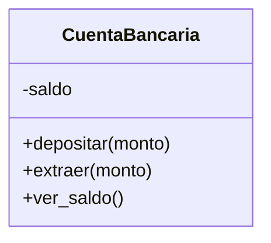

# 🛡️ POO II — Métodos especiales y encapsulamiento

!!! example "🤔 Dos cosas molestas de los objetos que hicimos"
    Seguimos con las clases de la clase pasada. Aparecen dos problemas:

    **1. Los objetos se imprimen feo.**
    ```python
    ana = Alumno("Ana", 9)
    print(ana)   # <__main__.Alumno object at 0x000001E3F2A8>  😵
    ```
    ¿Qué es eso? No nos dice nada útil.

    **2. Cualquiera puede romper los datos.**
    ```python
    cuenta = CuentaBancaria(100)
    cuenta.saldo = -9999999   # 😱 ¡me salteé toda la lógica de extraer()!
    ```
    Escribimos un método `extraer()` que controla que no te pases... y alguien lo esquiva tocando
    `saldo` directo. Todo nuestro cuidado, al tacho.

    Hoy resolvemos las dos: que los objetos se **muestren lindo** y que sus datos estén **protegidos**.

!!! info "🎯 Objetivos de la clase"
    Al terminar deberías poder:

    - Usar `__str__` para que tus objetos se impriman de forma legible.
    - Saber que existen otros **métodos especiales** (`__repr__`, etc.).
    - Entender qué es el **encapsulamiento** y por qué importa.
    - Usar la convención `_atributo` y controlar el acceso a los datos a través de métodos.

---

## ✨ `__str__`: que tu objeto se imprima lindo

`__str__` es un **método especial**: Python lo llama solo cuando hacés `print(objeto)` o
`str(objeto)`. Vos definís qué texto devuelve.

=== "❌ Sin `__str__`"

    ```python
    class Alumno:
        def __init__(self, nombre, nota):
            self.nombre = nombre
            self.nota = nota

    print(Alumno("Ana", 9))
    # <__main__.Alumno object at 0x000001E3F2A8>
    ```

=== "✅ Con `__str__`"

    ```python
    class Alumno:
        def __init__(self, nombre, nota):
            self.nombre = nombre
            self.nota = nota

        def __str__(self):
            return f"Alumno: {self.nombre} (nota {self.nota})"

    print(Alumno("Ana", 9))
    # Alumno: Ana (nota 9)
    ```

!!! note "🐍 Los métodos `__dobleguion__` son especiales"
    A los métodos con doble guion bajo adelante y atrás se los llama **dunder** (de *double
    underscore*). Python los llama **solo, en momentos especiales**: `__init__` cuando creás el
    objeto, `__str__` cuando lo imprimís. Vos no los llamás a mano (`ana.__str__()` funciona, pero lo
    natural es `print(ana)`).

!!! tip "🔍 `__repr__`, el primo técnico"
    `__str__` es para humanos (lindo). `__repr__` es para programadores (preciso, para debug). Si solo
    definís uno, que sea `__str__`. Hay muchos más dunder (`__len__`, `__eq__`, …) que vas a ir
    conociendo; por ahora con `__str__` te alcanza y sobra.

---

## 🔒 Encapsulamiento: proteger los datos

**Encapsular** es **esconder los datos internos** de un objeto y obligar a que se los toque **solo a
través de métodos controlados**. Es como un cajero automático: no metés la mano en la caja fuerte,
usás los botones (la interfaz), y el cajero se encarga de que no saques más de lo que tenés.

### El problema, en concreto

```python
cuenta = CuentaBancaria(100)
cuenta.extraer(500)      # ✅ tu método dice "Saldo insuficiente"
cuenta.saldo = 500       # ❌ pero esto lo pisa todo, sin control
```

### La convención del guion bajo

En Python, un atributo que arranca con **`_`** es una señal: *"esto es interno, no lo toques desde
afuera"*. No lo prohíbe (Python confía en vos), pero marca la intención.

```python
class CuentaBancaria:
    def __init__(self, saldo=0):
        self._saldo = saldo          # _ → "manejame con cuidado, usá los métodos"

    def depositar(self, monto):
        if monto > 0:
            self._saldo += monto

    def extraer(self, monto):
        if 0 < monto <= self._saldo:
            self._saldo -= monto
        else:
            print("Movimiento inválido")

    def ver_saldo(self):
        return self._saldo
```

Ahora la **única forma sensata** de mover el saldo es a través de `depositar()` y `extraer()`, que
**validan**. El dato (`_saldo`) está adentro, protegido por la "puerta" de los métodos.

!!! tip "🚪 La idea de fondo: interfaz vs. interior"
    Lo **público** (los métodos sin `_`) es la **interfaz**: lo que el mundo de afuera puede usar. Lo
    **interno** (`_saldo`) es el **cómo**, que queda escondido. Si mañana cambiás cómo guardás el
    saldo, mientras la interfaz siga igual, **nada del código que usa tu clase se rompe**. Eso es oro.

??? info "🌶️ Para los curiosos: `__` y `@property`"
    - **Doble guion bajo** (`__saldo`): Python le cambia el nombre por detrás (*name mangling*), así
      que `cuenta.__saldo` desde afuera **falla**. Es privacidad más estricta. La mayoría de los
      proyectos usan un solo `_` y listo.
    - **`@property`**: permite exponer algo que **parece** un atributo pero por dentro ejecuta código
      (por ejemplo, de solo lectura). Es la forma más "pythónica", pero es tema de más adelante:
      ```python
      class CuentaBancaria:
          def __init__(self, saldo=0):
              self._saldo = saldo

          @property
          def saldo(self):          # se usa como cuenta.saldo (sin paréntesis)
              return self._saldo    # ...pero no se puede asignar: queda de solo lectura
      ```

---

## 📐 El diagrama, ahora con candados

En un diagrama de clases, el **`+`** es público y el **`-`** es privado/interno. Nuestra cuenta
encapsulada se ve así:



De un vistazo se entiende el diseño: el `saldo` está **protegido** (`-`) y solo se lo toca por los
métodos **públicos** (`+`). Esa es la foto de una clase bien encapsulada.

---

## 🎮 Ejercicios

### 🌱 Ejercicio 1 — Que se imprima lindo

Tenés una clase `Producto` con `nombre` y `precio`. Agregale `__str__` para que `print(producto)`
muestre algo como `🛒 Yerba — $1500`.

```python
p = Producto("Yerba", 1500)
print(p)        # 🛒 Yerba — $1500
```

??? tip "💡 Pista"
    `__str__` recibe `self` y **devuelve un string** (con `return`, no `print`). Usá una f-string con
    `self.nombre` y `self.precio`.

??? success "✅ Solución"
    ```python
    class Producto:
        def __init__(self, nombre, precio):
            self.nombre = nombre
            self.precio = precio

        def __str__(self):
            return f"🛒 {self.nombre} — ${self.precio}"

    p = Producto("Yerba", 1500)
    print(p)        # 🛒 Yerba — $1500
    ```

### 🌿 Ejercicio 2 — El termostato protegido

Creá una clase `Termostato` que guarde una temperatura **interna** (`_temperatura`, arranca en 20).
Encapsulala:

- `ajustar(grados)` → cambia la temperatura, **pero la mantiene siempre entre 16 y 30** (si te pasás,
  la deja en el límite).
- `__str__` → muestra `🌡️ 22°C`.

```python
t = Termostato()
t.ajustar(50)
print(t)          # 🌡️ 30°C   (no deja pasar de 30)
t.ajustar(10)
print(t)          # 🌡️ 16°C   (no deja bajar de 16)
```

??? tip "💡 Pista"
    En `ajustar`, primero asigná, después "recortá" con dos `if` (o pensá en `min` y `max`). El dato
    vive en `self._temperatura`; nadie debería tocarlo de afuera, solo `ajustar`.

??? success "✅ Solución"
    ```python
    class Termostato:
        def __init__(self):
            self._temperatura = 20

        def ajustar(self, grados):
            if grados > 30:
                grados = 30
            elif grados < 16:
                grados = 16
            self._temperatura = grados

        def __str__(self):
            return f"🌡️ {self._temperatura}°C"

    t = Termostato()
    t.ajustar(50)
    print(t)          # 🌡️ 30°C
    t.ajustar(10)
    print(t)          # 🌡️ 16°C
    ```

    El método `ajustar` es la **puerta controlada**: pase lo que pase, la temperatura nunca queda
    fuera de rango. Eso es encapsular.

### 🌿 Ejercicio 3 — Alumno, ahora a prueba de errores

Retomá el `Alumno` con lista de notas (de POO I) y mejoralo:

- Las notas se guardan en `_notas` (interno).
- `agregar_nota(nota)` → solo agrega si la nota está **entre 0 y 10**; si no, imprime
  `"Nota inválida: <nota>"`.
- `__str__` → muestra `Ana — promedio 8.0`.

```python
ana = Alumno("Ana")
ana.agregar_nota(8)
ana.agregar_nota(15)    # Nota inválida: 15
ana.agregar_nota(10)
print(ana)              # Ana — promedio 9.0
```

??? tip "💡 Pista"
    En `agregar_nota`, un `if 0 <= nota <= 10:` decide si la agregás o la rechazás. Para el promedio
    en `__str__`, cuidado con la lista vacía (dividir por cero). Reutilizá la idea del promedio de
    POO I.

??? success "✅ Solución"
    ```python
    class Alumno:
        def __init__(self, nombre):
            self.nombre = nombre
            self._notas = []

        def agregar_nota(self, nota):
            if 0 <= nota <= 10:
                self._notas.append(nota)
            else:
                print(f"Nota inválida: {nota}")

        def promedio(self):
            if not self._notas:
                return 0
            return sum(self._notas) / len(self._notas)

        def __str__(self):
            return f"{self.nombre} — promedio {self.promedio()}"

    ana = Alumno("Ana")
    ana.agregar_nota(8)
    ana.agregar_nota(15)    # Nota inválida: 15
    ana.agregar_nota(10)
    print(ana)              # Ana — promedio 9.0
    ```

    Esto es **exactamente** lo que vas a necesitar en el proyecto: datos protegidos + validación al
    cargarlos. Un `Alumno` que no acepta notas imposibles es un `Alumno` confiable.

---

## 📌 Cheatsheet

```python
class Cosa:
    def __init__(self, valor):
        self._valor = valor          # _ → atributo interno (encapsulado)

    def cambiar(self, nuevo):        # método público = puerta controlada
        if nuevo >= 0:               # validación
            self._valor = nuevo

    def __str__(self):               # cómo se imprime el objeto
        return f"Cosa con valor {self._valor}"

c = Cosa(5)
print(c)            # Cosa con valor 5   (usa __str__)
c.cambiar(10)       # se modifica por la puerta, con control
```

---

!!! quote "Para cerrar"
    Tus objetos ya se muestran lindos y protegen sus datos: son clases **profesionales**. En la
    próxima clase damos el último concepto grande de POO: **herencia y polimorfismo**, para que una
    clase pueda "heredar" de otra y no repetir código. Después de eso, ¡arrancamos el proyecto! 🚀

## [⬅️ Anterior: POO I — Clases y objetos](./poo_1.md)
## [📚 Índice](../../clases.md)
## ➡️ Siguiente: Herencia y polimorfismo *(próximamente)*
