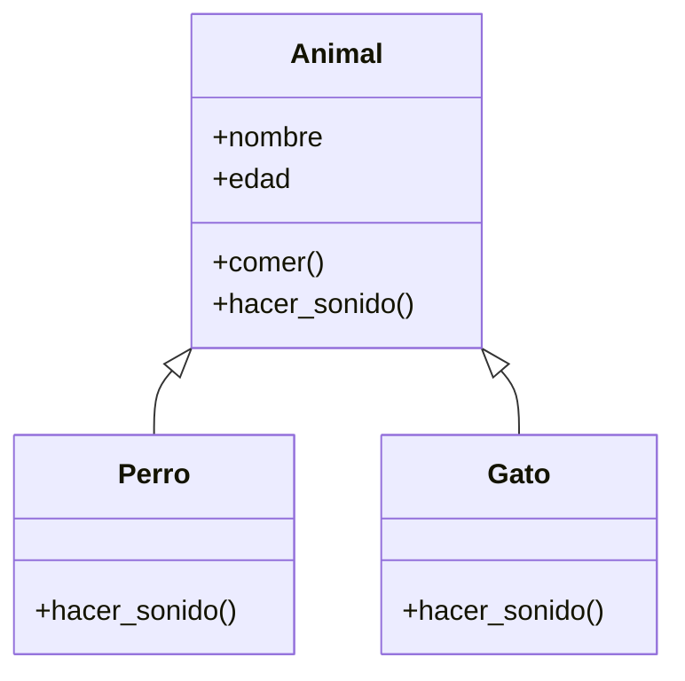

# 🔗 Herencia y polimorfismo

!!! example "🤔 El problema: código repetido entre clases parecidas"
    Querés modelar un `Perro` y un `Gato`. Los dos tienen nombre y edad, los dos comen igual... y solo
    se diferencian en el sonido que hacen.

    ```python
    class Perro:
        def __init__(self, nombre, edad):
            self.nombre = nombre
            self.edad = edad
        def comer(self):
            print(f"{self.nombre} está comiendo")
        def hacer_sonido(self):
            print(f"{self.nombre} dice: ¡Guau!")

    class Gato:
        def __init__(self, nombre, edad):   # 😮‍💨 idéntico al de Perro
            self.nombre = nombre
            self.edad = edad
        def comer(self):                    # 😮‍💨 idéntico al de Perro
            print(f"{self.nombre} está comiendo")
        def hacer_sonido(self):
            print(f"{self.nombre} dice: ¡Miau!")
    ```

    Todo lo que está en común lo escribiste **dos veces**. Si mañana cambia cómo comen, lo tenés que
    cambiar en los dos lados. ¿Y si pudieras escribir lo común **una sola vez** y que cada animal
    "herede" eso? Para eso existe la **herencia**.

!!! info "🎯 Objetivos de la clase"
    Al terminar deberías poder:

    - Hacer que una clase **herede** de otra (`class Hija(Madre)`) y reutilice su código.
    - Usar `super().__init__(...)` para reaprovechar el constructor de la clase madre.
    - **Sobrescribir** (override) un método para que la hija se comporte distinto.
    - Entender el **polimorfismo**: tratar objetos distintos con la misma interfaz.

---

## 🧬 Herencia: heredar para no repetir

La idea: una clase **madre** (o "base") tiene lo común. Las clases **hijas** la heredan y agregan o
cambian lo propio.

```python
class Animal:                      # la clase MADRE (lo común)
    def __init__(self, nombre, edad):
        self.nombre = nombre
        self.edad = edad
    def comer(self):
        print(f"{self.nombre} está comiendo")
    def hacer_sonido(self):
        print(f"{self.nombre} hace un sonido")

class Perro(Animal):               # Perro HEREDA de Animal
    def hacer_sonido(self):        # ...y cambia solo esto
        print(f"{self.nombre} dice: ¡Guau!")

class Gato(Animal):                # Gato también HEREDA de Animal
    def hacer_sonido(self):
        print(f"{self.nombre} dice: ¡Miau!")
```

`class Perro(Animal):` significa *"Perro es un Animal"*. Perro **no escribió** `__init__` ni `comer()`,
pero **los tiene**, porque los heredó:

```python
fido = Perro("Fido", 3)
fido.comer()          # Fido está comiendo   (heredado de Animal)
fido.hacer_sonido()   # Fido dice: ¡Guau!    (propio de Perro)
```

!!! tip "🧠 La pregunta clave: «¿es un…?»"
    Usá herencia cuando podés decir *"X **es un** Y"*: un perro **es un** animal, un gerente **es un**
    empleado, un círculo **es una** figura. Si no podés decir "es un", probablemente no sea herencia.

### Sobrescribir (override)

Cuando la hija define un método que **ya existía** en la madre, el suyo **gana**. Eso es
**sobrescribir**. Arriba, `Perro.hacer_sonido()` pisa al de `Animal`. Lo común se hereda, lo distinto
se sobrescribe.

---

## 🪜 `super()`: reaprovechar el constructor de la madre

¿Y si la hija necesita **un atributo más**? Por ejemplo, un `Perro` con `raza`. No queremos repetir
`self.nombre = nombre`... así que llamamos al constructor de la madre con `super()`:

```python
class Perro(Animal):
    def __init__(self, nombre, edad, raza):
        super().__init__(nombre, edad)   # ← la madre se encarga de nombre y edad
        self.raza = raza                 # ← y nosotros agregamos lo nuevo

fido = Perro("Fido", 3, "Caniche")
print(fido.nombre, fido.raza)   # Fido Caniche
```

`super()` es *"mi clase madre"*. `super().__init__(...)` corre el `__init__` de arriba, así no
repetís lo que ya estaba resuelto.

---

## 📐 El diagrama: la flecha de herencia

En un diagrama de clases, la herencia se dibuja con una **flecha que apunta a la madre**:



La flecha `Perro ──▷ Animal` se lee *"Perro es un Animal"*. `Perro` y `Gato` solo muestran lo que
**agregan o cambian**; todo lo demás lo heredan de `Animal`.

---

## 🎭 Polimorfismo: misma orden, distinta respuesta

**Polimorfismo** (palabra fea, idea simple): objetos **distintos** que responden a la **misma orden**,
cada uno a su manera. Como heredan la misma "interfaz", podés tratarlos a todos por igual:

```python
animales = [Perro("Fido", 3), Gato("Michi", 2), Perro("Rex", 5)]

for animal in animales:
    animal.hacer_sonido()     # ¡no nos importa si es Perro o Gato!
# Fido dice: ¡Guau!
# Michi dice: ¡Miau!
# Rex dice: ¡Guau!
```

El `for` no pregunta *"¿sos perro o gato?"*. Le dice a cada uno `hacer_sonido()` y **cada objeto sabe
qué hacer**. Eso es poderosísimo: podés agregar un `Vaca(Animal)` mañana y este `for` sigue andando
sin tocar una coma.

!!! note "🔌 Otra vez la caja negra"
    El `for` usa cada animal como una **caja negra**: confía en que todos saben `hacer_sonido()`, sin
    importarle el cómo. Herencia + polimorfismo = la forma más elegante de reutilizar código.

---

## 🎮 Ejercicios

### 🌱 Ejercicio 1 — Instrumentos

Creá una clase madre `Instrumento` con un atributo `nombre` y un método `tocar()` que imprima
`"<nombre> hace un sonido"`. Después creá `Guitarra` y `Bateria` que hereden de `Instrumento` y
**sobrescriban** `tocar()` con su propio sonido.

```python
Guitarra("Gibson").tocar()   # Gibson hace: ¡Riiiff!
Bateria("Pearl").tocar()     # Pearl hace: ¡Pum pum tss!
```

??? tip "💡 Pista"
    `class Guitarra(Instrumento):` ya te da el `__init__` con `nombre` gratis (heredado). Solo
    necesitás redefinir `tocar()` en cada hija. No hace falta escribir el constructor de nuevo.

??? success "✅ Solución"
    ```python
    class Instrumento:
        def __init__(self, nombre):
            self.nombre = nombre
        def tocar(self):
            print(f"{self.nombre} hace un sonido")

    class Guitarra(Instrumento):
        def tocar(self):
            print(f"{self.nombre} hace: ¡Riiiff!")

    class Bateria(Instrumento):
        def tocar(self):
            print(f"{self.nombre} hace: ¡Pum pum tss!")

    Guitarra("Gibson").tocar()
    Bateria("Pearl").tocar()
    ```

### 🌿 Ejercicio 2 — Cuenta premium (con `super()`)

Retomá la `CuentaBancaria` (con `_saldo`, `depositar`, `extraer`). Creá una `CuentaPremium` que
**herede** de ella y agregue un `nombre` de titular en el constructor (usando `super()`), más un
método `__str__` que muestre `"Cuenta de <nombre>: $<saldo>"`.

```python
c = CuentaPremium("Ana", 1000)
c.depositar(500)          # heredado de CuentaBancaria
print(c)                  # Cuenta de Ana: $1500
```

??? tip "💡 Pista"
    El `__init__` de `CuentaPremium` recibe `nombre` y `saldo`. Primero `super().__init__(saldo)` (para
    que la madre prepare `_saldo`), después `self.nombre = nombre`. `depositar` y `extraer` los heredás
    sin escribir nada.

??? success "✅ Solución"
    ```python
    class CuentaBancaria:
        def __init__(self, saldo=0):
            self._saldo = saldo
        def depositar(self, monto):
            if monto > 0:
                self._saldo += monto
        def extraer(self, monto):
            if 0 < monto <= self._saldo:
                self._saldo -= monto

    class CuentaPremium(CuentaBancaria):
        def __init__(self, nombre, saldo=0):
            super().__init__(saldo)      # la madre prepara _saldo
            self.nombre = nombre

        def __str__(self):
            return f"Cuenta de {self.nombre}: ${self._saldo}"

    c = CuentaPremium("Ana", 1000)
    c.depositar(500)
    print(c)                  # Cuenta de Ana: $1500
    ```

### 🌿 Ejercicio 3 — Figuras (el poder del polimorfismo)

Creá una clase madre `Figura` con un método `area()` que devuelva `0`. Después creá `Circulo` (recibe
`radio`) y `Rectangulo` (recibe `base` y `altura`), cada una sobrescribiendo `area()`. Finalmente,
poné varias figuras en una lista y **sumá todas las áreas con un solo `for`**.

```python
figuras = [Circulo(10), Rectangulo(4, 5), Circulo(1)]
# Área total: 337.30
```

??? tip "💡 Pista"
    Para el círculo: `3.1416 * self.radio ** 2`. Para el rectángulo: `self.base * self.altura`. El
    truco está en el `for`: como **todas** las figuras tienen `area()`, podés hacer `total += f.area()`
    sin preguntar de qué tipo es cada una. Ese es el regalo del polimorfismo.

??? success "✅ Solución"
    ```python
    class Figura:
        def area(self):
            return 0

    class Circulo(Figura):
        def __init__(self, radio):
            self.radio = radio
        def area(self):
            return 3.1416 * self.radio ** 2

    class Rectangulo(Figura):
        def __init__(self, base, altura):
            self.base = base
            self.altura = altura
        def area(self):
            return self.base * self.altura

    figuras = [Circulo(10), Rectangulo(4, 5), Circulo(1)]

    total = 0
    for f in figuras:
        total += f.area()      # cada figura calcula la suya
    print(f"Área total: {total:.2f}")   # Área total: 337.30
    ```

    Fijate que el `for` es **idéntico** sin importar cuántos tipos de figura haya. Si mañana agregás
    `Triangulo(Figura)`, lo metés en la lista y el `for` no cambia. Eso es escribir código que crece
    sin romperse. 🚀

---

## 📌 Cheatsheet

```python
class Madre:
    def __init__(self, x):
        self.x = x
    def saludar(self):
        print("Hola desde la madre")

class Hija(Madre):                   # Hija ES UNA Madre (hereda todo)
    def __init__(self, x, y):
        super().__init__(x)          # reusa el constructor de la madre
        self.y = y
    def saludar(self):               # sobrescribe (override)
        print("Hola desde la hija")

# Polimorfismo: misma orden, distinta respuesta
for obj in [Madre(1), Hija(1, 2)]:
    obj.saludar()
```

---

!!! quote "Para cerrar"
    Con esto **cerrás la parte conceptual de POO**: ya sabés modelar cosas (clases y objetos),
    mostrarlas y protegerlas (`__str__`, encapsulamiento) y reutilizar código entre clases parecidas
    (herencia y polimorfismo). Es **todo lo que necesitás** para el primer proyecto.

    🚀 **Lo que viene**: dejamos la teoría y arrancamos a construir el **Sistema de Asistencias del
    CFP**, juntando POO + archivos + JSON en una app de verdad. ¡Nos vemos ahí!

## [⬅️ Anterior: POO II — Métodos especiales y encapsulamiento](./poo_2.md)
## [📚 Índice](../../clases.md)
## ➡️ Siguiente: Sistema de Asistencias del CFP *(próximamente)*
